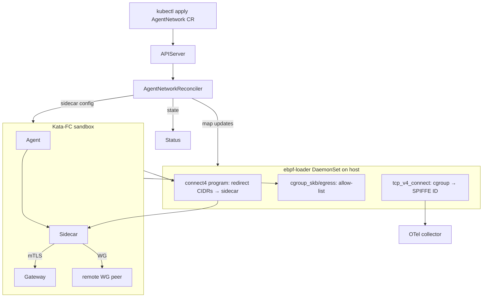

# Design — knative-agents-agentnet

## Overview

`agentnet` is two cooperating layers:

- **In-Pod (userspace)**: a sidecar that owns the agent's egress.
  It is one of: TCP/HTTP identity proxy (Mode A), or a WireGuard
  userspace device (Mode B), or both.
- **On-host (privileged)**: eBPF programs in the existing
  ebpf-loader DaemonSet that redirect, allow-list, and audit the
  agent's connects.

Both modes share an `AgentNetwork` CR shape. Operators with mixed
needs declare two CRs (or, in v2, a single CR with both blocks).

## Steering Document Alignment

### Technical Standards (`steering/tech.md`)
- Go 1.24 + cilium/ebpf for the host programs.
- `golang.zx2c4.com/wireguard` + `tun/netstack` for userspace WG.
- go-spiffe v2 for both transports' identity.
- OTel for audit; Prometheus for counters.

### Project Structure (`steering/structure.md`)
- New `pkg/agentnet/` with subpackages `proxy/`, `wireguard/`,
  `cgroup/`. CRD types live in `pkg/agentmodel/v1` to keep the
  spec/runtime split clean.

## Code Reuse Analysis

### Existing Components to Leverage
- `pkg/identity` — both transports rely on the X509 + JWT sources
  already wired in agents.
- `pkg/transport.PrivateDialer` — the TCP proxy uses it verbatim.
- `pkg/secrets` — broker fetches WG private key + per-peer secrets.
- `pkg/ebpfloader` — adds the new `egress_redirect.bpf.o` to the
  DaemonSet's program list with no chart changes (operator just
  rewrites the ConfigMap).
- `bpf/programs/network.bpf.c` already attaches `tcp_v4_connect` —
  we extend it with cgroup tagging.

### Integration Points
- **operator**: a new `AgentNetworkReconciler` watches the CR and
  injects the sidecar, or programs the ebpf-loader's BPF maps via
  the per-node DaemonSet.
- **AgentRun pod**: when an `Agent` references an `AgentNetwork`,
  the AgentRun reconciler adds the sidecar container to the Pod
  spec it produces.

## Architecture



## Components and Interfaces

### `pkg/agentnet/proxy`
- `TCPProxy{LocalAddr, Upstream, Identity, Authorize}` — calls
  `pkg/transport.PrivateDialer`.
- `HTTPProxy{LocalAddr, Upstream, JWTAudience, Identity}` — wraps
  `httputil.ReverseProxy`.
- `Sidecar.Run(ctx, []ResourceTarget)` — multiplexes both proxy
  kinds across the configured resources, one goroutine per resource.

### `pkg/agentnet/wireguard`
- `Adapter` interface: `Start(ctx, Config)`, `Stop()`, `Peers()`.
- `UserspaceDevice` — wraps `device.NewDevice` from the
  `wireguard-go` library with a `tun/netstack.CreateNetTUN` interface.
- `Config` covers both modes; `mode` discriminator decides whether
  to call `device.IpcSet` with `listen_port` or just peer entries.

### `pkg/agentnet/cgroup`
- `Resolver{NodeName}.SPIFFEFor(cgroupID) (spiffeid.ID, bool)` —
  walks the cgroup hierarchy on the host (DaemonSet has hostPID),
  reads the Pod's labels, looks up the agent's SPIFFE ID via the
  workload API.
- `MapController{Loader}.Update(redirectCIDRs, allowList)` — pushes
  the operator-supplied policy into the BPF maps owned by the
  ebpf-loader.

### `bpf/programs/egress_redirect.bpf.c`
Two programs in one object:

```c
SEC("cgroup/connect4")
int redirect_to_sidecar(struct bpf_sock_addr *ctx) { /* LPM trie */ }

SEC("cgroup_skb/egress")
int allow_only(struct __sk_buff *skb) { /* allow-list */ }
```

Maps:
- `redirect_cidrs` — `LPM_TRIE` keyed by `(prefix, ipv4)` →
  `(sidecar_ip, sidecar_port)`.
- `allow_list` — `HASH` keyed by
  `(cgroup_id, dst_ipv4, dst_port, proto)` → `(allowed: u8)`.

## Data Models

### `AgentNetworkSpec`
```go
type AgentNetworkSpec struct {
    Kind          NetworkKind         `json:"kind"`            // identityProxy | wireguardMesh
    AgentSelector metav1.LabelSelector `json:"agentSelector,omitempty"`

    IdentityProxy *IdentityProxySpec  `json:"identityProxy,omitempty"`
    WireGuardMesh *WireGuardSpec      `json:"wireguardMesh,omitempty"`
}

type IdentityProxySpec struct {
    Resources []ResourceTarget `json:"resources"`
    Egress    EgressPolicy     `json:"egress,omitempty"`
}

type ResourceTarget struct {
    Name      string         `json:"name"`
    Kind      string         `json:"kind"` // tcp | http
    LocalAddr string         `json:"localAddr,omitempty"`
    LocalPort int32          `json:"localPort,omitempty"`
    Gateway   string         `json:"gateway"`
    Authorize []string       `json:"authorize,omitempty"`  // SPIFFE-ID matchers
    JWTAudience string       `json:"jwtAudience,omitempty"`
}

type EgressPolicy struct {
    Enforcement string         `json:"enforcement,omitempty"` // ebpfRedirect | ebpfAllowList | none
    Allow       []EgressRule   `json:"allow,omitempty"`
    RedirectCIDRs []string     `json:"redirectCIDRs,omitempty"`
}

type EgressRule struct {
    CIDR     string  `json:"cidr"`
    Protocol string  `json:"protocol,omitempty"` // tcp | udp
    Ports    []int32 `json:"ports,omitempty"`
}

type WireGuardSpec struct {
    Mode       string        `json:"mode"` // client | server
    ListenPort int32         `json:"listenPort,omitempty"`
    PrivateKeyRef AuthRef    `json:"privateKeyRef"`
    Addresses  []string      `json:"addresses,omitempty"`
    DNS        []string      `json:"dns,omitempty"`
    Peers      []WGPeer      `json:"peers,omitempty"`
    MTU        int32         `json:"mtu,omitempty"`
}

type WGPeer struct {
    Name        string   `json:"name"`
    PublicKey   string   `json:"publicKey"`
    Endpoint    string   `json:"endpoint,omitempty"`
    AllowedIPs  []string `json:"allowedIPs"`
    PersistentKeepalive int32 `json:"persistentKeepalive,omitempty"`
    PSKRef      *AuthRef `json:"pskRef,omitempty"`
}
```

## Error Handling

1. **Gateway SVID mismatch** — TCPProxy rejects the dial; emits
   `agentnet_proxy_dial_errors_total{reason=svid_mismatch}`.
2. **JWT-SVID issuance fails** — HTTPProxy returns `503` with
   `X-Agentnet-Reason: jwt-svid-unavailable`.
3. **WG handshake fails** — adapter logs + retries with backoff;
   peer counter `agentnet_wg_peers{name=…,state=disconnected}` set.
4. **Unknown egress destination** — eBPF allow-list drops; the
   audit program still emits the connect attempt with
   `outcome=denied`.

## Testing Strategy

### Unit
- TCPProxy: `httptest`-style local pair (loopback ↔ in-process
  gateway) with a `pkg/identity` fake source.
- HTTPProxy: `httptest.NewServer` upstream that asserts the
  Authorization header parses as a JWT-SVID for the right audience.
- WireGuard adapter: spin up two userspace devices in the same
  process, send a packet, assert it lands.
- Cgroup resolver: synthetic `/proc/<pid>/cgroup` fixture.

### Property
- `BlockedDestinationsAreNeverDialed`: arbitrary EgressRule lists +
  arbitrary destinations; the sidecar must never connect when the
  destination is outside the merged allow-list.

### Quint — `spec/quint/agentnet.qnt`
- `EgressOnlyToAllowedCIDRs`
- `ProxyAuthRequired`
- `WireGuardPeerKnown`
- `Safety = ∧ all three`

### Integration
- envtest: apply AgentNetwork, verify the AgentRun reconciler adds
  the sidecar container to the rendered Pod and the ebpf-loader
  ConfigMap reflects the egress maps.
