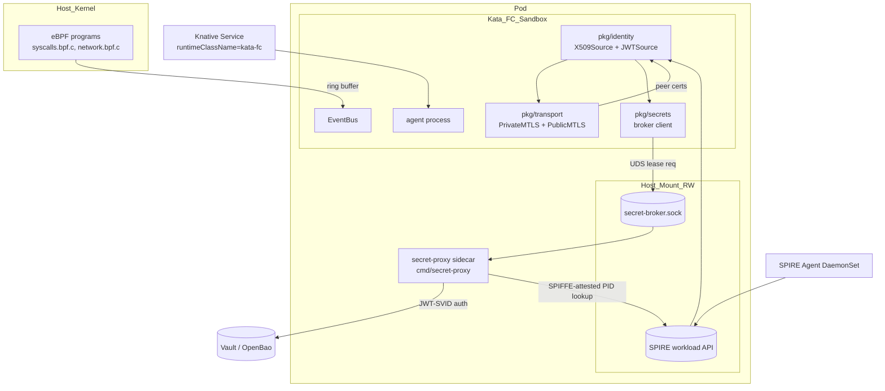

# Design Document — knative-agents

## Overview

knative-agents is composed of a small set of Go packages with sharply
defined interfaces, two binaries (`agent`, `secret-proxy`) co-located in
a Kubernetes Pod, and a fleet of eBPF programs loaded on the host. This
document maps each requirement in `requirements.md` to one or more
components and explains the chosen design.

## Steering Document Alignment

### Technical Standards (`steering/tech.md`)
- Go 1.24, cilium/ebpf, go-spiffe/v2, OTel, gRPC.
- Kata + Firecracker RuntimeClass (`kata-fc`) is the default; gVisor is
  the supported fallback for managed K8s without KVM. Anything outside
  the hardened set requires an explicit `allowHostRuntime=true` override.
- Trust domain `stigen.ai`, three modes (insecure/permissive/strict).

### Project Structure (`steering/structure.md`)
- Hexagonal: `pkg/<concern>` → small interface + default impl,
  `cmd/<binary>` wires them.
- DAG: identity ← transport,secrets ← agent. No package above
  `pkg/identity` is imported by it.

## Code Reuse Analysis

### Existing Components to Leverage
- **SPIRE workload API on CSI volume**: existing infra-blocks pattern
  reused; no new SPIRE deployment required.
- **ClusterSPIFFEID CRD**: existing convention; we add a chart-rendered
  template that binds the agent ServiceAccount → SPIFFE ID.
- **Vault / OpenBao** if already deployed in the cluster; otherwise the
  chart can deploy OpenBao as a dependency.

### Integration Points
- **SPIRE Agent**: read SVIDs over `unix:///run/spire/agent-sockets/api.sock`.
- **Knative Serving**: agent runs as `Service.serving.knative.dev/v1` with
  `runtimeClassName: kata-fc` (or the preset-mapped equivalent) and a sidecar.
- **Vault**: broker uses Vault HTTP API with K8s/JWT auth backed by SPIRE.

## Architecture



### Modular Design Principles
- **Single File Responsibility**: e.g.
  `pkg/identity/x509_source.go`, `pkg/identity/jwt_source.go`,
  `pkg/identity/authorizer.go`.
- **Component Isolation**: every `pkg/...` exports an interface plus a
  default constructor. Tests can substitute fakes without touching real
  SPIRE/Vault.
- **Service Layer Separation**:
  - **Driver layer** (sockets, eBPF) at the bottom.
  - **Domain layer** (identity, secrets, transport) in the middle.
  - **Wiring layer** (`cmd/agent`, `cmd/secret-proxy`) at the top.

## Components and Interfaces

### `pkg/identity`
- **Purpose:** Workload identity via SPIFFE.
- **Interfaces:**
  - `type Source interface { X509Source() *workloadapi.X509Source; JWTSource() *workloadapi.JWTSource; Mode() Mode }`
  - `type Authorizer interface { Authorize(*x509svid.SVID) error }`
- **Dependencies:** `go-spiffe/v2`.
- **Reuses:** existing `stigen.ai` trust domain, ClusterSPIFFEID CRDs.
- **Implements:** R-IDN-1, R-IDN-2, R-IDN-3.

### `pkg/transport`
- **Purpose:** mTLS listeners + dialers (private + public).
- **Interfaces:**
  - `type Listener interface { net.Listener; PeerID(net.Conn) (spiffeid.ID, bool) }`
  - `type Dialer interface { DialContext(ctx, addr) (net.Conn, error) }`
  - `func PrivateListener(cfg PrivateConfig, src identity.Source) (Listener, error)`
  - `func PublicListener(cfg PublicConfig, src identity.Source) (Listener, error)`
- **Dependencies:** `pkg/identity`, `crypto/tls`, `google.golang.org/grpc`.
- **Implements:** R-MTL-1, R-MTL-2.

### `pkg/secrets`
- **Purpose:** Client + server for the kloak-style broker, plus pluggable
  backends.
- **Interfaces:**
  - `type Client interface { Lease(ctx, name) (Lease, error); Refresh(ctx, Lease) (Lease, error) }`
  - `type Backend interface { Fetch(ctx, principal spiffeid.ID, name string) (Lease, error) }`
  - `type Lease struct { Name string; Value []byte; ExpiresAt time.Time }`
- **Wire format**: length-prefixed protobuf over UDS.
- **Authn**: server reads `SO_PEERCRED`, asks SPIRE
  `Attest()`-style API for the principal, then enforces a policy.
- **Implements:** R-SEC-1, R-SEC-2, R-SEC-3.

### `pkg/sandbox`
- **Purpose:** Tag agent Pods with the right RuntimeClass and classify
  isolation guarantees in a typed way so callers don't string-match.
- **Interfaces:**
  - `type Kind string` — `kata-fc | kata-qemu | kata-clh | gvisor | runc`
  - `func (k Kind) IsMicroVM() bool` — true for any Kata variant
  - `func (k Kind) IsHardened() bool` — true for everything except `runc`
  - `type Spec struct { RuntimeClass string; AllowHostEscape bool }`
  - `func DefaultSpec() Spec` returns `{RuntimeClass: "kata-fc"}`.
- **Implements:** R-SBX-1, R-SBX-2 (the latter mostly via deployment
  manifests + sample BPF probe).

### `pkg/ebpf`
- **Purpose:** Load CO-RE BPF programs, expose ring buffer events as a
  typed `EventBus`.
- **Interfaces:**
  - `type Loader interface { Load(progs ...Program) (Manager, error) }`
  - `type Manager interface { Detach(); Events() <-chan Event }`
  - `type EventBus interface { Subscribe(string) <-chan Event; Close() }`
- **Implementation:** wraps `cilium/ebpf` `CollectionSpec`, ring buffer
  reader.
- **Implements:** R-EBP-1, R-EBP-2.

### `pkg/runtime`
- **Purpose:** Lifecycle (`Start`, `Drain`, `Stop`), readiness gating.
- **Interfaces:**
  - `type Service interface { Start(ctx) error; Drain(ctx) error; Stop(ctx) error; Ready() bool }`
  - `type Manager interface { Register(Service); Run(ctx) error }`
- **Implements:** R-RUN-1, R-RUN-2.

### `pkg/config`
- **Purpose:** Typed YAML config with env override.
- **API:** `func Load[T any](path string) (T, error)`.

### `pkg/observability`
- **Purpose:** OTel tracer + meter providers, log shipping.
- **API:** `func Init(ctx, cfg) (shutdown func(context.Context) error, error)`.

### `pkg/health`
- **Purpose:** `/healthz` and `/readyz` HTTP handlers wired to runtime.

## Data Models

### Lease
```go
type Lease struct {
    Name      string
    Value     []byte // never persisted; cleared on Expire
    Issued    time.Time
    ExpiresAt time.Time
    Audience  spiffeid.ID
}
```

### Event (eBPF)
```go
type Event struct {
    Source    string         // "syscalls" | "network" | ...
    PID       uint32
    Cgroup    uint64
    Timestamp time.Time
    Payload   []byte         // typed by Source
}
```

### IdentityMode
```go
type Mode string
const (
    ModeInsecure   Mode = "insecure"
    ModePermissive Mode = "permissive"
    ModeStrict     Mode = "strict"
)
```

### AgentConfig (top-level YAML)
```yaml
mode: strict                 # insecure | permissive | strict
trustDomain: stigen.ai
identity:
  workloadAPI: unix:///run/spire/agent-sockets/api.sock
transport:
  private:
    addr: 0.0.0.0:8443
    authorize: spiffe://stigen.ai/ns/agents
  public:
    addr: 0.0.0.0:8444
    certPath: /etc/tls/tls.crt
    keyPath:  /etc/tls/tls.key
secrets:
  brokerSocket: /run/secret-broker/secret-broker.sock
  maxLeaseTTL: 15m
ebpf:
  programs: ["syscalls", "network"]
runtime:
  drainTimeout: 30s
  shutdownTimeout: 5s
sandbox:
  runtimeClass: kata-fc
observability:
  otlpEndpoint: otel-collector.observability:4317
```

## Error Handling

### Error Scenarios
1. **SVID never issued.** Source blocks until `IdentityBootTimeout`,
   then returns `errors.Is(..., identity.ErrBootTimeout)` and the agent
   exits non-zero. K8s restart-policy retries.
2. **Workload API disconnect mid-run.** Source enters degraded state;
   `Source.Mode()` becomes `ModeDegraded`, listeners stop accepting new
   connections, existing ones complete.
3. **Broker UDS missing.** Agent retries with backoff up to
   `BrokerBootTimeout`; readiness gate fails; Pod marked `NotReady`.
4. **Vault unreachable from broker.** Broker returns `ErrBackendDown`;
   leases issued from cache up to TTL, no new leases issued.
5. **BPF program verify fails.** Loader returns `ErrVerifierRejected`
   with offending program; agent logs and exits non-zero.
6. **Sandbox runtime unavailable on node.** Pod stays `Pending` with
   descriptive event. Either kata-deploy hasn't installed `kata-fc` on
   the node, or `/dev/kvm` is missing. Chart hint surfaces both
   possibilities and points at the matching `sandbox.preset` value.

## Testing Strategy

### Unit Testing
- `pkg/identity`: in-memory `workloadapi` fake (`spiffe/spire-api-sdk`
  test server); rotation simulated by ticking time.
- `pkg/transport`: `httptest.Server` wrapping our listener; assert peer
  ID extraction.
- `pkg/secrets`: in-memory backend; rapid generators for principals,
  policies, lease lifecycles.
- `pkg/ebpf`: skipped on non-Linux with `//go:build linux`. Linux: a
  micro probe loaded into a pinned map.

### Integration Testing
- `kind` cluster with SPIRE installed via Helm.
- Agent + broker deployed under `runtimeClassName=runc` (kind has no
  Kata or gVisor on common kind images) but with
  `featureGates.SkipSandboxCheck=true` for tests.
- End-to-end: client dials `PrivateMTLS`, agent fetches a secret via
  the broker, returns success; chaos: SVID rotated mid-flight.

### End-to-End Testing
- Real cluster (we provide scripts to spin up bare-metal+kata-fc, AKS+
  kata-cc-isolation, or GKE+gvisor as the three reference targets).
- Knative Service deployed; `wrk` measures cold start; e2e suite
  validates Section 3 of `requirements.md` end to end.

## Verification

### Formal Model (Quint)
Located in `spec/quint/`. Key invariants:
- `IdentityNeverEmpty`: between two times $t_1 < t_2$ where $t_1 < t_2 \le t_1 + \texttt{lifetime}$, there is always a valid SVID.
- `LeaseImpliesAuthorized`: every lease in the broker's `issued` set
  has its principal in the policy.
- `NoEscape`: every event delivered to the agent is tagged with the
  sandbox cgroup ID.

### Property Tests (rapid)
- `BrokerProperty_PolicyAuth`: for arbitrary policies, calls from a
  non-listed SPIFFE ID always return `ErrUnauthorized`.
- `BrokerProperty_LeaseTTLBounded`: every issued lease has TTL ≤ max.
- `IdentityProperty_RotationMonotonic`: every observed SVID is newer
  than (or equal to) the previous.
