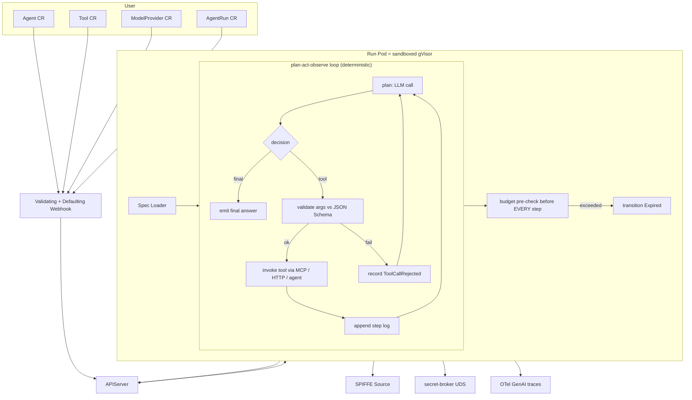

# Design — smol-agents-agent-model

## Overview

The agent-model layer is six declarative CRDs plus a deterministic Go
runtime that interprets them. The CRDs are *what an agent is*; the
runtime is *how an agent runs*. Both are versioned and verifiable.

## Steering Document Alignment

### Technical Standards (`steering/tech.md`)
- Go 1.26, controller-runtime, Kubebuilder.
- OTel GenAI semantic conventions for telemetry.
- MCP for tool transport.
- SPIFFE for identity, kloak-style broker for secrets.

### Project Structure (`steering/structure.md`)
- API types under `pkg/agentmodel/v1/` (kept here, not under
  `operator/`, so non-operator consumers can import them).
- Runtime under `pkg/agentruntime/`.
- Quint model in `spec/quint/agent_execution.qnt`.

## Code Reuse Analysis

### Existing Components to Leverage
- **`pkg/identity`** — Run Pods get a SPIFFE-aware Source.
- **`pkg/secrets`** — Provider keys and tool credentials enter via
  the broker; agents never read them directly.
- **`pkg/sandbox`** — `RuntimeClass` propagation.
- **`pkg/transport`** — internal `Tool kind=agent` calls go over
  private SPIFFE mTLS.
- **OTel stack** in `pkg/observability` — agents publish via the
  same OTel collector.

### Integration Points
- **Operator** (`smol-agents-operator`): the operator can render
  `Agent` CRs into the Pod templates it already produces; the
  agent-model layer is independent though, and can also be consumed
  by users not running our operator (they bring their own
  controller).
- **MCP servers** in the cluster: referenced by `Tool` URLs; can be
  Knative `Service`s or generic `Service`s.

## Architecture



## Components and Interfaces

### `pkg/agentmodel/v1/`
- **Purpose:** Declarative CR types.
- **Files:**
  - `types_agent.go` — `Agent`, `AgentSpec`, `AgentStatus`
  - `types_tool.go` — `Tool`, `ToolSpec` (kind discriminator)
  - `types_provider.go` — `ModelProvider`
  - `types_run.go` — `AgentRun`, `RunSpec`, `RunStatus`,
    `Step`, `Usage`, lifecycle constants
  - `types_session.go` — `AgentSession`
  - `types_policy.go` — `AgentPolicy`
  - `budget.go` — `Budget` and the canonical
    `Budget.Allows(usage Usage) bool`
  - `lifecycle.go` — `Phase` enum, transition table
  - `validation.go` — schema validators called by the webhook
  - `register.go` — scheme registration

### `pkg/agentruntime/`
- **Purpose:** The deterministic plan-act-observe executor.
- **Interfaces:**
  - `LLM` — `Chat(ctx, req) (resp, error)`. Implementations:
    `OpenAILLM`, `AnthropicLLM`, `LocalLLM`, `FakeLLM`.
  - `ToolInvoker` — `Invoke(ctx, tool, args) (Observation, error)`.
    Implementations: `MCPInvoker`, `HTTPInvoker`, `AgentInvoker`,
    `InProcessInvoker` (tests only).
  - `Clock` — wall-clock; tests inject `FakeClock`.
  - `Executor` — the loop; `Run(ctx, *Agent, *AgentRun) (*RunStatus, error)`.

- **Determinism:** `Executor` does no RNG outside `rand.New(rand.NewSource(seed))`,
  no `time.Now()` outside `Clock`, no goroutines for in-loop work.

### `pkg/agentmodel/runtime/contract.go`
The wire contract between the controller and the Run Pod:

```go
type StepRequest struct {
    Run         RunRef
    Decision    LLMDecision        // from previous Plan
    Now         time.Time
    BudgetLeft  Usage
}

type StepResponse struct {
    NextDecision *LLMDecision      // present unless terminal
    ToolCall     *ToolCall
    Observation  *Observation
    Final        *FinalAnswer
    Audit        StepAudit
}

type ToolCall struct {
    Name string
    Args json.RawMessage           // validated against tool.inputSchema
}

type Observation struct {
    Output    json.RawMessage      // validated against tool.outputSchema
    Error     string
    DurationMs int64
}
```

## Data Models

### `AgentSpec`
```go
type AgentSpec struct {
    Model         ModelRef       `json:"model"`
    Instructions  string         `json:"instructions"`
    Tools         []ToolRef      `json:"tools,omitempty"`
    Memory        *MemoryRef     `json:"memory,omitempty"`
    Budget        Budget         `json:"budget"`
    Identity      IdentitySpec   `json:"identity,omitempty"`
    Sandbox       SandboxSpec    `json:"sandbox,omitempty"`
    Replicas      *int32         `json:"replicas,omitempty"`
    GracefulCancel *time.Duration `json:"gracefulCancelTimeout,omitempty"`
}

type Budget struct {
    MaxSteps             int32 `json:"maxSteps"`
    MaxTokens            int64 `json:"maxTokens"`
    MaxWallClockSeconds  int32 `json:"maxWallClockSeconds"`
    MaxToolCalls         int32 `json:"maxToolCalls"`
}
```

### `RunStatus`
```go
type RunStatus struct {
    State              Phase           `json:"state"`
    StartedAt          *metav1.Time    `json:"startedAt,omitempty"`
    EndedAt            *metav1.Time    `json:"endedAt,omitempty"`
    Steps              []Step          `json:"steps"`
    Usage              Usage           `json:"usage"`
    TerminationReason  string          `json:"terminationReason,omitempty"`
    Output             *json.RawMessage `json:"output,omitempty"`
    Conditions         []metav1.Condition `json:"conditions"`
}

type Phase string
const (
    PhasePending        Phase = "Pending"
    PhaseRunning        Phase = "Running"
    PhaseRequiresAction Phase = "RequiresAction"
    PhaseCompleted      Phase = "Completed"
    PhaseFailed         Phase = "Failed"
    PhaseCancelled      Phase = "Cancelled"
    PhaseExpired        Phase = "Expired"
)
```

### `Tool kinds`
```go
type ToolKind string
const (
    ToolMCP      ToolKind = "mcp"      // MCP server URL
    ToolHTTP     ToolKind = "http"     // generic HTTP+JSON
    ToolAgent    ToolKind = "agent"    // sub-agent reference
    ToolFunction ToolKind = "function" // in-process function (testing only)
)
```

## Error Handling

1. **Tool not found** → Run state `Pending`, condition
   `ToolMissing`. Polled until tool appears or timeout.
2. **Tool input fails schema** → Step recorded as
   `kind=ToolCallRejected`, Run continues; LLM is told the call was
   rejected with the validation error.
3. **Tool returns malformed output** → Step recorded as
   `ObservationRejected`, Run continues; observation message
   replaced with `{"error":"output schema mismatch"}`.
4. **LLM provider error** → retried up to `RetryPolicy.MaxAttempts`
   with backoff; if exhausted, Run → `Failed` with reason
   `ProviderUnavailable`.
5. **Budget exceeded** → Run → `Expired` with
   `terminationReason=budget:<axis>`.
6. **Cancellation** → Run → `Cancelled` within
   `gracefulCancelTimeout`.
7. **Crash mid-Run** → controller restarts the Run from the last
   committed Step; deduplication via `StepAudit.RequestID`.

## Testing Strategy

### Unit Testing
- `Budget.Allows(Usage)` truth table.
- `lifecycle.CanTransition(from, to)` truth table.
- JSON Schema validators on representative tool schemas.
- DeepCopy round-trip via `runtime.Object` interface.

### Integration Testing
- **Executor against `FakeLLM` + `InProcessInvoker`**:
  - Run with budget that should expire — verify state.
  - Run with disallowed tool — verify rejection.
  - Run with seed → repeat → byte-identical step log.

### Property Testing (rapid)
- `BudgetNeverExceeded`: arbitrary Agent + tool latencies + token
  counts — final Usage ≤ Budget on every axis.
- `OnlyAllowedToolsCalled`: arbitrary tool sets — Run never invokes
  a tool whose name is not in `Agent.spec.tools`.
- `LifecycleProgresses`: every started Run reaches a terminal state
  within `maxWallClockSeconds + ε`.
- `Determinism`: same seed + same FakeLLM script → identical step
  log.

### Formal Model — `spec/quint/agent_execution.qnt`
Variables: `phase`, `stepsTaken`, `tokensUsed`, `wallClock`,
`toolCallsTaken`, `toolsAllowed`, `lastToolCalled`.
Actions: `start`, `plan`, `tool`, `observe`, `finalize`,
`cancel`, `tickClock`.
Invariants:
- `BudgetNeverExceeded`: `stepsTaken ≤ maxSteps ∧ tokensUsed ≤ maxTokens
   ∧ wallClock ≤ maxWallClockSeconds ∧ toolCallsTaken ≤ maxToolCalls`.
- `OnlyAllowedToolsCalled`: `lastToolCalled = "" ∨ toolsAllowed.contains(lastToolCalled)`.
- `LifecycleProgresses`: `phase ∈ {Pending, Running, RequiresAction}` →
  reachable terminal phase.
- `RunsTerminate`: from any state, finitely many steps reach a
  terminal state (run as `--max-steps` bound + invariant on counter).

## Verification

`make verify-formal` runs the new file alongside the existing three
Quint specs. CI's `formal` job picks it up via the existing globbing
pattern.
