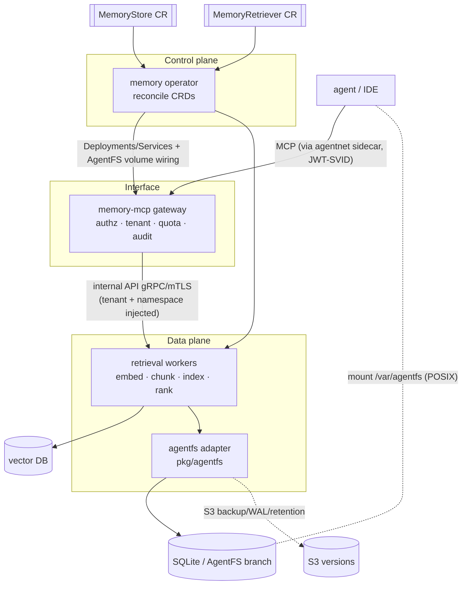

# Design Document — smol-agents-memory

## Overview

A memory subsystem with a **clean three-plane split**:

- **Control plane** — the operator reconciles two new CRDs (`MemoryStore`,
  `MemoryRetriever`) into running infrastructure and owns backend lifecycle.
- **Data plane** — **retrieval workers** own embedding, chunking, indexing,
  ranking, and the backend adapters (vector / graph / KV / event log /
  **filesystem (Turso AgentFS)**).
- **Interface** — a thin **MCP server** (`memory-mcp`) is the agent-facing
  access layer. It translates MCP tools/resources into the internal retrieval
  API and enforces identity, tenant isolation, quotas, audit, and policy. It
  owns **no indexing logic**, so it's swappable and can be joined by other
  protocol front-ends without touching the engine.

Agents reach `memory-mcp` the same way they reach any MCP tool today
(`Tool kind=mcp`), through their identity-aware **agentnet** sidecar. The
**filesystem** modality additionally **mounts** into the agent sandbox (reusing
the existing AgentFS volume mechanism), so a coding agent does normal file I/O
*and* the same SQLite-canonical filesystem is reachable over MCP.

## Steering Document Alignment

### Technical Standards (`.spec-workflow/steering/tech.md`)
- **Go 1.26**, hexagonal: `pkg/memory` exports interfaces (`Backend`,
  `Retriever`, internal API) with default impls wired in the binaries.
- **gRPC + mTLS** (go.opentelemetry.io/otel traced) for the internal
  gateway↔worker API — the steering-blessed in-mesh transport.
- **go-spiffe/v2** JWT-SVID for agent→gateway auth and tenant derivation;
  **pkg/secrets** broker for all backend credentials; **OTel** for audit/traces.
- Reuses **pkg/agentfs** (SQLite-canonical backup/restore/WAL/retention) for the
  filesystem modality rather than introducing a new persistence engine.

### Project Structure (`.spec-workflow/steering/structure.md`)
- New `pkg/memory/` (interfaces + internal API + MCP mapping + policy/quota/audit).
- New binaries `cmd/memory-mcp` (gateway) and `cmd/memory-worker` (data plane),
  Dockerfiles under `deploy/docker/`.
- New CRDs in `pkg/agentmodel/v1` (pure) + `operator/api/agentmodel/v1` (k8s
  wrappers, group `runtime.agents.smol-agents.ai`); controller under
  `operator/internal/controllers/memory/`.
- DAG preserved: `memory-mcp → pkg/memory(api) + identity`; `memory-worker →
  pkg/memory + pkg/agentfs + secrets(client) + ModelProvider`; operator →
  builders. No cycle into the gateway.

## Code Reuse Analysis

### Existing Components to Leverage
- **operator reconciliation spine** (`operator/internal/controllers`, builders,
  aggregator/status) — the new controller follows the `AgentNetwork`/`AgentNodePool`
  pattern (CRD → Deployment/Service + status conditions).
- **`pkg/agentmodel/v1`** — `AuthRef` (broker reference), `ModelProvider`
  (embedding model + broker creds), the CRD authoring + deepcopy conventions.
- **`pkg/secrets`** — backend credentials (vector DB DSN, S3 keys, embedding API
  key) are broker-resolved; never literals in the CRD or env.
- **`pkg/identity`** — JWT-SVID validation + trust domain → tenant derivation.
- **`pkg/agentfs`** — the **filesystem modality is this package**: `Manager`
  (Backup/Restore/WAL/Retention), `Storage`/`S3` driver interfaces, SQLite
  canonical state. The CRD reuses `AgentFSSpec`/`BackupPolicy`/`RestorePolicy`.
- **`operator/internal/builders/agentrun.go`** — already mounts the AgentFS
  volume + sidecar into an agent pod; the FS-mount path reuses this builder.
- **`Tool kind=mcp` + agentnet egress proxy** — agents reach `memory-mcp` as a
  normal MCP tool through their identity-injecting sidecar (+ eBPF allow-list).

### Integration Points
- **MCP** (streamable-HTTP transport) — `tools/list`, `tools/call`,
  `resources/list`, `resources/read`.
- **Turso AgentFS** — SQLite-backed branchable FS; engine already vendored via
  `pkg/agentfs` (`modernc.org/sqlite`).
- **Embedding providers** — via `ModelProvider` (OpenAI/Bedrock/local), creds via
  broker.
- **SPIRE** — JWT-SVID issuance + validation.

## Architecture



### Modular Design Principles
- **Single responsibility per plane**: gateway = access control + protocol;
  workers = retrieval engine; operator = lifecycle. None reaches into another's
  job (the gateway has no embedding code; the worker has no MCP code).
- **Pluggable backends**: one `Backend` adapter per `kind`; adding graph/KV
  changes neither the gateway nor the internal API.
- **Defense in depth**: tenant/namespace enforced at the gateway AND re-checked
  at the worker.

## Components and Interfaces

### 1. MCP gateway (`cmd/memory-mcp`, `pkg/memory/mcp`)
- Serves MCP over streamable-HTTP. On each call: validate JWT-SVID
  (`pkg/identity`) → derive tenant → resolve `retrieverRef` (cache of
  `MemoryRetriever`) → policy check (deny-by-default) → quota check → **inject
  tenant + namespace filter** → call the worker → audit → map result/error to MCP.
- Stateless; no backend creds; no index logic (R-MEM-MCP-3 / R-MEM-SEC-1).

### 2. Retrieval worker (`cmd/memory-worker`, `pkg/memory/worker`)
- gRPC server implementing the internal API. Embeds via `ModelProvider`, chunks,
  ranks, and dispatches to a `Backend`. Re-validates tenant/namespace.
- `Backend` interface: `Retrieve`, `Write`, `Get`, `Delete`, `ListNamespaces`,
  `Summarize`; FS adds `Branch`, `Snapshot`, `ListBranches`.

### 3. AgentFS adapter (`pkg/memory/backend_agentfs.go`)
- Implements `Backend` over a Turso AgentFS branch: file read/write/list map to
  the SQLite-canonical FS; `Branch` = AgentFS CoW fork; `Snapshot` = a
  `pkg/agentfs.Manager` full+WAL S3 version; `Restore` = manager restore.
- Mount: the worker (or the agent's AgentFS sidecar) exposes the branch at
  `mountPath`; the operator wires the volume into referencing agents.

### 4. Vector adapter (`pkg/memory/backend_vector.go`)
- First-class P1 backend (pgvector/qdrant) behind the same `Backend` interface.

### 5. Operator controller (`operator/internal/controllers/memory`)
- Reconciles `MemoryStore`+`MemoryRetriever` → worker Deployment + `memory-mcp`
  Deployment/Service + RBAC; resolves broker creds; for FS+mount, annotates/wires
  referencing agents to mount the AgentFS volume (reuse `agentrun.go`). Surfaces
  status; tears down per-retriever resources on delete.

## Data Models

### CRDs (`pkg/agentmodel/v1`, group `runtime.agents.smol-agents.ai`)
```go
type MemoryStoreSpec struct {
    Kind     string   // vector | graph | kv | eventlog | filesystem
    Driver   string   // pgvector | qdrant | neo4j | redis | agentfs
    Endpoint string
    Auth     *AuthRef            // broker-resolved creds
    Tenancy  TenancySpec         // shared(tenantLabelKey) | dedicated
    AgentFS  *AgentFSSpec        // reused as-is when kind=filesystem
}

type MemoryRetrieverSpec struct {
    Stores           []string            // MemoryStore refs
    ModelProviderRef string              // embedding model (existing CRD)
    TopK             int32               // default + clamped by quota
    Namespaces       []string            // allow-list
    Tenant           string
    Chunking         ChunkSpec
    Mount            *MountSpec          // FS: enable mount + mountPath (R-MEM-FS-2)
    Policy           []MemoryGrant       // deny-by-default (identity,op,namespace)
    Quota            QuotaSpec
    MutationsTraT    bool                // R-MEM-AUTH-3
}
```
Both carry a `status{phase, boundWorkers, conditions}`. Reproducible via
controller-gen (R-MEM-API-3).

### Internal API (gRPC, `pkg/memory/api`)
`Retrieve · Write · Get · Delete · ListNamespaces · Summarize · BranchFS ·
SnapshotFS · ListBranches`. Every request carries the gateway-derived
`tenant` + `namespace` + caller SPIFFE id (re-checked by the worker).

### MCP mapping
| MCP tool/resource | internal RPC |
|---|---|
| `retrieve_memory` | `Retrieve` |
| `write_memory` | `Write` |
| `get_memory` / `memory://documents/{id}` / `memory://files/{ref}/{path}` | `Get` |
| `delete_memory` | `Delete` |
| `list_memory_namespaces` / `memory://namespaces/{ns}` | `ListNamespaces` |
| `summarize_memory` | `Summarize` |
| `branch_memory_fs` / `snapshot_memory_fs` / `list_memory_branches` / `memory://branches/{agentId}` | `BranchFS`/`SnapshotFS`/`ListBranches` |

## Error Handling
- Typed errors map to MCP errors and audit reasons: `Unauthenticated` (no/invalid
  SVID), `PermissionDenied` (policy/tenant), `QuotaExceeded`, `NotFound`,
  `BackendUnavailable`. All **fail closed** — never an unscoped/anonymous fallback
  (R-MEM-SEC-1). A worker backend failure surfaces as `BackendUnavailable`, never
  a partial cross-tenant leak.

## Testing Strategy
- **Unit**: `Backend` adapters (vector + agentfs reusing `pkg/agentfs` fakes),
  tenant-injection + cross-tenant denial, policy deny-by-default, quota clamping,
  MCP↔RPC mapping, audit-record shape (asserts no content/creds present).
- **Property** (`pgregory.net/rapid`): no (identity, query) combination ever
  returns an out-of-tenant/out-of-namespace document.
- **Formal** (`spec/quint/memory_access.qnt`): "a document is returned only to an
  identity granted read on its namespace within its tenant; mutation only with
  granted write (+ TraT when required)" — wire into `make verify-formal`.
- **e2e** (extend the gti/L1 secretless pattern): deploy `memory-mcp` + worker +
  a vector backend + an agentfs branch; an attested agent retrieves/writes,
  **mounts** the FS and reads a written file back, and a second tenant is denied —
  via an in-cluster probe scenario.

## Open Questions
- MCP transport: streamable-HTTP only, or also stdio for local IDEs?
- Embedding cache location (worker-local vs. shared) and invalidation.
- Branch merge semantics (publish = fast-forward vs. 3-way) — P2.
- Episodes (`memory://episodes/{agentId}`) data model: derive from event log vs.
  first-class store — P2.

## Phasing
- **P1**: CRDs + validation + deepcopy; `memory-mcp` gateway (retrieve/write/get/
  delete/list); vector adapter; **agentfs adapter + mounting**; auth/tenant/
  policy/quota/audit; operator reconcile; quint invariant; e2e; docs.
- **P2**: `summarize_memory`; graph/KV/eventlog adapters; `episodes` resource;
  TraT-required mutations end-to-end; branch merge; stdio MCP transport.
