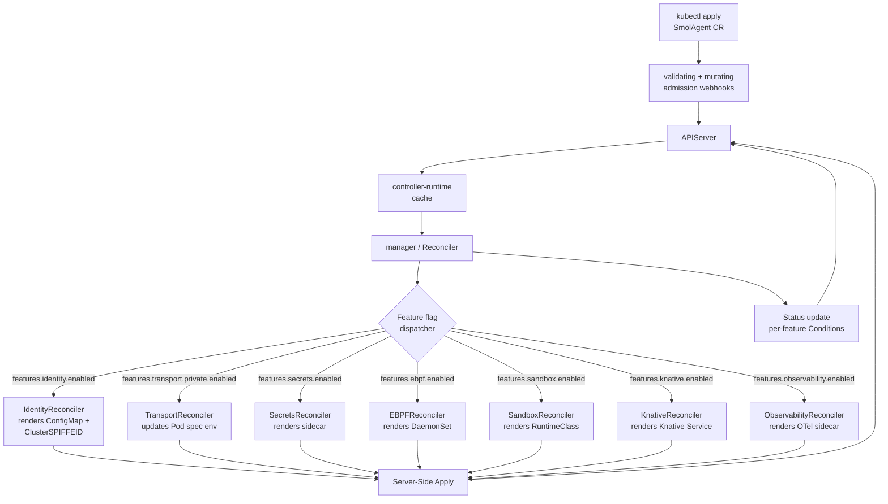

# Design — smol-agents-operator

## Overview

The operator is a Kubebuilder-built controller manager that watches two
custom resources (`SmolAgent` namespaced and `SmolAgentPlatform`
cluster-scoped) and reconciles each enabled feature flag into a
matching set of native Kubernetes objects. It is a thin orchestration
layer over the validated `pkg/...` libraries already in this repo —
the operator does **not** reimplement identity, transport, or secrets;
it produces the manifests that wire those libraries into Pods.

## Steering Document Alignment

### Technical Standards (`steering/tech.md`)
- Go 1.26, controller-runtime, Kubebuilder ≥ 4.5.
- All transports already described in `tech.md` are reused via the
  agent runtime image.

### Project Structure (`steering/structure.md`)
- New top-level directory `operator/` containing the Kubebuilder
  scaffolding, kept in the same Go module.
- Public API types live under `operator/api/v1/`.
- Per-feature reconcilers live under
  `operator/internal/controllers/features/<name>.go`.

## Code Reuse Analysis

### Existing Components to Leverage
- **`pkg/identity`** — operator drops the same `identity.Source`
  config into the agent ConfigMap.
- **`pkg/transport`** — listener config templates.
- **`pkg/secrets`** — sidecar config + policy.
- **`pkg/sandbox`** — RuntimeClass selection.
- **`pkg/ebpfloader`** — DaemonSet config.
- **`deploy/helm/templates/`** — the operator translates the same
  manifest shapes; we extract the templated bits into Go builders to
  avoid drift.

### Integration Points
- **Existing Helm chart** — coexists for one minor version. Tenants
  migrate by `kubectl apply` of a `SmolAgent` CR; the operator
  refuses to manage resources whose owner reference is not its own
  CR (so it never steals chart-managed resources).
- **SPIRE / Vault** — unchanged; the operator only renders the
  ClusterSPIFFEID and the secret-proxy ConfigMap.
- **Knative Serving** — operator continues to render
  `serving.knative.dev/v1` `Service` when feature `knative` is on.

## Architecture



### Modular Design Principles
- **Feature reconcilers**: one file per feature, ≤ 200 lines, all
  conform to `FeatureReconciler` interface.
- **Builders**: pure functions `Build<Resource>(spec) -> Object`
  that take CR fields and return a typed Kubernetes object.
- **No business logic in cmd/**: all logic lives under
  `operator/internal/`.

## Components and Interfaces

### `operator/api/v1/smolagent_types.go`
- **Purpose:** Public CR shape for tenants.
- **Highlights:**
  ```go
  type SmolAgentSpec struct {
      TrustDomain string         `json:"trustDomain"`
      Features    Features       `json:"features"`
      Rollout     RolloutPolicy  `json:"rollout,omitempty"`
      // +optional
      ImageOverrides ImageSet    `json:"imageOverrides,omitempty"`
  }

  type Features struct {
      Identity      IdentityFeature      `json:"identity"`
      Transport     TransportFeature     `json:"transport"`
      Secrets       SecretsFeature       `json:"secrets"`
      Sandbox       SandboxFeature       `json:"sandbox"`
      EBPF          EBPFFeature          `json:"ebpf"`
      Knative       KnativeFeature       `json:"knative"`
      Observability ObservabilityFeature `json:"observability"`
  }
  ```
- Each `<Name>Feature` embeds `FeatureBase{Enabled bool;
  RolloutPolicy RolloutPolicy}` so flags share a uniform shape.

### `operator/api/v1/smolagentplatform_types.go`
- **Purpose:** Cluster-wide defaults and policy.
- **Highlights:**
  ```go
  type SmolAgentPlatformSpec struct {
      DefaultTrustDomain string             `json:"defaultTrustDomain"`
      Defaults           Features           `json:"defaults"`
      FeaturePolicy      []FeaturePolicyRow `json:"featurePolicy"`
      EBPFLoader         EBPFLoaderSpec     `json:"ebpfLoader,omitempty"`
      Canary             CanaryConfig       `json:"canary,omitempty"`
  }

  type FeaturePolicyRow struct {
      Feature        string `json:"feature"`         // R-OP-FF-5: must be in features.All()
      Allowed        bool   `json:"allowed"`
      DefaultEnabled bool   `json:"defaultEnabled"`
  }
  ```

### `operator/pkg/features/features.go`
- **Purpose:** Single source of truth for feature names. R-OP-FF-5.
- **Interface:**
  ```go
  type Feature string
  const (
      Identity      Feature = "identity"
      TransportPrivate Feature = "transport.private"
      TransportPublic  Feature = "transport.public"
      Secrets       Feature = "secrets"
      Sandbox       Feature = "sandbox"
      EBPF          Feature = "ebpf"
      Knative       Feature = "knative"
      Observability Feature = "observability"
  )
  func All() []Feature
  func ConditionType(f Feature) string  // e.g. "IdentityReady"
  ```

### `operator/internal/controllers/smolagent_controller.go`
- **Purpose:** Top-level reconciler.
- **Reconcile flow:**
  1. Fetch CR; if not found, return.
  2. Resolve `SmolAgentPlatform` defaults; merge into CR.
  3. Validate platform `featurePolicy` allows every enabled feature.
  4. For each feature in `features.All()`:
     - Look up the registered `FeatureReconciler`.
     - Call `Reconcile(ctx, cr, platform) (FeatureResult, error)`.
     - Update the matching Status condition.
  5. Aggregate readiness: CR `Status.Phase = Ready` iff every
     enabled feature is Ready.
  6. Emit events for transitions.

### `operator/internal/controllers/features/`
One file per feature implementing:
```go
type FeatureReconciler interface {
    Name() features.Feature
    Reconcile(ctx context.Context,
              cr *v1.SmolAgent,
              platform *v1.SmolAgentPlatform) (FeatureResult, error)
}

type FeatureResult struct {
    Ready   bool
    Reason  string
    Message string
    Owned   []client.Object   // resources to apply via SSA
}
```

### `operator/internal/webhooks/`
- **Validating webhook** (`smolagent_webhook.go`):
  - Enforces R-OP-WH-1 rules (insecure mode, runc gate, policy gate).
- **Mutating webhook** (`smolagent_defaulter.go`):
  - Fills in defaults from `SmolAgentPlatform`.
- **Conversion webhook** (`smolagent_conversion.go`):
  - vN ⇆ vN+1 round-trippable.

### `operator/cmd/manager/main.go`
- **Purpose:** Process entrypoint.
- **Setup:** controller-runtime manager with leader election,
  health/readiness probes, metrics endpoint, webhook server.

## Data Models

### `SmolAgentStatus`
```go
type SmolAgentStatus struct {
    ObservedGeneration int64                `json:"observedGeneration"`
    Phase              string               `json:"phase"`              // Pending | Reconciling | Ready | Failed
    Conditions         []metav1.Condition   `json:"conditions"`
    Features           map[string]FeatureStatus `json:"features"`
    Endpoints          Endpoints            `json:"endpoints,omitempty"`
}

type FeatureStatus struct {
    Enabled       bool        `json:"enabled"`
    Ready         bool        `json:"ready"`
    Mode          string      `json:"mode,omitempty"`
    Reason        string      `json:"reason,omitempty"`
    Message       string      `json:"message,omitempty"`
    LastTransitionTime metav1.Time `json:"lastTransitionTime"`
    OwnedResources []ResourceRef `json:"ownedResources,omitempty"`
}
```

### Feature flag default matrix (v1)

| Feature              | Default `enabled` | Default `mode`/extras           | Owned resources                        |
|----------------------|-------------------|---------------------------------|----------------------------------------|
| `identity`           | true              | `mode: strict`                  | ConfigMap, ClusterSPIFFEID             |
| `transport.private`  | true              | authorize: any-in-trust-domain  | (env on agent Pod)                     |
| `transport.public`   | **false**         | requires certPath/keyPath       | Service of type LoadBalancer if asked  |
| `secrets`            | true              | backend: static                 | secret-proxy sidecar + ConfigMap       |
| `sandbox`            | true              | runtimeClass: gvisor            | RuntimeClass (if absent)               |
| `ebpf`               | true              | preset: generic                 | DaemonSet, ConfigMap, ServiceAccount   |
| `knative`            | true              | scaleToZero: true               | Knative Service                        |
| `observability`      | true              | otlpEndpoint: cluster default   | env on Pods                            |

## Error Handling

### Error Scenarios
1. **`SmolAgentPlatform` missing** — every CR stuck in
   `Pending`, condition `Type=Ready, Reason=PlatformAbsent`.
2. **Feature prereq missing** (e.g. RuntimeClass not installed,
   SPIRE CRD missing) — feature condition `Reason=PrerequisitesUnmet,
   Message=<which prereq>`. Operator emits `Warning FeaturePrereqMissing`.
3. **Forbidden feature** (platform `featurePolicy.allowed=false`) —
   webhook rejects at submit time with structured error.
4. **CRD upgrade collision** — conversion webhook fails;
   operator surfaces `Warning ConversionFailed`, leaves the CR's
   data plane untouched.
5. **Reconcile loop on a feature** — controller-runtime backoff
   plus per-feature `feature_reconcile_errors_total` metric.
6. **Drift** — managed resources mutated by another field manager;
   operator re-applies via SSA on next reconcile (≤ 30 s P95).
7. **Operator crash** — leader election promotes the second
   replica; no data plane impact (R-OP non-functional reliability).

## Testing Strategy

### Unit Testing
- **Builder tests**: each `Build<Resource>` is a pure function;
  table-driven tests assert the produced manifest matches a golden
  fixture.
- **Feature reconciler unit tests** with envtest:
  - `enabled=false` → `Owned == nil`, condition Disabled.
  - `enabled=true, prereqs unmet` → condition PrerequisitesUnmet.
  - `enabled=true, prereqs met` → expected objects with owner refs.
- **Webhook unit tests**: validating, mutating, conversion.

### Integration Testing
- envtest spins up a real api-server; we install our CRDs and run
  reconciles against a fake cluster. Assert that:
  - All Conditions move from Unknown → True under happy path.
  - Toggling a flag causes resource creation/deletion.
  - Drift heals.

### End-to-End Testing
- `make test-e2e-operator`:
  1. `kind create cluster` (or reuse if `KIND_REUSE=1`).
  2. Install operator manifests (`make deploy-operator`).
  3. Apply `samples/smolagent-everything.yaml`.
  4. `kubectl wait --for=condition=Ready smolagent/sample`.
  5. Run a feature toggle script: turn each feature off then on,
     re-assert.
  6. Verify `kubectl get smolagent -o wide` columns.

## Verification

### Formal Model — `spec/quint/operator_lifecycle.qnt`
- States: `Pending`, `Reconciling`, `Ready`, `Failed`.
- Variables: per-feature `(enabled, prereqs_met, applied, ready)`.
- Actions: `EnableFeature(f)`, `DisableFeature(f)`,
  `PrereqArrives(f)`, `PrereqGoesAway(f)`, `Reconcile()`.
- Invariants:
  - `FeatureProgresses`: `enabled ∧ prereqs_met → eventually ready`.
  - `OwnerSafety`: `not enabled → not applied` (we never leak owned
    resources for disabled features).
  - `ReadyImpliesAllEnabledReady`: aggregate `Phase=Ready` ⇒
    every enabled feature is `ready`.
  - `NoForbiddenFeatures`: webhook policy holds — no `enabled` flag
    is set for a feature whose platform policy disallows it.

### Property Tests (rapid)
- `BuildIdentityResources` is idempotent: `Build(spec) == Build(spec)`.
- `Conversion` is round-trippable for arbitrary v1 specs.
- `FeatureFlagMatrix` round-trip through Marshal/Unmarshal yields
  the same `Features` struct.

### Operator-specific Tests
- **Soak test**: 200 CRs, randomized feature toggles every 5 s for
  10 minutes; assert reconcile error rate < 0.5%.
- **Upgrade test**: install `vN-1`, apply CRs, upgrade to `vN`,
  observe Conditions remain `Ready` throughout.

## Migration Strategy (Helm → Operator)

1. Operator coexists with chart for one minor release.
2. Tenants migrate by `kubectl apply -f smolagent.yaml`; the
   operator only adopts resources it created (owner-ref check).
3. A `knactl migrate` command (future) reads the chart's release
   values and produces an equivalent `SmolAgent` CR.
4. Once tenants are on the operator, deprecate the chart on the
   following minor.
