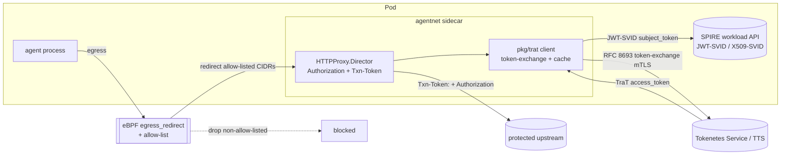

# Design Document — smol-agents-trat-egress

## Overview

Inject [Tokenetes](https://tokenetes.io/) Transaction Tokens (TraTs) into a
smol-agent's egress. The agent's outbound HTTP to a protected upstream is
already transparently redirected by the eBPF `egress_redirect` program to the
`pkg/agentnet/proxy` sidecar, whose `HTTPProxy.Director` stamps
`Authorization: Bearer <JWT-SVID>` on every request. This feature adds, at that
same seam, a short-lived **TraT** minted from the agent's SPIFFE identity and
conveyed in the **`Txn-Token`** header — so each egress request carries a
narrowly-scoped, identity-bound, seconds-lived credential instead of a static
secret.

**Division of labour (important, and the answer to "work with the eBPF proxy to
inject"):** eBPF cannot rewrite TLS-encrypted egress payloads. Its role is to
**capture** egress (redirect known CIDRs to the sidecar) and **constrain** it
(drop anything outside the allow-list). The **sidecar** the eBPF layer redirects
to performs the actual header injection (it originates the upstream TLS, so it
can add `Txn-Token`). Together: eBPF guarantees a TraT can only ever leave toward
an allow-listed destination; the sidecar guarantees every such request carries a
fresh, correctly-scoped TraT.

## Steering Document Alignment

### Technical Standards (`.spec-workflow/steering/tech.md`)
- go-spiffe/v2 for identity (the TraT `subject_token` is a JWT-SVID; the TTS
  connection is mTLS via X509-SVID). cilium/ebpf for the unchanged egress
  programs. No new kernel-side code.
- Trust domain `smol-agents.ai` maps to the TraT `aud` (trust domain) by default.
- Defense in depth: TraT is additive to mTLS + eBPF allow-list, not a
  replacement.

### Project Structure (`.spec-workflow/steering/structure.md`)
- New concern package `pkg/trat` (small interface + default impl), consumed by
  `pkg/agentnet/proxy`. DAG preserved: `pkg/trat` depends on `pkg/identity`
  only; nothing above the proxy imports it.

## Code Reuse Analysis

### Existing Components to Leverage
- **`pkg/agentnet/proxy/http.go` `HTTPProxy.Director`** — the existing injection
  point (sets `Authorization`). We add the `Txn-Token` header here.
- **`pkg/identity.Source` (JWTSource/X509Source)** — used both as the TraT
  `subject_token` and to mTLS-authenticate the TTS call. No new credential.
- **`AgentNetwork` `IdentityProxySpec` / `EgressPolicy`** — extend with TraT
  config; the eBPF redirect + allow-list machinery is reused unchanged.
- **`bpf/programs/egress_redirect.bpf.c` + `pkg/agentnet/cgroup`** — the
  capture + allow-list layer; no change.
- **`pkg/secrets` broker (optional)** — if the TTS needs a non-SPIFFE client
  credential, broker it rather than inlining (most deployments won't).

### Integration Points
- **Tokenetes Service (TTS)** — an in-cluster OAuth Token-Exchange endpoint
  (RFC 8693). The TraT shape (purp/azd/verification) is governed by the TTS's
  own `TraT` CRD (`tokenetes.io/v1alpha1`); we are a *requester*, configuring
  endpoint + scope + audience.
- **SPIRE workload API** — `subject_token` JWT-SVID source (already mounted).

## Architecture



### Modular Design Principles
- **`pkg/trat`**: one purpose — exchange a subject token for a TraT and cache it.
  Pure of HTTP-proxy concerns; testable with a fake TTS.
- **Proxy injection**: a single function `applyTraT(req, token)` setting the
  header; the proxy already owns request mutation.
- **Config mapping**: pure `ResourceTarget → trat.ExchangeParams`.

## Components and Interfaces

### 1. `pkg/trat` — TraT client
- **Purpose:** mint + cache TraTs via TTS token-exchange.
- **Interface:**
  ```go
  type Client interface {
      // Token returns a valid TraT for the given exchange params, minting
      // (and caching) one if none is cached or the cached one is near exp.
      Token(ctx context.Context, p ExchangeParams) (string, error)
  }
  type ExchangeParams struct {
      Scope    string // RFC 8693 scope (transaction intent)
      Audience string // trust domain
  }
  ```
- **Default impl:** holds the TTS URL + an `identity.Source`; builds the
  token-exchange POST (form-encoded), uses the JWT-SVID as `subject_token`,
  mTLS-dials the TTS with the X509-SVID, parses `access_token`, caches by
  `(sub, scope, audience)` until `exp − skew`.
- **Dependencies:** `pkg/identity`.

### 2. `HTTPProxy` TraT injection (`pkg/agentnet/proxy/http.go`)
- **Behaviour:** when `Resource.TraT != nil`, the Director calls
  `tratClient.Token(ctx, params)` and sets `req.Header.Set(header, token)`.
  On error it stamps `X-Agentnet-TraT-Error` so `jwtTransport.RoundTrip`
  returns 503 (fail closed, R-TRAT-SEC-1) — mirroring the existing JWT path.
- **Reuses:** the Director + `jwtTransport` short-circuit pattern already in
  place for JWT-SVID failures.

### 3. AgentNetwork config (`pkg/agentmodel/v1/agentnetwork.go`)
- Add `TraT *TraTInjection` to `ResourceTarget` and `TTS *TTSRef` to
  `IdentityProxySpec`; extend `validateIdentityProxy` (R-TRAT-API-1/2).

### 4. TTS authentication
- mTLS with the agent's X509-SVID is the default (TTS trusts the SPIRE bundle).
  If a TTS requires a client secret, source it through `pkg/secrets` (broker),
  never inline.

## Data Models

### CRD additions (`pkg/agentmodel/v1`)
```go
// On ResourceTarget:
TraT *TraTInjection `json:"trat,omitempty"`

type TraTInjection struct {
    Scope    string `json:"scope"`              // RFC 8693 transaction intent
    Audience string `json:"audience,omitempty"` // default: platform trust domain
    Header   string `json:"header,omitempty"`   // default: "Txn-Token"
}

// On IdentityProxySpec:
TTS *TTSRef `json:"tts,omitempty"`

type TTSRef struct {
    URL              string `json:"url"`                        // TTS token-exchange endpoint
    SubjectTokenType string `json:"subjectTokenType,omitempty"` // default: urn:ietf:params:oauth:token-type:jwt
    // Audience the JWT-SVID subject_token is minted for (the TTS's id).
    SubjectAudience  string `json:"subjectAudience,omitempty"`
}
```

### Token-exchange request (form-encoded, RFC 8693)
```
grant_type=urn:ietf:params:oauth:grant-type:token-exchange
requested_token_type=urn:ietf:params:oauth:token-type:txn_token
subject_token=<agent JWT-SVID>
subject_token_type=urn:ietf:params:oauth:token-type:jwt
audience=<trust domain>
scope=<resource.trat.scope>
```
Response: `{ "issued_token_type":"urn:ietf:params:oauth:token-type:txn_token",
"token_type":"N_A", "access_token":"<TraT JWT>" }`.

### TraT (consumed/forwarded; not minted by us)
JWT `typ: txntoken+jwt`, claims `iat`, `aud`, `exp`, `txn`, `sub`, `scope`,
`req_wl` (+ optional `tctx`/`rctx`). We treat it as opaque on egress and set it
as the `Txn-Token` header value verbatim.

## Error Handling
- TTS unreachable / non-2xx / unparseable ⇒ Director stamps a TraT error ⇒ 503
  to the agent (fail closed). Metric `dial_error{reason="trat:…"}`.
- `trat` set on a non-allow-listed resource ⇒ eBPF drops egress regardless
  (the TraT is never minted because the connection never reaches the sidecar /
  is dropped). Operator surfaces an AgentNetwork condition if misconfigured.
- Clock skew on `exp` handled by the cache skew margin.

## Testing Strategy
- **Unit:** `pkg/trat` against a fake TTS (golden token-exchange request;
  caching/refresh/skew; mTLS dial). `HTTPProxy` with a fake TraT client:
  asserts `Txn-Token` set + Authorization preserved; TTS error ⇒ 503.
- **Validation:** webhook rejects `trat` on tcp resources / missing TTS.
- **e2e (L1/L2):** a `fake-tts` fixture (issues a static TraT) + an
  AgentNetwork with a TraT resource; assert the upstream (`fake-gateway`) sees
  the `Txn-Token` header, and that eBPF drops egress to a non-allow-listed host
  even when `trat` is set (no token leaves). New scenario `R-E2E-SCN-TRAT`.
- **Formal:** extend `spec/quint/agentnet.qnt` (or a new `trat.qnt`) with the
  invariant "a TraT is only ever attached to egress permitted by the policy."

## Open Questions
1. **subject_token type** — JWT-SVID directly (default), or exchange the SVID at
   an OAuth IdP first? Default: JWT-SVID; the TTS trusts the SPIRE bundle.
2. **scope source** — static per-resource `scope` (P1) vs deriving scope/`rctx`
   from the actual outbound request (method/path) for finer transactions (P2).
3. **Transparent (non-resource) egress** — P1 covers the per-resource HTTP proxy
   (clean header insertion). Injecting into arbitrary eBPF-redirected HTTPS
   egress needs TLS interception (operator-managed CA) — defer to P2.
4. **Inbound verification** (R-TRAT-VERIFY) — our sidecar vs the Tokenetes Agent
   sidecar. P1 is egress-only.

## Phasing
- **P1:** `pkg/trat` + per-resource HTTP `Txn-Token` injection + CRD/webhook +
  unit tests + fake-tts e2e. Egress only.
- **P2:** request-derived scope/`rctx`; transparent-TLS-intercept egress;
  inbound TraT verification (or Tokenetes Agent sidecar integration).
