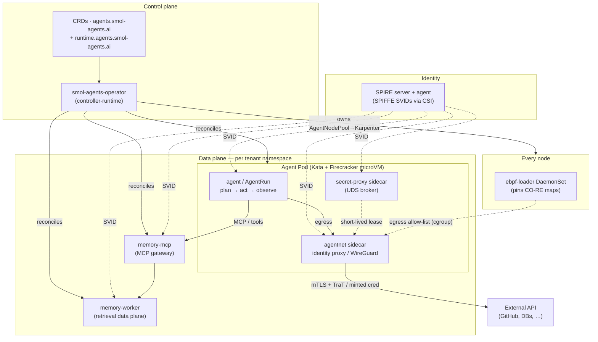

# smol-agents

**A verifiable, hardened runtime for autonomous agents on Kubernetes.**

[](https://github.com/smol-platform/smol-agents/actions/workflows/ci.yaml)
[](https://github.com/smol-platform/smol-agents/actions/workflows/e2e.yml)


[](LICENSE)

> ⚠️ **Alpha — interfaces will change.** This is pre-1.0 software under active
> development. CRD schemas, APIs, command-line flags, image tags, and on-disk /
> wire formats **may change without notice or a migration path** between
> releases. It is **not yet recommended for production**. Pin to a released tag
> and expect breaking changes between them.

smol-agents runs LLM agents, tools, and background workers as Kubernetes-native
workloads where **every safety property is checkable** — not asserted in a
comment. Each agent gets a hardware-isolated sandbox, a cryptographic identity,
encrypted transport, brokered secrets it never actually holds, and an eBPF
egress cage it cannot disable. The critical state machines are model-checked in
[Quint](https://quint-lang.org); the runtime invariants are property-tested; the
whole stack is exercised across three escalating end-to-end rings.

> One binary, one identity, one job — bounded by a microVM, gated by SPIFFE,
> and proven by a model checker.

---

## Why this exists

A modern agent is a piece of code that runs untrusted plans, calls external
APIs, and holds credentials. That is exactly the threat model you do *not* want
on a shared cluster. smol-agents fuses the four concerns that make that safe
into one coherent runtime, so platform teams don't reinvent them per tenant:

| Concern | Without smol-agents | With smol-agents |
|---|---|---|
| **Isolation** | container namespaces (shared kernel) | Kata + Firecracker **microVM** per agent (gVisor fallback) |
| **Identity** | bearer tokens in env vars | per-agent **SPIFFE SVID**, auto-rotated, issued by SPIRE |
| **Secrets** | long-lived keys in agent memory | **broker-minted, short-lived leases**; secretless egress the agent never sees |
| **Network** | open egress | **eBPF allow-list** + identity-aware proxy the agent can't switch off |

Everything else — the operator, the agent model, memory, node provisioning — is
built so those four guarantees hold *by construction*.

---

## Highlights

- 🛡️ **Two layers of containment** — host-side eBPF visibility *and* a
  per-agent Kata/Firecracker microVM. Defense in depth, not either/or.
- 🪪 **Zero-trust identity** — SPIFFE/SPIRE X.509 + JWT SVIDs, dual-rail mTLS
  (public gateway + private mesh), three modes (`insecure`/`permissive`/`strict`).
- 🔑 **Secretless agents** — a kloak-style broker mints credentials per request
  over a Unix socket, authenticated by `SO_PEERCRED` + SPIFFE. With
  **TraT egress** the agent's GitHub/GitLab token is minted, injected, and
  exfil-blocked **without the agent ever touching it**.
- 🧠 **Agent memory as an MCP service** — vector / graph / KV / event-log /
  filesystem backends behind one MCP gateway, with tenant isolation,
  deny-by-default policy, quotas, audit, and **branchable, 3-way-mergeable**
  filesystem memory backed by [Turso AgentFS](https://github.com/tursodatabase/agentfs).
- 🤖 **Declarative agent model** — ship an agent as one CR: identity, model,
  tools (MCP-typed), memory, and a **hard budget** (`maxSteps`/`maxTokens`/
  `maxWallClock`/`maxToolCalls`) the formal model proves is never exceeded.
- 🧩 **Many harnesses, one model** — loop, Hermes, claude-code, codex, aider,
  goose, inflection-pi, **pi-mono** (HTTP via an in-pod key-isolating bridge),
  and **OpenClaw** (WebSocket daemon); plus **agent-to-agent** composition
  (`kind=agent` tools spawn child runs with usage roll-up + subtree GC).
- 🖥️ **Human-attachable agents** — a turn-model/runtime split underpins durable
  sessions and a **driver-mode terminal attach** plane: a human authenticates
  against a bundled OIDC IdP, an `AttachGrant` authorizes, and `agentterminal`
  reverse-proxies a recorded ttyd/tmux PTY (viewer read-only, driver writable),
  bypassing the activator.
- ⚙️ **Operator, not chart** — feature-flagged `SmolAgent`/`SmolAgentPlatform`
  CRs with per-feature status conditions, canary rollouts, and drift healing.
- 🏗️ **Node provisioning that understands isolation** — `AgentNodePool` derives
  KVM/metal node shape from an agent's sandbox and programs Karpenter to make
  exactly those nodes (with a gVisor fallback when no KVM exists).
- ✅ **Verifiable by default** — 10 Quint specifications, `rapid` property tests,
  and L0/L1/L2 e2e rings (docker-compose → kind → AWS bare-metal).

---

## Architecture



**How a single egress request stays safe:** the agent makes a plain outbound
call → the host eBPF `connect4` program transparently redirects it to the
`agentnet` sidecar → the sidecar originates the upstream TLS and, at one seam,
stamps a fresh JWT-SVID / **TraT** and (for provider APIs) a **broker-minted,
short-lived credential** → eBPF `egress` drops anything not on the allow-list.
The agent never holds the credential and cannot reach an unlisted host.

---

## Custom resources

12 CRDs across two API groups. The substrate group describes *where* agents
run; the runtime group describes *what* runs.

### `agents.smol-agents.ai/v1` — substrate

| Kind | Scope | Purpose |
|---|---|---|
| `SmolAgentPlatform` | Cluster | Cluster-wide defaults: RuntimeClass, ebpf-loader, trust domain, node provisioning. |
| `SmolAgent` | Namespaced | One hardened agent workload; every capability is a feature flag with a status condition. |
| `AgentNodePool` | Cluster | Kata-capable node shape → compiles to a Karpenter `NodePool` + `EC2NodeClass`. |

### `runtime.agents.smol-agents.ai/v1` — workload model

| Kind | Purpose |
|---|---|
| `Agent` | Declarative agent: instructions, model, tools, memory, **hard budget**, sandbox, harness. |
| `Tool` | MCP-typed tool with input/output JSON Schema; malformed calls rejected before dispatch. |
| `ModelProvider` | LLM / embedding provider + broker-resolved credentials. |
| `AgentRun` | A single invocation (states aligned with OpenAI Assistants API) with a replayable step log. |
| `AgentSession` | Durable, long-running session: a checkpointed `serve-session` worker that resumes its turn log on restart and consumes turns from NATS via the gateway. |
| `AgentPolicy` | Guardrails: tool allow-lists, budget ceilings, identity constraints. |
| `AgentNetwork` | Egress: identity proxy / WireGuard mesh + eBPF allow-list (+ TraT / secretless). |
| `AttachGrant` | Human attach authorization: `{agentRef, subject, role: viewer\|driver, expiresAt}` resolved by `agentterminal` into an audience-bound, short-TTL attach token before a WSS terminal session. |
| `MemoryStore` | A backend (vector / graph / KV / eventlog / filesystem) + tenancy + broker creds. |
| `MemoryRetriever` | A retrieval pipeline over stores: embedding, chunking, topK, quota, deny-by-default policy. |

---

## Quickstart (local kind)

> Full matrix of install paths — devenv, source, kind, production Helm/operator —
> is in **[docs/INSTALL.md](docs/INSTALL.md)**.

```bash
git clone https://github.com/smol-platform/smol-agents
cd smol-agents

# 1. Dev shell with the whole toolchain pinned (Go, clang, kubectl, kind, quint)
devenv shell

# 2. Build + test + lint + formal-check everything
make all              # tidy · fmt · vet · lint · build · test
make verify-formal    # run the Quint model checker (10 specs)

# 3. Stand up the full stack on kind (Knative + SPIRE + operator)
./test/e2e/scripts/up-kind.sh

# 4. Submit the smallest possible agent
kubectl apply -f operator/config/samples/smolagent_minimal.yaml
kubectl wait --for=jsonpath='{.status.phase}'=Ready \
  smolagent/hello -n tenant-a --timeout=120s
```

```yaml
# operator/config/samples/smolagent_minimal.yaml — every feature on its default
apiVersion: agents.smol-agents.ai/v1
kind: SmolAgent
metadata:
  name: hello
  namespace: tenant-a
spec:
  trustDomain: smol-agents.ai
  mode: strict          # SPIFFE mTLS required on every connection
```

On a laptop without `/dev/kvm`, override the sandbox to `runc` (dev only) or use
the gVisor preset — see [docs/INSTALL.md §4.2](docs/INSTALL.md).

For worked, runnable scenarios — loop tools, agent-to-agent composition, durable
sessions, human approval, the governance floor, and secretless egress — with a
field-by-field walkthrough, see **[docs/examples/](docs/examples/README.md)**.

---

## Documentation

| Start here | What it covers |
|---|---|
| **[docs/features/](docs/features/README.md)** | Feature-by-feature deep dives (the guided tour). |
| **[docs/INSTALL.md](docs/INSTALL.md)** | Four install paths + kernel/cluster prerequisites + troubleshooting. |
| **[docs/runbooks/](docs/runbooks/)** | Operational guides: [secretless egress](docs/runbooks/secretless-egress.md), [memory-mcp](docs/runbooks/memory-mcp.md), [node pools](docs/runbooks/agent-node-pools.md), [k0s local cluster](docs/runbooks/k0s-local-cluster.md), [L2 e2e](docs/runbooks/e2e-l2.md). |
| **[.spec-workflow/specs/](.spec-workflow/specs/)** | The source of truth: EARS requirements, design, and tasks per subsystem. |
| **[spec/quint/](spec/quint/)** | The 10 formal specifications (the actual safety contracts). |

### Feature guides

| Guide | Subsystem | CRDs | Spec |
|---|---|---|---|
| [Runtime & Identity](docs/features/runtime-and-identity.md) | sandbox · SPIFFE · mTLS · secrets · eBPF | — | `smol-agents-platform` |
| [Operator](docs/features/operator.md) | reconcile spine, feature flags, rollouts | `SmolAgent`, `SmolAgentPlatform` | `smol-agents-operator` |
| [Agent Model](docs/features/agent-model.md) | declarative agents, budgets, replay | `Agent`,`Tool`,`ModelProvider`,`AgentRun`,`AgentSession`,`AgentPolicy` | `smol-agents-agent-model` |
| [Networking (agentnet)](docs/features/agentnet.md) | identity proxy · WireGuard · eBPF egress | `AgentNetwork` | `smol-agents-agentnet` |
| [Egress Credentials](docs/features/egress-credentials.md) | TraT + secretless provider tokens | `AgentNetwork` (ext.) | `smol-agents-trat-egress`, `smol-agents-secretless-egress` |
| [Memory](docs/features/memory.md) | MCP memory, backends, AgentFS, 3-way merge | `MemoryStore`,`MemoryRetriever` | `smol-agents-memory` |
| [Node Provisioning](docs/features/node-provisioning.md) | isolation→node-shape→Karpenter | `AgentNodePool` | `agent-platform` design |
| [Verification](docs/features/verification.md) | Quint, rapid, L0/L1/L2 e2e | — | `smol-agents-fullstack-e2e` |

---

## Repository layout

```
cmd/            7 production binaries + e2e test doubles (fake-*, probes)
  agent/          the agent runtime entrypoint (run · serve-session)
  agentgateway/   stateless HTTP front door → NATS turn queue (Knative Service)
  secret-proxy/   kloak-style broker sidecar (SO_PEERCRED + SPIFFE)
  ebpf-loader/    privileged per-node DaemonSet that pins CO-RE maps
  memory-mcp/     MCP gateway for the memory subsystem (thin)
  memory-worker/  retrieval data plane (embed · chunk · rank · backends)
  agentctl/       diagnostics CLI
operator/       controller-runtime manager, CRD types, builders, controllers
pkg/            16 packages — identity, transport, sandbox, secrets, ebpf,
                agentnet, agentruntime, agentmodel, agentfs, memory, trat, …
bpf/            CO-RE eBPF programs (egress_redirect, network, syscalls)
spec/quint/     10 formal specifications wired into `make verify-formal`
deploy/         Helm chart, Kustomize overlays, Dockerfiles, SPIRE/Knative
test/e2e/       L0 (compose) · L1 (kind) · L2 (AWS bare-metal) rings
docs/           INSTALL, feature guides, runbooks, design notes
.spec-workflow/ per-subsystem requirements / design / tasks (source of truth)
```

---

## Verification

Correctness here is a build artifact, not a claim:

```bash
make verify          # vet + lint + test (-race) + verify-formal
make verify-formal   # typecheck + Safety invariant on all 10 Quint specs
make test            # unit + rapid property tests, race detector on
make e2e-l0          # docker-compose ring (~1 min)
make e2e-l1          # kind ring (~5 min, Linux)
make e2e-l2          # AWS Spot bare-metal ring (~12 min)
```

Every requirement tagged in a `requirements.md` is cited by at least one Quint
invariant or `rapid` property. The Quint specs cover SVID rotation, the secret
broker handshake, agent + operator lifecycle, agentnet egress, AgentFS, TraT /
secretless egress, and memory access + merge.

---

## Status

**Alpha — interfaces will change** (see the warning at the top). The platform
runtime, operator, agent model, agentnet, TraT & secretless egress, the memory
subsystem, and node provisioning are implemented and exercised end-to-end at L1.

Recent hardening (the [agent-runtime fit analysis](docs/research/agent-runtime-fit-analysis.md)
P0–P2 path), live-verified on a single-node cluster:

- **Run-datapath containment** — AgentRun pods pin a sandbox `RuntimeClass`
  (fail-closed: a run holds `Pending` rather than execute unisolated) and get a
  default-deny egress `NetworkPolicy` (DNS + in-cluster + public 80/443; cloud
  metadata + link-local blocked).
- **No per-kind custom image** — claude-code / codex / aider / goose ship
  ready-to-run bundle images; `harness.image` is optional and `harness.version`
  pins the tag.
- **Durable sessions** — `AgentSession` runs a long-running `agent serve-session`
  worker that checkpoints its turn log to AgentFS (kopia/S3) and **resumes on
  restart**, parking in `RequiresAction` when idle.
- **Gateway + queue + autoscaling** — a stateless `agentgateway` (Knative
  Service, scale-to-zero) publishes turns to **NATS JetStream**; session workers
  consume them durably.
- **End-to-end on real z.ai (glm-4.6)** — the five core flows (multiple runs, a
  long session per request, idle **pause + resume**, AgentFS **cross-pod
  file-state recovery**, and **config/settings injection** for a new agent) were
  verified live on glm-4.6. Run notes + the z.ai gotchas (Coding-Plan endpoint,
  the loop path bridge, claude-code file-writes needing kata) are in
  [docs/examples](docs/examples/README.md#running-these-for-real-with-zai-live-verified-2026-06-06).

**Milestones M1–M4 + M5 (v0.3.0).** The governance/containment floor (M1), the
capability wire — tools, observability, files (M2), agent composition + A2A (M3),
the interactive/terminal/daemon plane (M4), and the human-in-the-loop pre-run
gate (M5) are implemented and unit-/envtest-covered (both Go modules green under
`-race`). M1–M3 are live-verified (z.ai glm-4.6 on kind, plus a 24/24 L2 datapath
suite on kata metal). The **M4 attach/daemon plane** (Dex OIDC, ttyd/PTY,
`pi`/`openclaw` binaries) is code-complete but its **live e2e is a follow-up** on
a cluster carrying those bundle images. The Option-B OpenClaw scale routing
(`M4.23`), SSH attach (`M4.13`), and the human canvas (`M4.24`) are the deferred
long-tail (see [docs/design/m4-interactive-scope.md](docs/design/m4-interactive-scope.md)).

Remaining work is tracked per subsystem (`tasks.md`): multi-tenant hardening,
serverless cold-start, and broader live-infra coverage.

---

## Contributing & license

Issues and PRs welcome; please run `make verify` before opening one. The Go
module path is currently `github.com/smol-platform/smol-agents`.

Licensed under the **[Apache License 2.0](LICENSE)** — the CNCF-standard
license (Kubernetes, Prometheus, Envoy, and containerd all use it). See
[`NOTICE`](NOTICE) for attribution.
