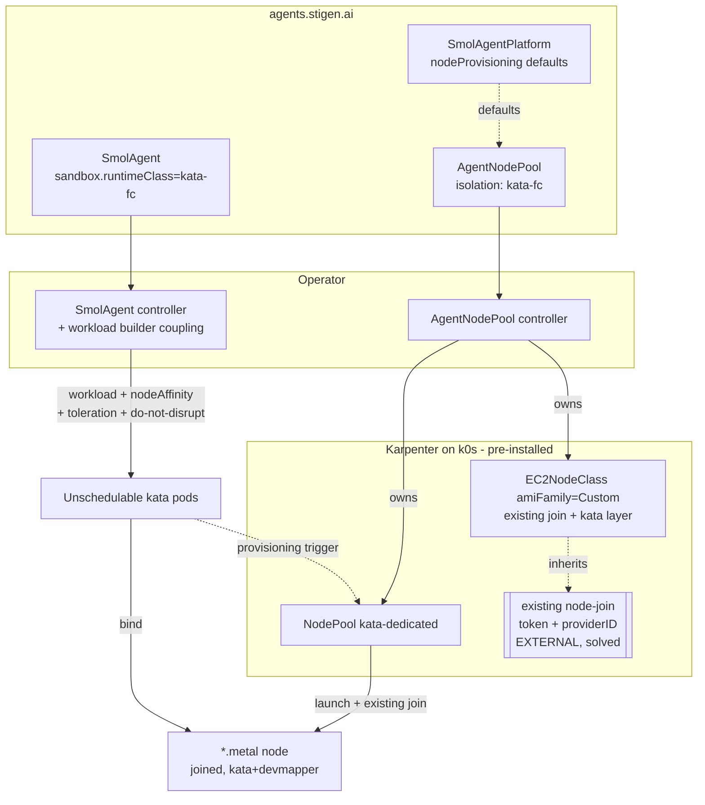

# Design Document — Agent Platform: Node Provisioning & Karpenter Integration

> Status: **P1 implemented.** Scope is the node-provisioning layer that lets
> the operator ship as a self-contained platform. Workload modelling
> (durable/serverless, isolation, scale) already existed; this document does
> **not** re-design it.
>
> Implementation (P1): `AgentNodePool` CRD + controller, the Karpenter
> builder, workload coupling (auto-match pool by isolation + `do-not-disrupt`),
> Platform `nodeProvisioning`, the per-distro kata recipe in userData, gVisor
> fallback, kata `RuntimeClass` overhead, an envtest, and a **second provider
> (Cluster Autoscaler, `spec.provider`, R-PROV-3)** all landed. Remaining: the
> live e2e on a real Karpenter-on-k0s cluster (P1.6) and serverless hardening
> (P2). Operations: `docs/runbooks/agent-node-pools.md`.
>
> **Decided in review:**
> - Substrate is **self-managed k0s on EC2** (EKS later, community nice-to-have).
> - **Node→k0s join (incl. join-token + `providerID`) is already solved in our
>   existing Karpenter deployment and is OUT OF SCOPE for this operator.** The
>   operator contributes only the kata/devmapper layer and composes with the
>   existing join. An IID-attested token broker is a possible future extension,
>   not core.
>
> After review we scaffold the `AgentNodePool` CRD + controller (step "b"),
> preceded by a small composition spike (see below).

## Overview

Today the operator assumes kata-capable nodes already exist. The L2 e2e
proves this by hand-bootstrapping a single k0s node per distro (kata-static
+ devmapper + containerd drop-ins via `scripts/aws-l2/*`). To **ship**, the
operator must own the *kata-readiness* of nodes: ensure KVM-capable hosts get
provisioned with kata + devmapper, and guarantee sandboxed agents land on them.

**Thesis — node provisioning and workload isolation are one problem.**
`kata-fc` needs `/dev/kvm`; on AWS, KVM is only exposed on bare-metal
(`*.metal`) instances. So an agent's isolation choice (`features.sandbox.
runtimeClass`) *determines its node shape*. A generic autoscaler can't know
that. The operator can: it derives node requirements from the agent's
sandbox, programs Karpenter to make exactly those nodes, and binds the agent
to them. That closed loop — isolation → node shape → provisioner → scheduling
— is the platform's reason to exist.

**Substrate & division of labour.** Target is self-managed **k0s on EC2**.
Karpenter (already deployed, with a **working node-join mechanism** we do not
own) scales workers that join the k0s control plane. This operator's job is
narrow and additive: declare *kata-capable* node pools (metal/KVM, kata +
devmapper) and layer the kata bits onto whatever the existing Karpenter
deployment already uses to join nodes.

### What already exists (not in scope)

| Concern | Where | Notes |
|---|---|---|
| Durable vs serverless | `SmolAgentSpec.deploymentKind` = `knative`\|`deployment`\|`statefulset` | `knative` → Knative Service (scale-to-zero); others → Deployment/StatefulSet |
| Isolation runtime | `features.sandbox.runtimeClass` (default `kata-fc`) | `AllowHostEscape` guarded by Platform webhook |
| Serverless scale | `features.knative` (`scaleToZero`, `minScale`, `maxScale`) | already modelled |
| **Node→k0s join + `providerID`** | **existing Karpenter deployment (external)** | **token issue solved there; operator does not re-implement** |
| Cluster env presets | `SmolAgentPlatformSpec.ebpfLoader.preset` | precedent for a per-environment node concept |
| Node kata recipe | `scripts/aws-l2/{cloud-init-*,*.bu}.tmpl` | kata-static → `/opt/kata`, devmapper thin-pool, containerd drop-ins; hardened across 4 distros |

### What's new (in scope)

1. `AgentNodePool` — a cluster-scoped CRD (group `agents.stigen.ai`) that
   declares a kata-capable node shape and compiles to a Karpenter `NodePool` +
   `EC2NodeClass`.
2. **Kata-layer composition** — the operator's `EC2NodeClass` carries the
   kata/devmapper/thin-pool additions *on top of* the existing join mechanism
   (base kata-ready AMI, or a userData include), without owning the join.
3. Coupling logic in the workload builder: KVM-requiring runtimeClasses get
   nodeAffinity + tolerations to a matching pool, plus disruption protection.
4. Bootstrap delivery for the kata layer: boot-time `userData` and a prebaked
   AMI (decision: support both).

### Requirements addressed

- **R-PROV-1** The operator provisions kata-capable (KVM/metal + kata +
  devmapper) nodes for sandboxed agents without manual node bootstrap.
- **R-PROV-2** A kata agent is never scheduled onto a non-KVM node; a no-KVM
  cluster falls back to the gVisor runtime path.
- **R-PROV-3** Node config (`AgentNodePool`) is provider-neutral at the API
  surface; Karpenter-on-k0s is the first-class backend, EKS/others addable.
- **R-PROV-4** The kata layer ships as both boot-time userData and a prebaked
  AMI, selectable per pool.
- **R-PROV-5** Live agent microVMs are protected from involuntary
  consolidation/drift disruption.
- **R-PROV-6** The operator's node config **composes with** the existing
  Karpenter node-join (join + `providerID` are external preconditions) and does
  not re-implement them.

## Steering Document Alignment

### Technical Standards (`.spec-workflow/steering/tech.md`)
- Keeps `kata-fc` default, **gVisor as the no-KVM fallback** — made automatic:
  if no `AgentNodePool` satisfies KVM, the operator routes the agent to gVisor
  (subject to Platform policy) instead of leaving it Pending.
- `allowHostRuntime` / `AllowHostEscape` semantics unchanged.
- Go, controller-runtime, kubebuilder markers, DeepCopy as in `operator/api/v1`.

### Project Structure (`.spec-workflow/steering/structure.md`)
- `operator/api/v1/agentnodepool_types.go` (new type beside platform types).
- `operator/internal/controllers/nodepool/` (new reconciler).
- Coupling in existing `operator/internal/builders/workload.go`.
- Karpenter rendering isolated in `operator/internal/builders/karpenter/`.

## Code Reuse Analysis

### Existing Components to Leverage
- **Existing Karpenter deployment**: reuse its node-join mechanism verbatim
  (base AMI / launch template / userData snippet — composition seam TBC). The
  operator never touches join, tokens, or `providerID`.
- **`SmolAgentPlatform` CR**: gains a `nodeProvisioning` block (Karpenter
  backend reference, subnet/SG discovery tags, the base-AMI/join reference, IAM
  role). `AgentNodePool` objects inherit these defaults.
- **`SandboxFeature.RuntimeClass`**: the existing field is the *input* to the
  coupling — runtimeClass → "requires KVM?" → pool match.
- **`builders/workload.go`**: already sets `RuntimeClassName` on both Deployment
  pod and Knative Service podspec; we add nodeAffinity, tolerations, and
  `karpenter.sh/do-not-disrupt` in the same place — one builder, both kinds.
- **`scripts/aws-l2/*` recipe**: the kata/devmapper/thin-pool steps become the
  userData/AMI **kata layer**, appended to (not replacing) the existing join.
- **`cloudinit_test.go` golden pattern**: reused to assert `AgentNodePool` →
  Karpenter rendering and kata-layer userData contents.

### Integration Points
- **Existing Karpenter node-join (EXTERNAL precondition)**: the operator's
  `EC2NodeClass` builds on it. Composition seam to confirm: (a) a **base
  kata-ready AMI** built on top of the join-capable base image (join inherited,
  kata baked), or (b) **userData composition** where our kata recipe is appended
  after the existing join snippet. Either way join + `providerID` come from the
  existing deployment.
- **Karpenter on non-EKS k0s**: `NodePool` (`karpenter.sh/v1`) + `EC2NodeClass`
  (`karpenter.k8s.aws/v1`, `amiFamily: Custom`). Already running in the cluster;
  the operator just adds kata-dedicated NodePools/EC2NodeClasses alongside the
  existing ones (dedicated taint → no conflict).
- **Knative Serving podspec feature-flags**: kata in `knative` mode requires
  `kubernetes.podspec-runtimeclassname`, `podspec-affinity`,
  `podspec-tolerations`, `podspec-nodeselector` in `config-features`. Operator
  verifies and surfaces a condition if missing.
- **kata `RuntimeClass.overhead`**: populated so Karpenter sizes nodes for the
  VM (e2e ships `runtime/00-runtimeclass-kata-fc.yaml`).

## Architecture



Pod-driven handoff: the operator keeps the kata-dedicated `NodePool`/
`EC2NodeClass` in sync with each `AgentNodePool`, and emits pods matching
exactly that pool. Karpenter launches the metal instance; the **existing**
join mechanism brings it into k0s with a `providerID`; the operator's kata
layer makes it run microVMs; Karpenter binds the pods.

### Modular Design Principles
- **AgentNodePool controller**: owns only its Karpenter child objects.
- **Workload builder coupling**: pure `applyNodePlacement(pod, runtimeClass,
  pool)` — testable without a cluster.
- **karpenter builder package**: pure `AgentNodePool → (NodePool, EC2NodeClass)`
  translation; golden-tested.
- **kata-layer renderer**: pure recipe → userData/AMI inputs; no join logic.

## Components and Interfaces

### 1. `AgentNodePool` CRD (`operator/api/v1/agentnodepool_types.go`)
- **Purpose:** provider-neutral declaration of a kata-capable node shape.
- **Scope:** Cluster (`scope=Cluster`, shortName `anp`), group `agents.stigen.ai`,
  `+kubebuilder:subresource:status`.

### 2. AgentNodePool controller (`operator/internal/controllers/nodepool/`)
- **Purpose:** reconcile `AgentNodePool` → owned `NodePool` + `EC2NodeClass`
  (kata layer composed onto the platform's join reference); set status
  (`KarpenterSynced`, `CapacityAvailable`).
- **Dependencies:** Karpenter CRDs present (discovery check → `Degraded` if absent).

### 3. Workload coupling (`operator/internal/builders/workload.go`)
- **Behaviour:** for a resolved KVM-requiring `runtimeClass`, find the matching
  `AgentNodePool` (by `isolation`, or explicit `features.sandbox.nodePoolRef`),
  inject `nodeAffinity` (pool label), `tolerations` (pool taint), and
  `karpenter.sh/do-not-disrupt: "true"` (R-PROV-5). Identical for Deployment
  pod template and Knative Service podspec.
- **Fallback (R-PROV-2):** no KVM pool + policy permits → swap to gVisor, drop
  placement; else `Failed/NoKVMCapacity`.

### 4. Webhook additions (`operator/internal/webhooks/`)
- Validate `AgentNodePool` (valid isolation, non-empty selectors, join/base
  reference present).
- On `SmolAgent` admission, warn when a kata runtimeClass has no matching
  pool and no gVisor fallback is allowed.

## Data Models

### `AgentNodePoolSpec` (illustrative)
```go
type AgentNodePoolSpec struct {
    // Isolation this pool provides. Drives KVM/metal requirement + match.
    // +kubebuilder:validation:Enum=kata-fc;kata-clh;gvisor;runc
    Isolation string `json:"isolation"`

    // +kubebuilder:validation:Enum=arm64;amd64
    // +kubebuilder:default:=arm64
    Arch string `json:"arch,omitempty"`

    InstanceFamilies []string `json:"instanceFamilies,omitempty"`

    // +kubebuilder:default:={"on-demand"}
    CapacityType []string `json:"capacityType,omitempty"`

    // MinNodes warm floor (0 = on-demand). Reserved for P2 cold-start.
    // +kubebuilder:default:=0
    MinNodes int32 `json:"minNodes,omitempty"`

    Limits     ResourceLimits   `json:"limits,omitempty"`
    Bootstrap  NodeBootstrap    `json:"bootstrap"`  // kata layer only
    ThinPool   ThinPoolConfig   `json:"thinPool,omitempty"`
    Disruption DisruptionConfig `json:"disruption,omitempty"`
}

type NodeBootstrap struct {
    // +kubebuilder:validation:Enum=PrebakedAMI;UserData
    Mode string `json:"mode"`
    // PrebakedAMI: selectors for the kata-ready image (built on the existing
    // join-capable base; kata baked in).
    AMISelector []AMISelectorTerm `json:"amiSelector,omitempty"`
    // UserData: which hardened kata recipe to append after the existing join.
    // +kubebuilder:validation:Enum=al2023;bottlerocket;flatcar;fedora-coreos
    Distro string `json:"distro,omitempty"`
}

type ThinPoolConfig struct {
    // +kubebuilder:validation:Enum=instance-store;ebs
    // +kubebuilder:default:=instance-store
    Backing  string `json:"backing,omitempty"`
    DataSize string `json:"dataSize,omitempty"` // e.g. 50Gi
    MetaSize string `json:"metaSize,omitempty"` // e.g. 5Gi
}
```

### Compilation mapping (`AgentNodePool` → Karpenter v1, k0s substrate)

| AgentNodePool | NodePool (`karpenter.sh/v1`) | EC2NodeClass (`karpenter.k8s.aws/v1`) |
|---|---|---|
| `isolation: kata-fc` | requirement `node.kubernetes.io/instance-type In [<family>.metal]` + taint `agents.stigen.ai/isolation=kata-fc:NoSchedule` | — |
| `arch` | requirement `kubernetes.io/arch In [arch]` | — |
| `instanceFamilies` | requirement `karpenter.k8s.aws/instance-family In […]` | — |
| `capacityType` | requirement `karpenter.sh/capacity-type In […]` | — |
| `limits` | `spec.limits` | — |
| `disruption` | `spec.disruption` (`consolidationPolicy: WhenEmpty`, budgets) | — |
| `bootstrap: UserData` | — | `amiFamily: Custom`; userData = **existing join snippet** + appended kata/devmapper recipe |
| `bootstrap: PrebakedAMI` | — | `amiSelectorTerms` = kata-ready AMI (existing join baked in); userData = thin-pool create only |
| `thinPool` | — | created at firstboot on raw instance-store NVMe (ephemeral → always at boot); matching `blockDeviceMappings`; **not** `instanceStorePolicy: RAID0` |
| (cluster defaults) | `nodeClassRef` | base-AMI/join reference, IAM role, subnet/SG selectors from `SmolAgentPlatform.nodeProvisioning` |

Pool label `agents.stigen.ai/pool: <name>` + taint are the workload builder's join keys.

## Bootstrap Strategy (kata layer; both modes, one recipe)

The hardened `scripts/aws-l2` steps are the single source for the **kata layer**
(kata install + devmapper thin-pool + containerd drop-ins). Node→k0s join is
supplied by the existing Karpenter deployment and is not part of this recipe.

- **UserData mode** — append the kata recipe after the existing join snippet in
  `EC2NodeClass.userData`. No image pipeline; node-Ready in minutes (must fit
  Karpenter's registration window). Best for dev / fast iteration.
- **PrebakedAMI mode** — bake kata onto the existing join-capable base AMI via
  Packer, tag `kata-ready`; userData then only creates the thin-pool. Fastest
  node-Ready; default for prod; prerequisite for viable P2 serverless cold-start.

**Thin-pool placement:** raw instance-store NVMe (c7gd/m7gd local NVMe), built
at firstboot regardless of mode (instance store is blank per launch). Not
`instanceStorePolicy: RAID0` (that formats NVMe for containerd; we need raw
devices for devmapper).

## Failure Modes & Error Handling

- **No metal capacity** (spot intermittency seen in us-east-2): NodePool spans
  `capacityType` + families; `CapacityAvailable=False`; durable agents stay
  Pending (acceptable for P1).
- **Kata layer fails at boot** (devmapper/containerd): node joins but has no
  kata RuntimeClass usable; pod stays Pending; surface on the pool. (Join
  itself is the existing deployment's concern.)
- **Karpenter not installed / misconfigured:** controller `Degraded` with a
  specific message.
- **No-KVM cluster:** automatic gVisor fallback (R-PROV-2) when policy allows,
  else `Failed/NoKVMCapacity`.
- **Knative feature-flags missing:** Platform condition
  `KnativeRuntimeClassUnsupported`; serverless-on-kata refuses rather than
  silently dropping the runtimeClass.
- **Consolidation eviction of live VMs:** prevented by `do-not-disrupt` +
  `consolidationPolicy: WhenEmpty`.

## Testing Strategy

- **Unit / golden:** `AgentNodePool` → (`NodePool`,`EC2NodeClass`); kata-layer
  userData contains kata + devmapper markers and preserves the existing join
  snippet; `applyNodePlacement` for kata vs gVisor vs runc (extends
  `cloudinit_test.go`).
- **envtest:** controller child-object create/update/delete, finalizer + ownerRef.
- **e2e (on k0s):** extend the L2 ring to drive provisioning *through* the
  existing Karpenter — a kata agent triggers a metal worker that joins (existing
  mechanism) and runs the kata pod. Reuses the SSM/scenario harness.

## Recommended first step: composition spike (before scaffolding)

The remaining unknown is no longer "does k0s+Karpenter join work" (it does —
proven by the existing deployment) but "**does our kata layer compose cleanly
onto an already-joining Karpenter node and run a kata pod?**" A short spike on
the live cluster:

1. Take one existing Karpenter NodePool/EC2NodeClass; add a kata-dedicated copy
   constrained to `*.metal`, with the kata recipe appended to its userData (or a
   kata-baked AMI).
2. Create an unschedulable kata pod targeting it; confirm Karpenter launches a
   metal node, it joins via the existing mechanism, and the kata pod runs.

This validates the composition seam (option a vs b) for the cost of an
afternoon, and tells us exactly what `nodeProvisioning` must reference.

## Optional Extensions (not core)

- **IID-attested join-token broker** — only if you ever want to replace the
  existing token mechanism with per-launch short-lived tokens (reusing the SPIRE
  `aws_iid` trust path). Out of scope; the existing solution stands.
- **EKS substrate** — a different `EC2NodeClass`/bootstrap behind the same
  `AgentNodePool` API (community nice-to-have).
- **Second provisioner backend (Cluster Autoscaler) — IMPLEMENTED.**
  `spec.provider: ClusterAutoscaler` proves R-PROV-3: CAS scales an external
  ASG the operator can't create, so the operator emits the node-group spec
  (CAS discovery tags + kata launch-template userData) as a ConfigMap for IaC
  to apply; the workload coupling is identical to Karpenter. A `static` (no
  autoscaler) backend remains a possible future addition.

## Phasing

- **P1 (this design):** durable agents end-to-end; `AgentNodePool` → Karpenter
  (kata-dedicated, kata layer composed onto the existing join) on k0s; coupling
  + gVisor fallback; both kata-layer bootstrap modes.
- **P2:** serverless hardening — warm pools (`minNodes`), Knative `minScale`,
  kata VM templating/snapshots vs the cold-start (node + pod + Firecracker +
  SPIRE attest).
- **P3:** extensions (EKS substrate, second provisioner, operator-owned
  Karpenter lifecycle, OLM/OperatorHub packaging).

## Open Questions for Review

1. **Substrate — DECIDED: self-managed k0s first** (EKS later).
2. **Node-join — DECIDED: external/solved** in the existing Karpenter
   deployment; operator composes, doesn't own it. IID broker = optional extension.
3. **Composition seam (NEW, needs your input):** does the operator's kata layer
   ride as (a) a **base kata-ready AMI** built on your join-capable base image,
   or (b) **userData appended** after your existing join snippet? This is what
   `nodeProvisioning` references. The spike settles it.
4. **Pool selection:** auto-match by `isolation`/runtimeClass (zero change to
   existing `SmolAgent`s) vs explicit `features.sandbox.nodePoolRef`.
   **Recommendation:** auto-match primary, explicit ref as override.
5. **Where provisioning defaults live:** `nodeProvisioning` block on
   `SmolAgentPlatform` (recommended) vs per-`AgentNodePool`.
6. **gVisor fallback policy:** silent auto-fallback vs explicit Platform opt-in
   (`allowGvisorFallback`). Security-relevant — gVisor is weaker than a microVM.
7. **Run the composition spike before scaffolding (b)?** Recommended.
