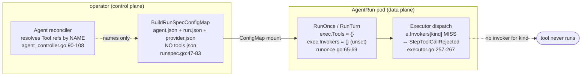

# Design Document — Tool Kinds: Implementation Status & Roadmap

> **Status: loop-mode tool invocation is NOT implemented as of v0.2.0.**
>
> A loop-mode (`mode: loop`) `Agent` may reference `Tool` CRs of any kind
> (`mcp`, `http`, `agent`, `function`), the operator will resolve those refs by
> **name** and report the Agent `Ready` — but the run pod **never receives the
> tool specs and has no invoker to call them with**, so an LLM that tries to
> use a tool gets the call rejected at runtime. The single working invoker
> (`function`) is **test-only**. Harness-mode (`mode: harness`) agents are
> unaffected: their tool loop runs *inside the harness*, opaque to the platform.
>
> This document makes that gap explicit and authoritative so tenants don't
> declare loop-mode tools that silently never run, lays out the wiring needed
> to ship them, and recommends an **apply-time guardrail** to fail loud in the
> meantime.

## Overview

The agent model advertises four tool transports via the `ToolKind` enum
(`pkg/agentmodel/v1/types.go:94-99`):

```go
ToolMCP      ToolKind = "mcp"
ToolHTTP     ToolKind = "http"
ToolAgent    ToolKind = "agent"
ToolFunction ToolKind = "function"
```

Each has a typed spec on the discriminated-union `ToolSpec`
(`pkg/agentmodel/v1/types.go:145-155`): `MCPSpec`, `HTTPSpec`,
`AgentTargetSpec`, `FunctionSpec`. Per-kind required-field validation exists
(`pkg/agentmodel/v1/validation.go:88-105`), and the
[Agent Model feature doc](../features/agent-model.md) describes `Tool` as "an
MCP-typed capability with input/output JSON Schema". The *model* is complete.

The **invocation path** is not. In **loop mode** the deterministic executor
(`pkg/agentruntime/executor.go`) is supposed to dispatch a planned tool call
through a `ToolInvoker` keyed by the tool's kind. That seam exists and is
exercised by tests, but **no production invoker is registered for any kind**,
and the operator **never ships the resolved tool specs into the run pod**. The
result is an end-to-end break that is invisible until an LLM actually emits a
tool call mid-run.

This is the prerequisite called out as "production loop-mode tool wiring" /
"loop-tool wiring" throughout
[framework-enhancements.md](framework-enhancements.md) (e.g. items A1, A4-Part-B,
O1) — several high-impact enhancements are gated on closing exactly this gap.

## Current reality (verified)

The break is in four places, in the order data would have to flow:

1. **The operator resolves tool refs by *name* only.** The Agent reconciler
   loops over `agent.Spec.Tools`, does a `r.Get` on each `Tool` CR purely to
   confirm it exists, and records the names in `Status.ResolvedTools`
   (`operator/internal/controllers/agentmodel/agent_controller.go:90-108`). It
   never reads `Tool.Spec` and never carries it forward. The Agent is reported
   `Ready` on existence alone.

2. **The run-spec builder ships no tool specs.** `BuildRunSpecConfigMap`
   marshals only the `Agent` spec, the `AgentRunSpec`, and (for loop mode) a
   resolved `provider.json` into the per-run ConfigMap
   (`operator/internal/builders/runspec.go:47-83`). There is **no `tools.json`**
   — the file contains **zero references to tools** of any kind. So the pod's
   mounted spec directory (`/etc/smol-agents/run`, `runspec.go:23`) has nothing
   for the runtime to load tool definitions from.

3. **The runtime builds the executor with empty `Tools` and unset `Invokers`.**
   `RunTurn` (the shared core of `RunOnce`) constructs the executor via
   `New()`, then sets only `Harness`, `Secrets`, and `LLM`
   (`pkg/agentruntime/runonce.go:65-69`). `New()` initialises `Tools` and
   `Invokers` to **empty maps** (`pkg/agentruntime/executor.go:54-60`) and
   **nothing ever populates them**. The pod entrypoint confirms this:
   `cmd/agent/run.go:53` calls `RunOnce` and never reads a `tools.json` or
   assigns `exec.Invokers`.

4. **The executor therefore rejects every tool call.** When the LLM plans a
   tool call, the executor looks up `e.Invokers[tool.Spec.Kind]`
   (`pkg/agentruntime/executor.go:257`); with an empty map the lookup misses
   and it records a `StepToolCallRejected` step carrying
   `no invoker for kind "<kind>"` (`executor.go:258-267`). Even before that,
   `e.Tools[tc.Tool]` (`executor.go:222`) is empty, so the call is rejected as
   "tool not found in catalog" (`ErrToolNotFound`, `iface.go:56`). Either way
   the tool **never executes**.

**The one invoker that works is test-only.** The sole `ToolInvoker`
implementation in the tree is `InProcessInvoker`, a map-of-Go-handlers fake in
`pkg/agentruntime/fake.go:46-61`. It is registered **only in tests**, **only**
for `v1.ToolFunction` (e.g. `pkg/agentruntime/executor_test.go:73-74`,
`pkg/agentruntime/property_test.go:60`). No non-test code constructs it.



## Per-kind status

| Kind | Intended transport | Invoker exists? | Usable in loop mode? | Notes |
|---|---|---|---|---|
| `mcp` | MCP server over `mcp://…` or `http(s)://…/mcp` (`MCPSpec`, `types.go:110-114`) | **No** | **No** | The headline tool kind in [agent-model.md](../features/agent-model.md). Needs an MCP client invoker + transport + `Auth`→broker translation (future, below). |
| `http` | Generic HTTP+JSON endpoint (`HTTPSpec`, `types.go:116-122`) | **No** | **No** | Simplest invoker to ship first: one outbound request, args→body, response→observation, `Auth`/`Headers` applied. |
| `agent` (A2A) | One Agent invokes another (`AgentTargetSpec`, `types.go:124-127`) | **No** | **No** | Dead beyond the generic dispatch case. Design lives in **[framework-enhancements.md item A1](framework-enhancements.md)** — do **not** duplicate; that item also owns the apiserver-connectivity, in-pod-identity, RBAC, and AgentNet-egress prerequisites. |
| `function` | In-process Go handler (`FunctionSpec`, `types.go:129-132`) | **Test-only** (`InProcessInvoker`, `fake.go:46-61`) | **No** (production) | The comment on `FunctionSpec` says "(test only)". Wired only in `*_test.go`. There is no mechanism to register Go handlers into a *production* run pod, and by design there shouldn't be (arbitrary in-pod Go is not a tenant-facing surface). |

Validation does **not** save the user here: `ValidateAgent` checks that each
`Tool` CR validates (a `function` tool still needs `spec.function.name`,
`validation.go:101-104`), but **nothing rejects a loop-mode Agent for
referencing a kind with no production invoker**. That is the gap the
[interim guardrail](#interim-guardrail-recommended-now) closes.

## What already works (so this is a wiring gap, not a redesign)

Two things are deliberately *not* broken, which keeps the remaining work to
plumbing rather than architecture:

- **The dispatch seam is real and tested.** `ToolInvoker`
  (`pkg/agentruntime/iface.go:31-35`) is the per-kind transport abstraction;
  the executor's allow-list check, input-schema validation, budget pre-check,
  dispatch, output-schema validation, and per-step accounting
  (`executor.go:210-308`) all already work — `InProcessInvoker` proves the seam
  end-to-end in tests. New invokers slot in behind this interface with no
  executor changes.

- **The observability path is already complete.** When loop tools *do* run,
  each iteration is recorded as a `v1.Step` with a `ToolCallRecord`
  (`executor.go:301-306`; `ToolCallRecord` at `types.go:255-262`). The
  executor's steps flow into `Result.Steps`, are copied verbatim into the wire
  contract `RunResult.Steps` (`pkg/agentruntime/runonce.go:34,80-87`), and the
  AgentRun controller folds them into `run.Status.Steps`
  (`operator/internal/controllers/agentmodel/agentrun_controller.go` —
  `foldRunResult` sets `run.Status.Steps = rr.Steps`). **Loop-mode steps are
  not dropped.** So once tools execute, their calls are visible in
  `AgentRun.status.steps` without further work. (Subject to the termination-
  message size cap noted in [framework-enhancements.md](framework-enhancements.md)
  item O1.)

## Required wiring to ship loop-mode tools

In dependency order. Steps 1–3 unlock all kinds at once; the MCP transport in
step 4 is additional and marked future.

1. **Ship the resolved tool specs into the pod.** Extend the Agent reconciler's
   resolve loop (`agent_controller.go:90-108`) to keep each fetched
   `Tool.Spec`, and extend `BuildRunSpecConfigMap`
   (`operator/internal/builders/runspec.go:47-83`) to marshal the resolved
   `[]pure.Tool` into a new `tools.json` key alongside `agent.json` /
   `run.json`. Mind the ~1 MiB ConfigMap ceiling (the same constraint that
   bounds `AgentRunSpec.Inputs`, `types.go:199-206`). Define the filename as a
   shared constant mirroring `AgentSpecFile`/`RunSpecFile`
   (`pkg/agentruntime/runonce.go:19-22`).

2. **Deserialize and populate the executor.** In the run entrypoint /
   `RunOnce` (`cmd/agent/run.go:53` → `pkg/agentruntime/runonce.go:44-54`),
   read `tools.json`, build the `exec.Tools` catalog keyed by name, and
   register the relevant `exec.Invokers[kind]`. This is the single seam that
   makes step 3's invokers reachable; it is the same "missing seam" identified
   in [framework-enhancements.md item A1](framework-enhancements.md).

3. **Implement HTTP and MCP invokers behind the existing seam.** Add a
   `pkg/agentruntime/invokers/` package (new) with `http.go` and `mcp.go`, each
   satisfying `ToolInvoker` (`iface.go:31-35`):
   - **`http`**: issue one request to `HTTPSpec.URL` (method default `POST`,
     `types.go:117-120`), marshal `args` as the JSON body, apply
     `HTTPSpec.Headers`, and return the JSON response as the `Observation`.
     The executor already validates the response against the tool's
     `OutputSchema` (`executor.go:287`), so the invoker need not.
   - **`mcp`**: an MCP client that lists/calls tools on `MCPSpec.URL`
     (`types.go:111-113`). See step 4 for transport/auth specifics.

4. **MCP transport + `Auth`→broker credential translation *(future)*.** The
   `mcp` invoker needs (a) an MCP client/transport for `mcp://` and
   `http(s)://…/mcp` endpoints, and (b) translation of `MCPSpec.Auth`
   (`*AuthRef`, `types.go:113`) into a runtime credential **leased from the
   secret broker** — never an inline secret, consistent with how harness env
   `secretRef`s are resolved today (`pkg/agentruntime/executor.go:354-373`,
   which fails loud when a `secretRef` is set but no broker is configured) and
   with the broker model in
   [egress-credentials.md](../features/egress-credentials.md) and
   [secrets-broker-credential-backends.md](secrets-broker-credential-backends.md).
   Outbound reachability to an MCP server is also governed by the egress layer
   — see [agentnetwork-agentpolicy-interaction.md](agentnetwork-agentpolicy-interaction.md).
   (There is no `mcp-integration.md`; MCP wiring is described here and tracked
   as future work.)

The `agent`-kind invoker is intentionally **out of scope here** — it is owned
end-to-end by [framework-enhancements.md item A1](framework-enhancements.md),
which carries its own much larger prerequisite list (in-pod kube client,
downward-API identity, new SA RBAC, and AgentNet egress allow-listing of the
apiserver).

## Interim guardrail (recommended now)

Until steps 1–3 land, the failure is **silent at apply time and only visible
mid-run** — the worst possible shape, because the LLM may burn budget before a
tool call is rejected, and the rejection is buried in `Status.Steps`.

**Recommendation:** make the Agent reconciler / a validating admission webhook
**reject a loop-mode Agent that references a `Tool` of a kind with no
production invoker** (`mcp`, `http`, `agent`, and `function`), and surface it as
a clear `Status` condition / apply-time error. This converts a runtime mystery
into an immediate, legible failure.

A natural home is right after the existing tool-resolution loop
(`agent_controller.go:90-108`): once a `Tool` CR is fetched, inspect
`tool.Spec.Kind`; if the Agent is `mode: loop` (`AgentSpec.Mode`,
`types.go:48-50`) and the kind has no registered production invoker, set
`Status.Phase = "Failed"`, `Reason = "ToolKindUnsupported"`, with a message
like:

```
loop-mode tool "search" has kind "mcp", which has no runtime invoker in v0.2.0;
loop-mode tool invocation is not yet implemented (see docs/design/tool-kinds-roadmap.md).
Use mode: harness, or remove the tool reference.
```

Notes:
- Keep the set of "supported kinds" as a single source of truth so the check
  and the eventual invoker registration can't drift.
- This is a **temporary** guardrail. As each invoker ships (steps 1–4), remove
  its kind from the reject-list. When all production kinds are wired, the check
  becomes a no-op and can be deleted.
- It does **not** touch harness-mode agents — those don't go through the
  loop executor's invokers at all (next section).

## Relationship to harness-mode tools

The gap is **specific to loop mode**. A `mode: harness` Agent
([agent-model.md](../features/agent-model.md), "Harness mode";
[harness-authoring.md](harness-authoring.md)) does **not** use the executor's
`Invokers` map: `Executor.Run` branches to `runHarness` before any loop logic
(`pkg/agentruntime/executor.go:83-84`), which makes a single bounded call to
the harness and never touches `e.Tools`/`e.Invokers`
(`executor.go:377-434`). Any tool use inside such an agent is the **harness's
own** tool loop (e.g. the Hermes gateway running `delegate_task` /
`mixture_of_agents` server-side) — the platform invokes **none** of it and
cannot govern it with our schema/allow-list/budget machinery.

The harness *may* report what it did: `harness.Response.ToolCalls` is folded
into the single `Final` step's `ToolCalls` when a harness surfaces a structured
tool log (`executor.go:400-408`; the field is documented best-effort at
`pkg/agentruntime/harness/iface.go:56-58`). In v0.2.0 **no shipped harness
populates it** (surfacing it from Hermes is
[framework-enhancements.md items H1 / A2-Part-A](framework-enhancements.md)).
So the harness tool boundary is: the platform governs the *single call to the
harness*, not the harness's internal fan-out.

This is the boundary to keep clear for tenants: **`Agent.spec.tools` is the
loop-mode tool allow-list and is inert in harness mode.** A harness agent that
references `Tool` CRs gets them resolved by name (the reconciler doesn't
distinguish mode in its loop, `agent_controller.go:90-108`) but they have **no
effect** — the harness decides its own tools out-of-band. (The proposed
[interim guardrail](#interim-guardrail-recommended-now) deliberately scopes its
rejection to `mode: loop` so it doesn't false-positive on this benign case.)

### A2A (`ToolKind=agent`) overlap

`ToolKind=agent` is the dead A2A transport: types/validation/deepcopy exist,
but there is no invoker and no dispatch case beyond the generic
`e.Invokers[kind]` miss. Its full design — synchronous child-`AgentRun`
invoker, in-pod kube client, identity, RBAC, budget roll-up, and the AgentNet
egress invariant — is owned by
**[framework-enhancements.md item A1](framework-enhancements.md)**. This
document cross-links it rather than restating it; A1 in turn depends on the
generic loop-tool wiring (steps 1–3 above) before its A2A-specific work
begins.

## See also

- [Agent Model](../features/agent-model.md) — what an Agent/`Tool` is; the
  `Tool` CRD is described there as an MCP-typed, JSON-Schema capability.
- [Framework Enhancements](framework-enhancements.md) — item **A1** (A2A
  child-run invoker; owner of `ToolKind=agent`), item **O1** (wire Steps;
  observability backbone), and the repeated "loop-tool wiring" prerequisite.
- [Agent Runtime Fit Analysis (v0.2.0)](../research/agent-runtime-fit-analysis-v0.2.0.md)
  — runtime capability assessment against v0.2.0 source.
- [Harness Authoring](harness-authoring.md) — the harness contract and where
  harness-internal tool loops live.
- [Egress Credentials](../features/egress-credentials.md) /
  [Secrets Broker Credential Backends](secrets-broker-credential-backends.md) —
  how a future `mcp`/`http` invoker's `Auth` becomes a broker-leased
  credential, secretless.
- [AgentNetwork ↔ AgentPolicy Interaction](agentnetwork-agentpolicy-interaction.md)
  — egress governance an outbound tool invoker must compose with.
