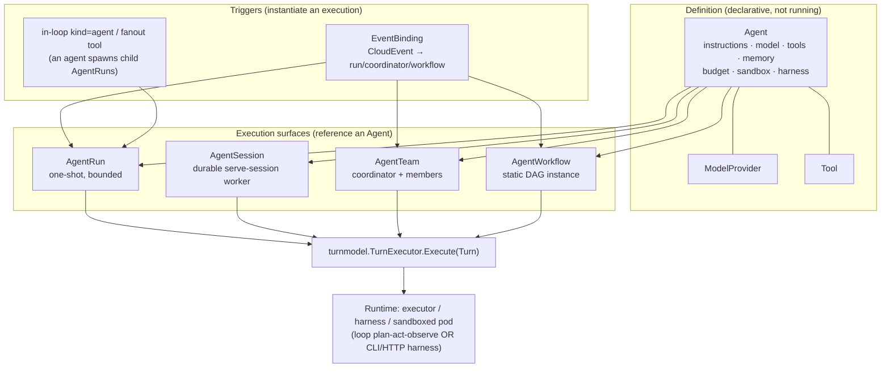

# Choosing a workload: the agent-execution selection matrix

> One page for the question *"how do I actually run an agent?"* across the
> platform's composition surfaces. Every surface drives the **same `Agent`
> definition** (instructions, model, tools, memory, budget, sandbox, harness)
> through the **same runtime** (`turnmodel.TurnExecutor` → executor/harness/pod);
> they differ only in *lifetime*, *routing*, and *composition*. Pairs with
> `knative-agents-c5r.6`.

## The model in one picture

An `Agent` is a **definition**, never a running thing. An *execution surface*
references it and supplies a lifetime + a routing strategy. All surfaces fold
results into their own status via the one runtime seam.

## The selection matrix

| Surface | Lifetime | Routing | Composition | Use it when |
|---|---|---|---|---|
| **`AgentRun`** | one-shot (bounded) | none — a single agent | first-class CRD | A discrete task with a definite end: "answer this", "process this record". The replayable step log + OpenAI-Assistants-aligned states are the unit of work everything else builds on. |
| **`AgentSession`** | **durable** (multi-turn) | none — a single agent | first-class CRD | A conversation or worker that must **remember across turns** and survive restarts: a checkpointed `serve-session` worker resumes its turn log and consumes turns from NATS via the gateway. Scale-to-zero when idle. |
| **`AgentTeam`** | one-shot or durable | **LLM-lead** — a coordinator decides who runs next | first-class CRD | Work whose decomposition isn't known up front and needs a lead agent to delegate / converge (generator-verifier, mixture-of-agents). The team is the GC root + field-wise usage roll-up over its member subtree. |
| **`AgentWorkflow`** | one-shot (per instance) | **static DAG** — edges fixed at author time | first-class CRD | A known multi-step pipeline with deterministic data flow between steps. A paused template is cloned into a fresh un-paused instance per trigger. |
| **in-loop A2A** (`kind=agent` / `kind=fanout` tool) | inherits the caller | **in-loop** — the agent calls a sub-agent as a tool | **in-loop tool**, not a CRD | One agent needs another *inside its own reasoning loop* (a sub-skill, a map-reduce fanout). Child `AgentRun`s carry usage roll-up + ownerRef subtree GC. No separate object to manage. |
| **EventBinding** (trigger) | n/a — instantiates one of the above | filter (type/source/subject) → target | trigger surface | You want work to start **from a CloudEvent** instead of `kubectl apply`. A namespace-wide Knative-`Trigger` analog that matches events to a target (AgentRun / AgentTeam / AgentWorkflow / AgentSession turn). See `docs/design/event-intake.md`. |

## The three axes, decoded

- **Lifetime** — *one-shot* (`AgentRun`, `AgentWorkflow` instance, team coordinator
  run) ends and is folded to status; *durable* (`AgentSession`) checkpoints and
  resumes. Durable is the only surface with cross-turn memory; everything else is
  independent executions (D6: loop-resume is deferred — independent turns by
  default).
- **Routing** — who decides the next unit of work: *none* (one agent),
  *static DAG* (`AgentWorkflow`, author-fixed edges), or *LLM-lead* (`AgentTeam`
  coordinator chooses at runtime).
- **Composition** — *first-class CRD* (a managed object with its own
  status/GC/quotas) vs *in-loop tool* (`kind=agent`/`fanout`, no object — the
  child run lives and dies inside the parent's loop).

## Decision shortcut

1. Start from `AgentRun` — it's the atom; prefer it unless you need more.
2. Need memory across turns / a long-lived worker? → **`AgentSession`**.
3. Need several agents and the steps are **fixed**? → **`AgentWorkflow`**.
   Steps decided **at runtime** by a lead? → **`AgentTeam`**.
4. Need a sub-agent *inside one agent's loop*, not a managed object? →
   **in-loop `kind=agent`/`fanout` tool**.
5. Want any of the above to start from an event? → wrap it in an **`EventBinding`**.

---

*See also:* `docs/design/turn-model-vs-runtime.md` (the TurnExecutor seam),
`docs/design/multi-agent-orchestration.md` (AgentTeam internals),
`docs/design/agentteam-event-driven.md`, `docs/design/event-intake.md`,
`docs/design/durable-session-architecture.md`.
