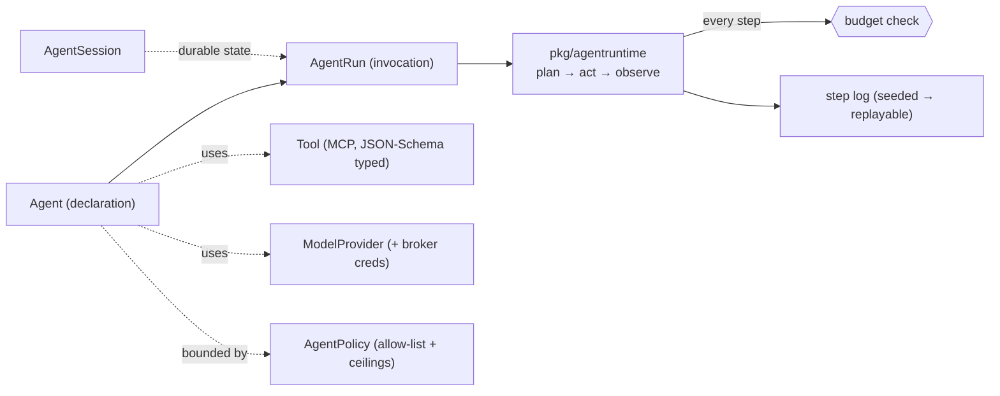

# Agent Model

> What an "agent" *is* on this platform, and how a tenant declares one — so the
> cluster can take a YAML description of identity, model, tools, memory, and
> budget and produce a verifiable, replayable execution.
> **Spec:** `.spec-workflow/specs/smol-agents-agent-model/`.
> **Packages:** `pkg/agentmodel` (types), `pkg/agentruntime` (executor).

## What it is

The agent model is the *workload* layer that runs on the [platform
substrate](runtime-and-identity.md). You ship an agent the way you ship a
`Deployment`: one CR. The runtime then proves, mechanically, that the agent
stayed inside its budget, only called allow-listed tools, and only received
credentials through the broker under its own SPIFFE identity.

Six CRDs in `runtime.agents.stigen.ai/v1` cover declaration, invocation,
identity, and policy:

| Kind | Role |
|---|---|
| `Agent` | The declaration — instructions, model, tools, memory, budget, sandbox, harness. |
| `Tool` | An MCP-typed capability with input/output JSON Schema. |
| `ModelProvider` | An LLM or embedding provider + broker-resolved credentials. |
| `AgentRun` | One invocation, with states aligned to the OpenAI Assistants API and a replayable step log. |
| `AgentSession` | Durable state shared across runs. |
| `AgentPolicy` | Guardrails: tool allow-lists, budget ceilings, identity constraints. |



## What makes it verifiable

### Hard budgets, enforced before every step

An `Agent` declares ceilings the runtime evaluates **before each step** — the
formal model proves the cap is never exceeded:

```yaml
budget:
  maxSteps: 1                # plan-act-observe iterations
  maxTokens: 200000
  maxWallClockSeconds: 1800
  maxToolCalls: 0
```

### Industry-aligned vocabulary

Run states match OpenAI's Assistants API; tools speak **MCP**; identity uses
**SPIFFE**/DID; telemetry uses the OpenTelemetry `gen_ai.*` semantic
conventions. Nothing bespoke to learn if you've used those.

### Tool typing

Every `Tool` ships input/output JSON Schema. The runtime **rejects malformed
calls before they reach the tool** — a class of agent failure removed by
construction.

### Determinism + replay

Every run captures a step log. Given a seed, the runtime replays a run to
bit-identical output — the basis for debugging, audit, and regression testing of
non-deterministic systems.

### Per-agent identity + secretless credentials

Every run Pod gets one SPIFFE ID; LLM-provider keys and tool credentials enter
**only via the secret broker** under that identity (never an env-var secret in
the clear), and the Pod inherits the platform sandbox by default.

**Proven by**
[`spec/quint/agent_execution.qnt`](../../spec/quint/agent_execution.qnt)
(budget cap) and the `pkg/agentruntime` `rapid` property suite.

## Two execution shapes

### Native runtime (`mode: ...`, default)

`pkg/agentruntime` is a deterministic **plan → act → observe** executor: it asks
the `ModelProvider` for a plan, dispatches typed `Tool` calls, observes results,
and loops until done or budget-exhausted — logging every step.

### Harness mode (`mode: harness`)

Wrap an existing agent CLI (Claude Code, Codex, π, …) as a one-shot or
persistent harness, keeping the same identity, sandbox, budget, and storage
guarantees. Samples: `agent_claude_code.yaml`, `agent_codex.yaml`,
`agent_pi.yaml`.

```yaml
apiVersion: runtime.agents.stigen.ai/v1
kind: Agent
metadata: { name: code-reviewer, namespace: tenant-a }
spec:
  mode: harness
  instructions: |
    You are a senior code reviewer. Audit the code in your working
    directory and produce structured feedback as JSON.
  budget: { maxSteps: 1, maxTokens: 200000, maxWallClockSeconds: 1800, maxToolCalls: 0 }
  harness:
    kind: claude-code
    image: smol-agents/claude-code:0.1.0
    sessionPolicy: persistent          # share state across runs
    cli: { promptFlag: --print, workingDir: /var/agentfs/repo }
    env:
      - name: ANTHROPIC_API_KEY
        secretRef: { secretName: anthropic-prod }   # broker-resolved
  storage:
    kind: agentfs                      # branchable, S3-backed — see Memory guide
    agentfs:
      sizeGiB: 20
      mountPath: /var/agentfs
      backup:
        s3: { bucket: stigen-agent-state, prefix: code-reviewer/, region: us-east-1 }
        schedule: "@hourly"
        walSnapshotInterval: "30s"
      restore: { mode: latest, ifMissing: fresh }
```

`storage.kind: agentfs` mounts a [Turso AgentFS](memory.md) volume into the
sandbox, so a coding agent does normal file I/O over a SQLite-canonical,
versioned, S3-backed filesystem.

## How tools, models, and memory connect

- **Tools** are referenced by an `Agent` and dispatched by the runtime; MCP
  tools (`Tool kind=mcp`) reach external MCP servers through the
  [agentnet](agentnet.md) identity sidecar — including the
  [memory MCP gateway](memory.md).
- **ModelProviders** carry the embedding/LLM endpoint and a broker credential
  reference; the same `ModelProvider` powers a `MemoryRetriever`'s embedding.
- **Memory** is attached either over MCP (retrieval) or by mounting AgentFS
  (filesystem) — see the [Memory guide](memory.md).

## Try it

```bash
kubectl apply -f operator/config/samples/agent_claude_code.yaml
kubectl get agentrun -n tenant-a            # watch run states progress
kubectl get agentrun <run> -n tenant-a -o jsonpath='{.status.stepLog}'  # replay log
```

## See also

- [Operator](operator.md) — reconciles `Agent`/`AgentRun` into Pods.
- [Memory](memory.md) — `ModelProvider` embeddings, AgentFS storage, MCP tools.
- [Egress Credentials](egress-credentials.md) — how tool/provider creds stay secretless.
