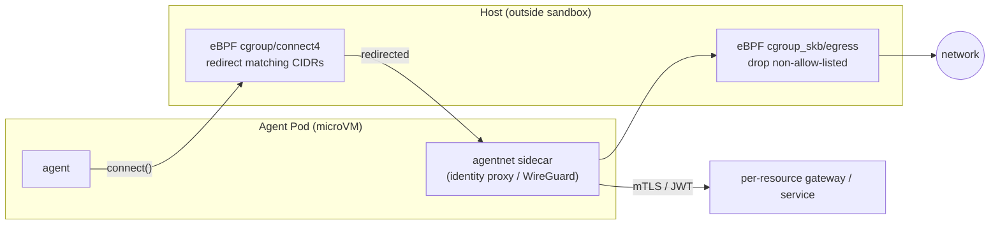

# Networking (agentnet)

> Let agents reach restricted resources without exposing the host to a
> compromised agent — an identity-aware proxy, a userspace WireGuard mesh, and
> an eBPF egress cage the agent cannot disable.
> **Spec:** `.spec-workflow/specs/smol-agents-agentnet/`.
> **Package:** `pkg/agentnet` (proxy, cgroup). **CRD:** `AgentNetwork`.

## What it is

`agentnet` is the egress layer. It offers two interoperable modes under one
`AgentNetwork` CR, plus a host-level eBPF policy that sits **outside** the
Kata-FC sandbox so a compromised agent cannot turn it off.



## The three legs

### 1. Identity proxy (recommended for known services)

A SPIFFE-aware sidecar wraps the agent's egress in mTLS/JWT and routes it to
per-resource gateways — the right path for "agent talks to a known service"
(databases, internal HTTP APIs, MCP servers). Two proxy types:

- **TCP** — a byte forwarder over SPIFFE mTLS (e.g. private Postgres/Redis).
- **HTTP** — a reverse proxy that mints a **JWT-SVID per upstream audience** and
  stamps it on each request, so the upstream can authorize the agent by identity
  with no shared secret.

The HTTP proxy's `Director` is the single injection seam that
[egress credentials](egress-credentials.md) extend with TraTs and
broker-minted provider tokens.

### 2. WireGuard mesh (for raw network reach)

A **userspace** WireGuard adapter (`golang.zx2c4.com/wireguard` + `tun/netstack`)
— no kernel module, runs cleanly inside Kata-FC. Two modes:

- `client` — join an existing WireGuard network as an ordinary peer.
- `server` — run a small WireGuard server other peers dial.

Use this when agents need raw reach into a private network the operator doesn't
already front with a proxy, without granting kernel privileges.

### 3. eBPF egress policy (defense in depth)

A cgroup `connect4` program transparently **redirects** matching destinations to
the local sidecar; a `cgroup_skb/egress` program **drops everything outside the
allow-list**. The maps are programmed by the operator from the CR, and the
programs run on the host — even if the in-Pod proxy is bypassed, the host rule
still drops the connection.

Enforcement modes (`spec.identityProxy.egress.enforcement`): redirect-only,
drop-only, or `ebpfBoth`.

## The `AgentNetwork` CR

Discriminated by `kind` (`identityProxy` | `wireguardMesh`). Samples:
`agentnetwork_proxy.yaml`, `agentnetwork_wg_client.yaml`,
`agentnetwork_wg_server.yaml`, `agentnetwork_secretless_github.yaml`.

```yaml
apiVersion: runtime.agents.stigen.ai/v1
kind: AgentNetwork
metadata: { name: db-proxy, namespace: tenant-a }
spec:
  kind: identityProxy
  agentSelector: { app.kubernetes.io/name: smol-agents }
  identityProxy:
    resources:
      - name: postgres
        kind: tcp
        localPort: 5432
        gateway: postgres.infra.svc:5432    # reached over SPIFFE mTLS
    egress:
      enforcement: ebpfBoth
      redirectCIDRs: [0.0.0.0/0]
      allow:
        - { cidr: 10.0.0.0/8, protocol: tcp, ports: [5432] }   # everything else dropped
```

The agent connects to `localhost:5432`; the sidecar carries it to the gateway
over mTLS; eBPF guarantees no other destination is reachable.

## Why this shape

eBPF cannot rewrite TLS-encrypted payloads, so it does what it's good at —
**capture** (redirect known CIDRs to the sidecar) and **constrain** (drop
non-allow-listed egress). The sidecar, which originates the upstream TLS, does
the actual identity/credential injection. Together: eBPF guarantees a request
can only leave toward an allow-listed host; the sidecar guarantees every such
request carries the right identity.

**Proven by** [`spec/quint/agentnet.qnt`](../../spec/quint/agentnet.qnt).

## See also

- [Egress Credentials](egress-credentials.md) — TraT + secretless tokens at the
  proxy seam.
- [Runtime & Identity](runtime-and-identity.md) — the SPIFFE/mTLS + eBPF this
  builds on.
- Runbook: a full secretless GitHub walk-through in
  [docs/runbooks/secretless-egress.md](../runbooks/secretless-egress.md).
