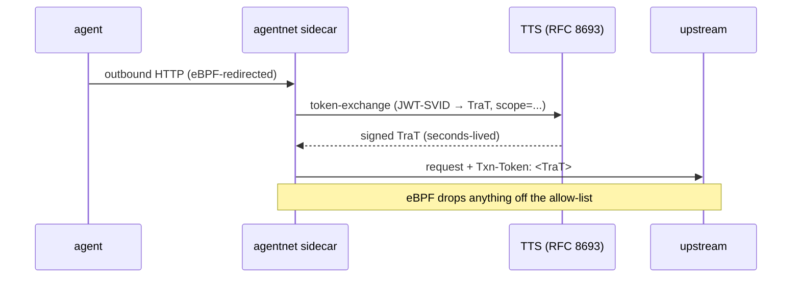
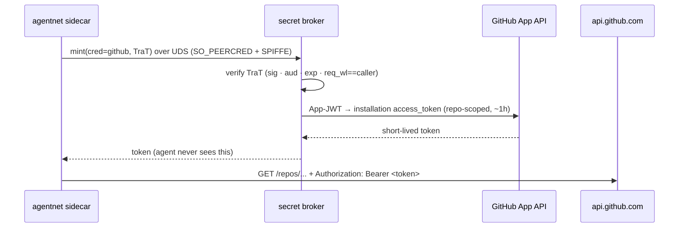

# Egress Credentials — TraT & Secretless

> Token exchange all the way down: `user token → TraT (internal intent) →
> provider credential (external, short-lived, scoped)`. The agent egresses to
> GitHub/GitLab/internal backends **without ever holding the credential**.
> **Specs:** `.spec-workflow/specs/smol-agents-trat-egress/`,
> `.spec-workflow/specs/smol-agents-secretless-egress/`.
> **Packages:** `pkg/trat`, `pkg/secrets` (backends), `pkg/agentnet/proxy`.

## The problem

An agent that calls an external API needs a credential. The naive answer — a
long-lived PAT in the agent's environment — is exactly the thing you don't want
a possibly-compromised agent to hold: it can read it, log it, or exfiltrate it.
Two composable features remove the long-lived secret entirely.

## Layer 1 — TraT injection (internal intent)

Every redirected egress request already passes through the
[agentnet](agentnet.md) sidecar, whose `HTTPProxy.Director` stamps
`Authorization: Bearer <JWT-SVID>`. **TraT egress** adds, at that same seam, a
short-lived **[Tokenetes](https://tokenetes.io) Transaction Token** minted from
the agent's SPIFFE identity and carried in the **`Txn-Token`** header.

A TraT is a narrowly-scoped, identity-bound, *seconds*-lived assertion of
*intent* (`sub` / `scope` / `rctx`). It says "this attested agent intends to do
exactly this operation" — and unlike a static secret it cannot be replayed for
anything else. The TraT's `subject_token` is the agent's JWT-SVID; the TTS
connection is mTLS via the X.509-SVID. No new credential is introduced.



**Proven by**
[`spec/quint/secretless_egress.qnt`](../../spec/quint/secretless_egress.qnt).

## Layer 2 — Secretless provider credentials (external)

For an upstream that needs a **provider-native** credential (a GitHub token, a
GitLab token), the sidecar doesn't carry the TraT to the upstream — it hands the
TraT to the **secret broker**, which:

1. **verifies** the TraT — signature against the TTS JWKS, audience, expiry, and
   crucially that `req_wl == the caller's attested SPIFFE ID` (sender-constraint:
   a TraT minted for agent A cannot be used by agent B);
2. **mints** a short-lived, scope-limited provider credential — e.g.
   `POST /app/installations/{id}/access_tokens` against the GitHub App API yields
   a repo/permission-scoped installation token (~1h);
3. returns it to the sidecar, which **injects** it as
   `Authorization: Bearer <token>` on the outbound request.

The credential flows **broker → proxy → upstream** — never broker → agent. The
agent is *blind* to the token it is using, and the eBPF allow-list ensures that
token can only ever leave toward the authorized host. The root secret (the
GitHub App private key) lives only in the broker and is never logged or
persisted.



## Defense in depth

A single injected credential is gated by **three independent controls**:

| Control | Guarantees |
|---|---|
| SPIFFE attestation (`SO_PEERCRED` + SPIRE) | only the real caller can ask the broker |
| Signed TraT (verified, sender-constrained) | the request matches an authorized *intent*, bound to that caller |
| eBPF egress allow-list | the credential can only leave toward the authorized host |

Remove any one and the other two still hold. A TraT is **not** an external
credential — it authorizes the mint; the provider token is what reaches GitHub.

## The CR

This is all configured on an `AgentNetwork` (`identityProxy`). From
`agentnetwork_secretless_github.yaml`:

```yaml
apiVersion: runtime.agents.stigen.ai/v1
kind: AgentNetwork
metadata: { name: github-secretless, namespace: tenant-a }
spec:
  kind: identityProxy
  agentSelector: { app.kubernetes.io/name: smol-agents }
  identityProxy:
    tts:                                       # mint + verify Txn-Tokens
      url: https://tts.security.svc/token
      subjectAudience: spiffe://stigen.ai/ns/security/sa/tts
      jwksUrl: https://tts.security.svc/jwks   # required: broker verifies the TraT
    resources:
      - name: github
        kind: http
        localPort: 9200
        gateway: https://api.github.com/
        jwtAudience: spiffe://stigen.ai/ns/tenant-a/sa/agent
        credential:
          name: github                 # broker credential/policy key
          scope: github:repo:read      # the authorizing TraT's intent
          header: Authorization        # injection target (defaults shown)
          scheme: Bearer
    egress:
      enforcement: ebpfBoth
      redirectCIDRs: [0.0.0.0/0]
      allow:
        - { cidr: 140.82.112.0/20, protocol: tcp, ports: [443] }   # api.github.com only
```

The agent simply calls `http://localhost:9200/repos/...`; everything above
happens transparently, and any egress that isn't `api.github.com` is dropped by
eBPF.

## Status & operations

The secretless-egress P1 path (broker `DynamicBackend` mint + TraT verification +
proxy injection, fail-closed) is **implemented and verified end-to-end**,
including on a real multi-tenant SPIRE. The full setup — registering a GitHub
App, configuring the broker's `CredentialPolicy`, wiring the TTS — is in the
runbook.

- **Runbook:** [docs/runbooks/secretless-egress.md](../runbooks/secretless-egress.md)
- **Prereqs:** [INSTALL §1.6](../INSTALL.md)

## See also

- [Networking (agentnet)](agentnet.md) — the proxy seam and eBPF allow-list.
- [Runtime & Identity](runtime-and-identity.md) — the broker, SPIFFE, and leases.
