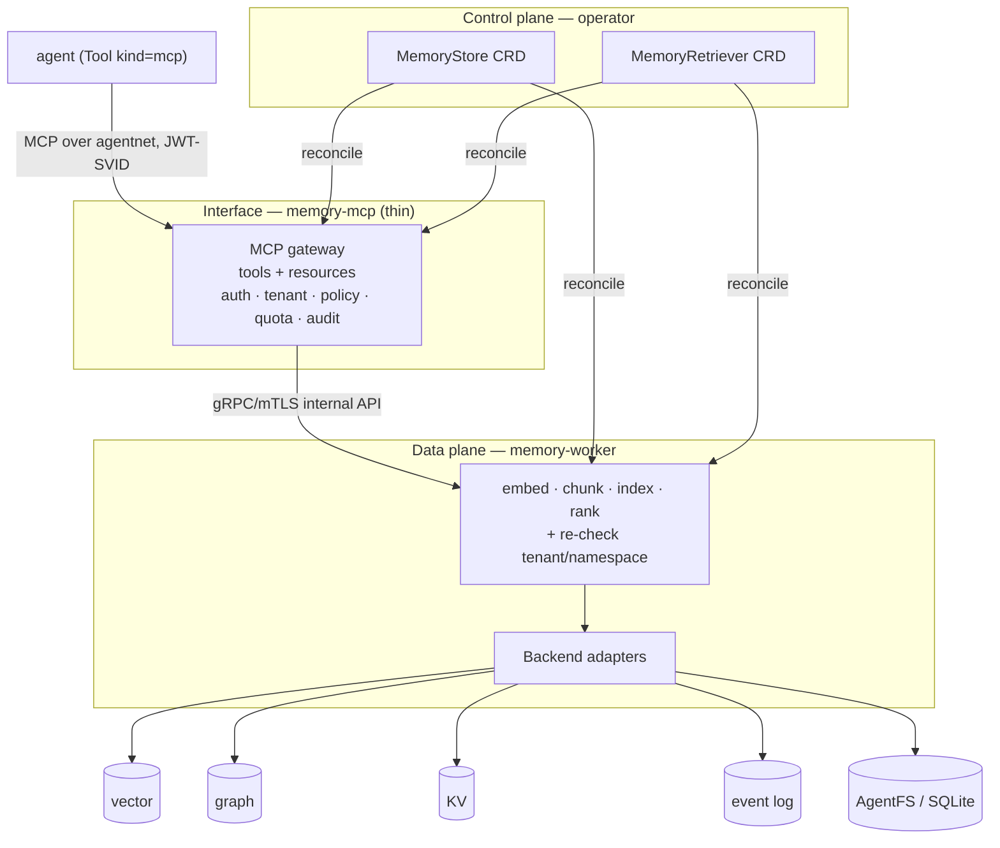

# Memory

> Agent memory as an MCP service — vector, graph, KV, event-log, and filesystem
> backends behind one identity-aware gateway, with tenant isolation,
> deny-by-default policy, quotas, audit, and **branchable, 3-way-mergeable**
> filesystem memory.
> **Spec:** `.spec-workflow/specs/smol-agents-memory/`.
> **Packages:** `pkg/memory`, `pkg/agentfs`. **Binaries:** `cmd/memory-mcp`,
> `cmd/memory-worker`. **CRDs:** `MemoryStore`, `MemoryRetriever`.

## What it is

A memory subsystem with a clean **three-plane split**, so the access layer is
swappable and the engine is reusable:



- **Control plane** — the operator reconciles `MemoryStore` + `MemoryRetriever`
  into running infrastructure and owns backend lifecycle.
- **Data plane** — `memory-worker` owns embedding, chunking, indexing, ranking,
  and the backend adapters. It **re-checks** tenant/namespace on every call.
- **Interface** — `memory-mcp` is a **thin** MCP gateway. It translates MCP
  tools/resources into the internal retrieval API and enforces identity, tenant
  isolation, quotas, audit, and policy. It owns **no indexing logic**.

Agents reach `memory-mcp` exactly like any MCP tool (`Tool kind=mcp`), through
their [agentnet](agentnet.md) identity sidecar.

## Backends (one `Backend` interface)

| Modality | Drivers |
|---|---|
| **vector** | in-memory (fake-embedder for tests), **pgvector**, **qdrant** |
| **KV** | redis (miniredis for tests) |
| **graph** | neo4j |
| **event log** | in-tree append-only (`memory://episodes/{agentId}`) |
| **filesystem** | **Turso AgentFS** (SQLite-canonical, branchable, S3-backed) |

Backend credentials (DSNs, S3 keys, embedding API keys) are **always
broker-resolved** — never literal secrets in the CR.

## MCP surface

**Tools:** `retrieve_memory`, `write_memory`, `list_memory_namespaces`,
`get_memory`, `delete_memory`, `summarize_memory`, and for the filesystem
modality `branch_memory_fs`, `snapshot_memory_fs`, `list_memory_branches`.

**Resources:** `memory://namespaces/{ns}`, `memory://retrievers/{ref}`,
`memory://documents/{...}`, `memory://episodes/{agentId}`,
`memory://files/{ref}/{path}`, `memory://branches/{agentId}`.

## Security model (the whole point)

- **Tenant from identity** — the gateway derives the tenant from the caller's
  SPIFFE path; it **overrides** any tenant in the request rather than trusting
  it. A retriever bound to `tenant-b` is unreachable by a `tenant-a` caller.
- **Deny-by-default policy** — only explicitly granted `(identity, operation,
  namespace)` tuples are allowed (see `policy:` below).
- **Quotas** — `maxTopK`, `requestsPerMinute`, `maxWriteBytes` clamped at the
  gateway.
- **Audit without leak** — structured records carry who/what/when but **never**
  content or credentials.
- **TraT-gated mutations** (optional, `mutationsTraT: true`) — writes/deletes
  require a verified, subject-bound TraT; fail-closed.
- **Fail-closed transport** — gateway↔worker is gRPC + mTLS with JWT-SVID
  validation; a broken secure path denies rather than degrades.

**Proven by**
[`spec/quint/memory_access.qnt`](../../spec/quint/memory_access.qnt)
("a document is returned only to an identity granted read on its namespace
within its tenant; mutation only with granted write + TraT when required").

## Filesystem memory & 3-way merge

The `filesystem` modality reuses `pkg/agentfs` — a SQLite-canonical filesystem
with backup / WAL / retention to S3. It **mounts into the agent sandbox** at a
`mountPath`, so a coding agent does normal file I/O *and* the same filesystem is
reachable over MCP. (This is the `storage.kind: agentfs` an
[`Agent`](agent-model.md) declares.)

Because AgentFS branches are copy-on-write, two agents can fork a knowledge base,
work independently, and merge:

- **Merge base** — a per-file `sha256` *fork manifest* captured at branch time.
- **Classification** — each file is unchanged / added / modified / deleted on
  each side; conflicting edits are detected against the merge base.
- **In-tree diff3** — an LCS-based three-way hunk merge resolves overlapping text
  edits.
- **Conflict policies** — `fail` · `ours` · `theirs` · `markers` · `union`,
  selectable per merge, with `dryRun` and atomic commit, and per-retriever
  policy restrictions.

**Proven by**
[`spec/quint/memory_merge.qnt`](../../spec/quint/memory_merge.qnt).

## The two CRDs

### `MemoryStore` — a backend

```yaml
apiVersion: runtime.agents.stigen.ai/v1
kind: MemoryStore
metadata: { name: prod-vectors, namespace: tenant-alpha }
spec:
  kind: vector
  driver: pgvector
  endpoint: pgvector.infra.svc:5432
  auth: { secretName: pgvector-dsn }     # broker-resolved at runtime
  tenancy: { model: shared, tenantLabelKey: tenant }   # row-level isolation
```

### `MemoryRetriever` — a retrieval pipeline (with the access policy)

```yaml
apiVersion: runtime.agents.stigen.ai/v1
kind: MemoryRetriever
metadata: { name: prod-knowledge-default, namespace: tenant-alpha }
spec:
  stores: [prod-vectors]
  modelProviderRef: openai-text-embedding-3    # an existing ModelProvider CR
  topK: 10
  namespaces: [default, docs, code]
  tenant: team-alpha
  chunking: { size: 512, overlap: 64, strategy: fixed }
  quota: { maxTopK: 100, requestsPerMinute: 120, maxWriteBytes: 1048576 }
  mutationsTraT: false
  policy:                                  # deny-by-default
    - { identity: spiffe://stigen.ai/ns/agents/sa/coder,     operations: [read, write], namespaces: [default, code] }
    - { identity: spiffe://stigen.ai/ns/agents/sa/researcher, operations: [read],        namespaces: [default, docs] }
```

Samples: `memorystore_vector.yaml`, `memorystore_filesystem.yaml`,
`memoryretriever_default.yaml`, `memoryretriever_filesystem.yaml`.

## Status

P1 + P2 implemented: all backends, the full MCP surface, secure gRPC/mTLS
transport with JWT validation, `summarize_memory`, TraT-gated mutations, the
3-way merge with conflict policies, stdio MCP transport, and an LRU embedding
cache. Verified end-to-end at L1 over gRPC/mTLS against real SPIRE. Remaining:
live-infra integration tests for pgvector/qdrant/neo4j/redis/S3 (adapters are
unit-tested with fakes; integration tests are build-tagged and skip without
endpoints).

## Try it

```bash
kubectl apply -f operator/config/samples/memorystore_vector.yaml
kubectl apply -f operator/config/samples/memoryretriever_default.yaml
# Connect an agent via Tool kind=mcp pointing at the memory-mcp Service.
```

- **Runbook:** [docs/runbooks/memory-mcp.md](../runbooks/memory-mcp.md)
  (declare a store/retriever, connect an agent, mount AgentFS, verify isolation).

## See also

- [Agent Model](agent-model.md) — `ModelProvider` embeddings and `storage: agentfs`.
- [Egress Credentials](egress-credentials.md) — the TraT mechanism reused for
  mutation gating.
- [Runtime & Identity](runtime-and-identity.md) — the SPIFFE/broker foundations.
