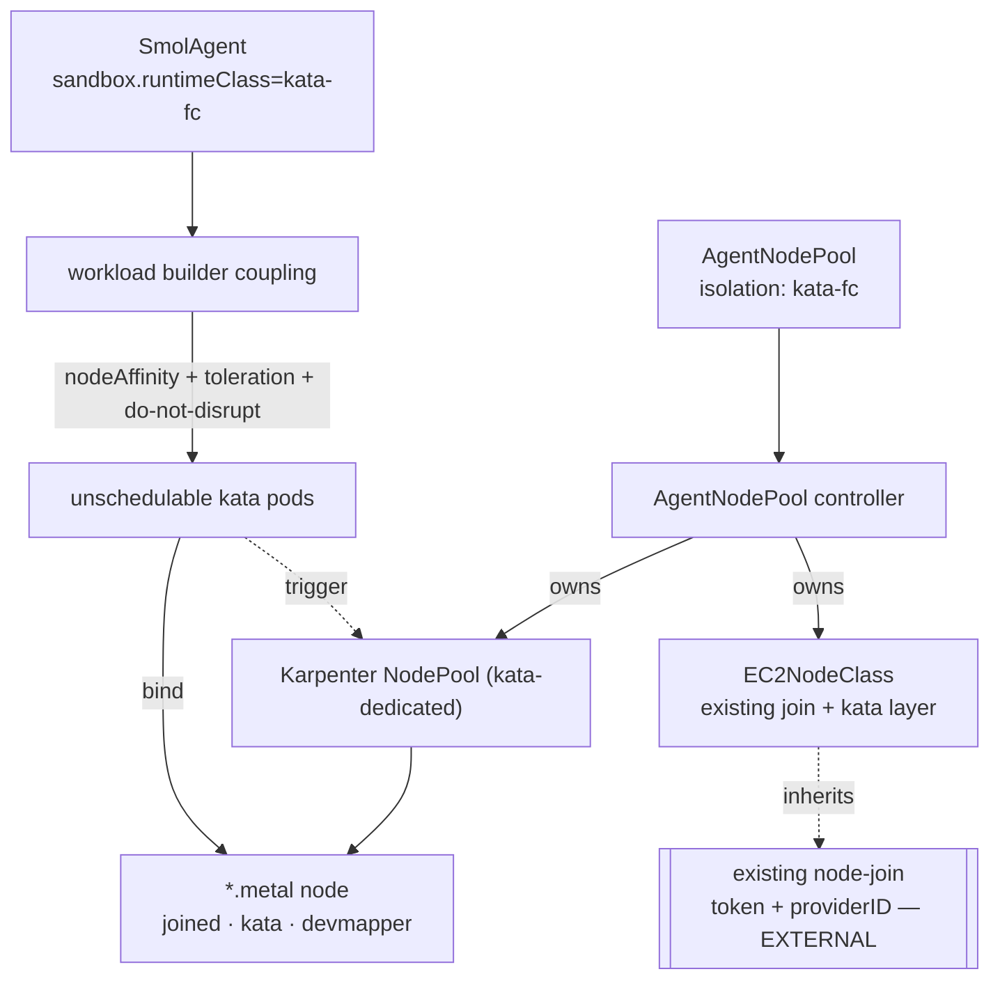

# Node Provisioning

> The operator derives node shape from an agent's *isolation* and programs
> Karpenter to make exactly those nodes — closing the loop
> isolation → node shape → provisioner → scheduling.
> **Design:** `docs/design/agent-platform.md`. **CRD:** `AgentNodePool`.
> **Runbook:** [docs/runbooks/agent-node-pools.md](../runbooks/agent-node-pools.md).

## The thesis

Node provisioning and workload isolation are **one problem**. `kata-fc` needs
`/dev/kvm`; on AWS, KVM is only exposed on bare-metal (`*.metal`) instances. So
an agent's isolation choice *determines its node shape*. A generic autoscaler
can't know that — the operator can: it reads the agent's sandbox, derives the
node requirements, programs Karpenter to build those nodes, and binds the agent
to them. That closed loop is the platform's reason to own provisioning.

## What the operator owns (and what it doesn't)

The substrate is **self-managed k0s on EC2**. The existing Karpenter deployment
already solves node→k0s join (join token + `providerID`) — that is **out of
scope**. The operator contributes only the **kata layer** (kata install +
devmapper thin-pool + containerd drop-ins) *composed onto* the existing join,
plus the workload coupling that lands sandboxed agents on the right nodes.

## `AgentNodePool` → Karpenter

A cluster-scoped, **provider-neutral** declaration of a kata-capable node shape
that compiles to a Karpenter `NodePool` + `EC2NodeClass`:

| `AgentNodePool` | compiles to |
|---|---|
| `isolation: kata-fc` | instance-type requirement `*.metal` + taint `agents.smol-agents.ai/isolation=kata-fc:NoSchedule` |
| `arch` / `instanceFamilies` / `capacityType` | matching Karpenter requirements |
| `bootstrap: UserData` | `amiFamily: Custom`; userData = existing join snippet **+** appended kata/devmapper recipe |
| `bootstrap: PrebakedAMI` | `amiSelectorTerms` = kata-ready AMI (join baked in); userData = thin-pool create only |
| `thinPool` | devmapper thin-pool on raw instance-store NVMe, created at firstboot |
| `disruption` | consolidation policy + budgets |

Two bootstrap modes ship from one hardened recipe (`scripts/aws-l2/*`, validated
across AL2023 / Ubuntu / Flatcar / Fedora CoreOS):

- **UserData** — append the kata recipe after the existing join; no image
  pipeline, node-Ready in minutes. Best for dev/iteration.
- **PrebakedAMI** — bake kata onto the join-capable base AMI; userData only
  creates the thin-pool. Fastest node-Ready; default for prod.

## Workload coupling

For a KVM-requiring `runtimeClass`, the workload builder injects — identically
for a Deployment pod template and a Knative Service podspec:

- `nodeAffinity` to the pool's label,
- `tolerations` for the pool's taint,
- `karpenter.sh/do-not-disrupt: "true"` so live agent microVMs are never
  consolidated out from under a running VM.

**gVisor fallback (R-PROV-2):** if no `AgentNodePool` satisfies KVM and policy
permits, the operator routes the agent to the gVisor path instead of leaving it
`Pending`; otherwise it surfaces `Failed/NoKVMCapacity` — a sandboxed agent is
never silently scheduled onto an unsandboxed node.

## Provider-neutral by proof

R-PROV-3 ("the API surface is provider-neutral") is demonstrated by a **second
backend**: `spec.provider: ClusterAutoscaler`. CAS scales an external ASG the
operator can't create, so the operator emits the node-group spec (discovery tags
+ kata launch-template userData) as a ConfigMap for IaC to apply — and the
workload coupling is identical to the Karpenter path. Samples:
`agentnodepool_kata_arm64.yaml` (Karpenter), `agentnodepool_cas_kata.yaml`
(Cluster Autoscaler).

## Status

P1 implemented: the `AgentNodePool` CRD + controller, the Karpenter builder,
workload coupling, gVisor fallback, kata `RuntimeClass.overhead` (so Karpenter
sizes nodes for the VM), the Cluster Autoscaler backend, and golden + envtest
coverage. Remaining: the live e2e on a real Karpenter-on-k0s cluster (P1.6) and
serverless cold-start hardening (P2 — warm pools, kata VM templating/snapshots).

## See also

- [Operator](operator.md) — the reconcile spine and `SmolAgentPlatform.nodeProvisioning` defaults.
- [Runtime & Identity](runtime-and-identity.md) — the sandbox `Kind` that drives the requirement.
- Runbooks: [agent-node-pools](../runbooks/agent-node-pools.md),
  [k0s local cluster](../runbooks/k0s-local-cluster.md),
  [L2 e2e](../runbooks/e2e-l2.md).
