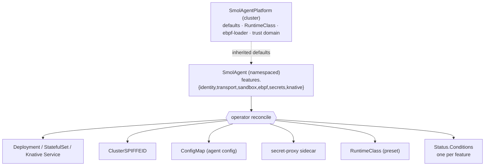

# Operator

> The control plane: a Kubebuilder controller manager that replaces the static
> Helm chart with a declarative, feature-flagged Kubernetes API.
> **Spec:** `.spec-workflow/specs/smol-agents-operator/`.
> **Code:** `operator/` (api, controllers, builders, webhooks, cmd/manager).

## What it is

Instead of `helm install` per tenant, you describe what you want — identity,
transport, sandbox, eBPF, secrets, Knative — as typed fields on a `SmolAgent`
custom resource. The operator reconciles the underlying primitives
(Deployment / StatefulSet / Knative Service, DaemonSet, ClusterSPIFFEID,
ConfigMap, secret-proxy sidecar, RuntimeClass) and **continuously heals drift**.

It inherits every guarantee of the hand-installed platform — gVisor/Kata
sandboxing, SPIFFE identity, dual-rail mTLS, the secret broker, the ebpf-loader
DaemonSet, and the formal lifecycle invariants — and adds a control-plane
lifecycle on top: every capability is a *flag* with an auditable status
condition reflecting reality.



## The two CRDs

### `SmolAgentPlatform` (cluster-scoped)

Cluster-wide defaults one or more agents inherit: the RuntimeClass + sandbox
preset, the ebpf-loader DaemonSet spec, the default trust domain, and (for
[node provisioning](node-provisioning.md)) a `nodeProvisioning` block. Without a
platform CR, every `SmolAgent` stays `Pending → PlatformAbsent` — it is the
single cluster knob the operator keys off.

```bash
kubectl apply -f operator/config/samples/smolagentplatform.yaml
```

### `SmolAgent` (namespaced)

One hardened agent workload. Fields mirror the old `values.yaml` but are typed,
validated, and feature-flagged:

```yaml
apiVersion: agents.stigen.ai/v1
kind: SmolAgent
metadata: { name: hello, namespace: tenant-a }
spec:
  trustDomain: stigen.ai
  mode: strict
  deploymentKind: knative          # knative | deployment | statefulset
  features:
    sandbox:    { runtimeClass: kata-fc }
    transport:  { private: { authorize: ["prefix:spiffe://stigen.ai/ns/tenant-a"] } }
    secrets:    { enabled: true }
    ebpf:       { programs: [syscalls, network] }
    observability: { otlpEndpoint: "otel-collector.observability:4317" }
  rollout:
    policy: Canary                  # Immediate | Canary | Manual
    canaryPercent: 10
```

`deploymentKind: knative` produces a scale-to-zero Knative Service; the others
produce a Deployment or StatefulSet.

## Key behaviours

### Per-feature flags with status conditions

Every capability — identity, `transport.private`, `transport.public`, secrets,
sandbox, ebpf, knative, observability — is a `Feature` with `enabled`, `mode`,
optional `config`, and a matching `Status.Conditions` entry the operator updates
on **every** reconcile. You can read the agent's true state from `kubectl get`,
not infer it from logs.

### Feature gates, safe-by-default

A feature turns on only when its prerequisites are satisfied (CRDs present,
RuntimeClass installed, host capabilities available). Otherwise the operator
surfaces `FeaturePrerequisitesUnmet` rather than silently degrading. Example:
asking for `kata-fc` on a cluster with no `/dev/kvm` and no gVisor fallback
allowed yields a clear condition, not a `Pending` mystery.

### Progressive rollout

Each `SmolAgent` carries a `spec.rollout` block — canary percentage, paused
state, and a per-feature `rolloutPolicy` (`Immediate` | `Canary` | `Manual`) —
so a fleet-scale change can be canaried or held per capability.

### Conversion webhooks

`vN ⇆ vN+1` conversion lets tenants stay on stable APIs across operator
upgrades.

## Install & migrate

```bash
# Install the operator (namespace + RBAC + CRDs + webhooks + Deployment)
kubectl apply -k operator/config/default

# The singleton platform CR
kubectl apply -f operator/config/samples/smolagentplatform.yaml

# A tenant agent
kubectl apply -f operator/config/samples/smolagent_minimal.yaml
kubectl wait --for=jsonpath='{.status.phase}'=Ready smolagent/hello -n tenant-a
```

The chart and operator **coexist for one minor release** so tenants migrate at
their own pace — the operator only manages resources whose `OwnerReferences`
point at its CR, so the two never fight. The full `values.yaml → SmolAgent.spec`
mapping table and a step-by-step walk-through are in
[INSTALL §11](../INSTALL.md).

## Reconcile spine for other subsystems

The operator's reconcile pattern (CRD → Deployment/Service + status conditions +
owner refs + finalizer teardown) is the template the rest of the platform
follows: the [memory controller](memory.md), the
[`AgentNetwork` controller](agentnet.md), and the
[`AgentNodePool` controller](node-provisioning.md) all reuse the same builders
and aggregator/status machinery. Coverage is enforced with `envtest`
(`make envtest`).

**Proven by**
[`spec/quint/operator_lifecycle.qnt`](../../spec/quint/operator_lifecycle.qnt).

## See also

- [Runtime & Identity](runtime-and-identity.md) — the guarantees being flagged.
- [Agent Model](agent-model.md) — the richer `runtime.agents.stigen.ai` workload CRDs.
- [Node Provisioning](node-provisioning.md) — the operator owning node shape.
