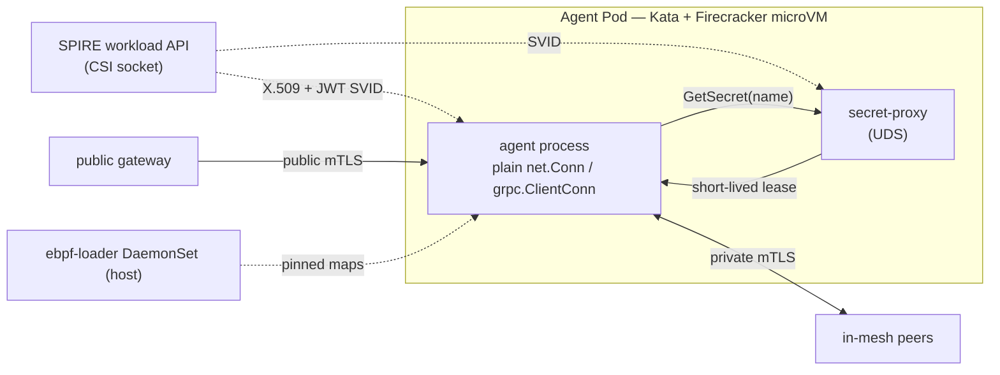

# Runtime & Identity

> The hardened core every other feature inherits: a hardware-isolated sandbox,
> a cryptographic identity, two-rail mTLS, a secret broker, and host eBPF.
> **Spec:** `.spec-workflow/specs/smol-agents-platform/`.
> **Packages:** `pkg/identity`, `pkg/transport`, `pkg/sandbox`, `pkg/secrets`,
> `pkg/ebpf`, `pkg/ebpfloader`, `pkg/runtime`, `pkg/config`, `pkg/health`,
> `pkg/observability`.

## What it is

The platform runtime turns a plain Go process into a *hardened agent*: it boots
with a verifiable identity, refuses traffic from unknown peers, holds no
long-lived secrets, runs inside a microVM, and can observe the host kernel
without privileges leaking into the agent. These are not features you turn on
later — they are the substrate the operator, agent model, and memory subsystem
all build on.



## The five foundations

### 1. Identity — SPIFFE/SPIRE (`pkg/identity`)

Every agent receives a **SPIFFE ID** of the form
`spiffe://<trust-domain>/ns/<namespace>/sa/<serviceaccount>`, materialized as
auto-rotating **X.509-SVIDs** (for mTLS) and **JWT-SVIDs** (for token-bearing
egress). Built on `go-spiffe/v2`'s `X509Source` / `JWTSource`.

- **Boot gate** — the runtime blocks up to `identity.bootTimeout` for its first
  SVID; no identity, no serving.
- **Rotation** — certificates rotate at `rotationThreshold` (default 50 %) of
  remaining lifetime; the chaos tests assert 100 % rotate before expiry with no
  observable handshake failure.
- **Authorizers** — SPIFFE-aware matchers (`any:`, `prefix:`, exact ID) decide
  which peers may connect.

Three **modes** govern strictness, matching the infra-blocks convention:

| Mode | Behaviour |
|---|---|
| `insecure` | No mTLS. Requires `SMOL_AGENTS_ALLOW_INSECURE=1`. Local dev only. |
| `permissive` | Serves mTLS but also accepts plaintext — migration aid. |
| `strict` | SPIFFE mTLS required on every connection. Production default. |

**Proven by** [`spec/quint/identity.qnt`](../../spec/quint/identity.qnt).

### 2. Transport — two-rail mTLS (`pkg/transport`)

Two listener/dialer types, both gRPC- and HTTP/2-capable:

- **`PrivateMTLS`** — in-mesh traffic. Both ends present SPIFFE SVIDs; the peer
  must satisfy `transport.private.authorize` (OR semantics across matchers).
- **`PublicMTLS`** — ingress. Validates an X.509 chain from a public CA, pinned
  to a SPIFFE-bound server identity, for traffic arriving through a gateway.

Agents see a plain `net.Conn` / `grpc.ClientConn`; SPIFFE and mTLS live behind
it. The public rail is disabled by default (`public.addr: ""`).

### 3. Sandbox — Kata + Firecracker (`pkg/sandbox`)

Every agent process executes inside a **Kata Containers + Firecracker microVM**
(`runtimeClassName: kata-fc`) — a compromised agent is bounded by the KVM
hypervisor, not just namespaces. A typed `Kind` enum classifies runtimes:

| Class | RuntimeClasses | Boundary |
|---|---|---|
| microVM-backed | `kata-fc`, `kata-qemu`, `kata-clh` | Firecracker/QEMU + KVM exit gates |
| userspace | `gvisor` (`runsc`) | gVisor syscall allow-list (no `/dev/kvm` needed) |
| unsandboxed | `runc` | **none** — guarded by R-SBX-1 (`allowHostEscape` required) |

The Helm chart ships **nine distro presets** (`generic`, `bare-metal`,
`eks-bottlerocket`, `aks`, `openshift-sandboxed`, `k3s`, `talos`, `gke`,
`generic-gvisor`) that map your environment to the right RuntimeClass — see
[INSTALL §1.4.1](../INSTALL.md). gVisor is the automatic fallback where KVM is
unavailable (e.g. GKE Sandbox).

### 4. Secrets — kloak-style broker (`pkg/secrets`, `cmd/secret-proxy`)

A sidecar listens on a **Unix domain socket** and authenticates each caller with
**`SO_PEERCRED` + the SPIRE workload API** — the kernel tells the broker which
PID/UID connected, and SPIRE attests its SPIFFE ID. The agent calls
`GetSecret(name)` and receives a **short-lived lease** (≤ `maxLeaseTTL`, default
15m) of a Vault/OpenBao-issued ephemeral secret. Raw key material never enters
agent memory in the steady state.

The `Backend` interface is pluggable: `static` (dev), Vault/OpenBao, and a
**`DynamicBackend` mint path** that powers [secretless
egress](egress-credentials.md) (broker → proxy → upstream; the agent is blind).
Access is gated by a `Policy` keyed on the caller's SPIFFE ID.

**Proven by** [`spec/quint/secrets.qnt`](../../spec/quint/secrets.qnt).

### 5. eBPF — host visibility without agent privilege (`pkg/ebpf`, `pkg/ebpfloader`)

CO-RE BPF programs (syscall, network, egress) load via a **privileged
`ebpf-loader` DaemonSet** that runs once per node, attaches the programs, and
**pins their maps to bpffs**. Unprivileged agent Pods then read events through
the pinned paths **without holding `CAP_BPF` themselves** — privileged
operations live in one well-audited DaemonSet while the agent stays in its
microVM. This is the "two layers of containment" principle: host eBPF *and*
microVM isolation.

Pinned maps survive Pod termination, so rolling DaemonSet upgrades don't drop
events (the loader deliberately does not unpin on shutdown). Distro presets and
the full operational story are in [INSTALL §6.5](../INSTALL.md).

## Configuration reference

The agent's typed YAML (loaded + validated by `pkg/config`):

```yaml
mode: strict                       # insecure | permissive | strict
trustDomain: smol-agents.ai
identity:
  workloadAPI: unix:///run/spire/agent-sockets/api.sock
  bootTimeout: 30s                 # block this long for the first SVID
  maxJWTLifetime: 5m
  rotationThreshold: 0.5           # rotate at 50% remaining
transport:
  private:
    addr: "0.0.0.0:8443"
    authorize:                     # ≥1 matcher; OR semantics
      - "prefix:spiffe://smol-agents.ai/ns/agents"
  public:
    addr: ""                       # empty = disabled
    certPath: /etc/tls/tls.crt
    keyPath:  /etc/tls/tls.key
secrets:
  brokerSocket: /run/secret-broker/secret-broker.sock
  maxLeaseTTL: 15m
ebpf:
  programs: [syscalls, network]
  objectsDir: /usr/share/smol-agents/bpf
sandbox:
  runtimeClass: kata-fc
observability:
  otlpEndpoint: otel-collector.observability:4317
```

Environment overrides exist for every critical field
(`SMOL_AGENTS_MODE`, `SMOL_AGENTS_TRUST_DOMAIN`, `SMOL_AGENTS_BROKER_SOCKET`, …);
see [INSTALL §6](../INSTALL.md).

## Lifecycle (`pkg/runtime`)

The runtime coordinates `Start → Ready → Serving → Draining → Stopped`, exposing
`/healthz` and `/readyz` (`pkg/health`) and OTLP traces/metrics
(`pkg/observability`). It will not report Ready until identity is established and
its listeners are bound.

**Proven by** [`spec/quint/agent_lifecycle.qnt`](../../spec/quint/agent_lifecycle.qnt).

## Try it

```bash
# Build the core binaries
make build            # → bin/agent, bin/secret-proxy, bin/agentctl

# Inspect an agent's identity from inside its Pod
kubectl exec -n tenant-a <agent-pod> -c agent -- /agentctl status

# Confirm the private listener refuses peers without an SVID
openssl s_client -connect <pod-ip>:8443    # handshake fails (expected)
```

## See also

- [Operator](operator.md) — turns these foundations into feature flags.
- [Networking](agentnet.md) / [Egress Credentials](egress-credentials.md) —
  build on identity + secrets + eBPF.
- [INSTALL](../INSTALL.md) — prerequisites, presets, troubleshooting.
