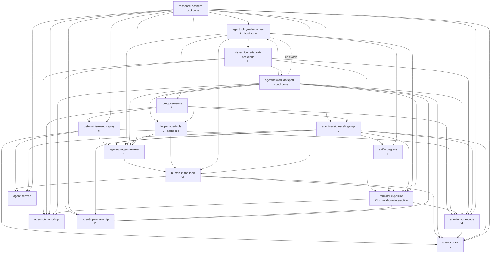

# smol-agents Implementation Specs — Master Roadmap

> **Status: ROADMAP INDEX / DESIGN — 2026-06-03 (v0.2.0 source, HEAD `d6f930b`).** This is the index for the 17 implementation-grade specs written to take smol-agents from "strong single-tenant secure runtime" to "full support for the named agents + every stubbed feature wired end-to-end." Each spec is a build sheet with `file:line` citations and external-API research; this README sequences them. Everything below a milestone's exit criteria is **PROPOSED** until the spec lands — nothing here is implemented yet unless a verified-fact callout says so.
>
> **Grounded in:** [agent-runtime-fit-analysis-v0.2.0.md](../research/agent-runtime-fit-analysis-v0.2.0.md) (the 20-agent audit that enumerated the gaps — §1 "Top 5 gaps", §2 interface scorecard) and [framework-enhancements.md](../design/framework-enhancements.md) (the four-axis enhancement roadmap whose "model is richer than the wire" thesis these specs operationalize). Where those two disagree with the tree, the **VERIFIED FACTS** in each spec win — several beliefs in `framework-enhancements.md` are now stale (e.g. its O1 claim that `RunResult` drops Steps; Steps already fold to the cluster — see [response-richness](response-richness.md) §2).
>
> **Design background per area:** [agent-platform.md](../design/agent-platform.md), [harness-authoring.md](../design/harness-authoring.md), [tool-kinds-roadmap.md](../design/tool-kinds-roadmap.md), [durable-session-architecture.md](../design/durable-session-architecture.md), [agent-session-scaling.md](../design/agent-session-scaling.md), [custom-agent-images.md](../design/custom-agent-images.md), [agentnetwork-agentpolicy-interaction.md](../design/agentnetwork-agentpolicy-interaction.md), [secrets-broker-credential-backends.md](../design/secrets-broker-credential-backends.md). Feature docs: [agent-model.md](../features/agent-model.md), [agentnet.md](../features/agentnet.md), [egress-credentials.md](../features/egress-credentials.md), [memory.md](../features/memory.md), [operator.md](../features/operator.md), [runtime-and-identity.md](../features/runtime-and-identity.md).

---

## 1. Overview

This spec set covers two intertwined objectives the maintainer asked for:

1. **Full support for five concrete agents** — [hermes](agent-hermes.md), [claude-code](agent-claude-code.md), [codex](agent-codex.md), [pi-mono over HTTP](agent-pi-mono-http.md), and [openclaw over HTTP](agent-openclaw-http.md) — plus a research spec on **interactive terminal exposure** ([terminal-exposure-http-ssh-tmux](terminal-exposure-http-ssh-tmux.md)) for HTTP/SSH/tmux attach.
2. **Implementing every stubbed-or-missing feature** the v0.2.0 audit flagged — the control plane *around* the proven runtime: governance ([agentpolicy-enforcement](agentpolicy-enforcement.md), [run-governance](run-governance.md)), per-workload egress ([agentnetwork-datapath-enforcement](agentnetwork-datapath-enforcement.md)), loop-mode tools ([loop-mode-tools-and-invokers](loop-mode-tools-and-invokers.md), [agent-to-agent-invoker](agent-to-agent-invoker.md)), richer observability ([response-richness](response-richness.md)), durable-session scaling ([agentsession-scaling-impl](agentsession-scaling-impl.md)), files ([artifact-egress](artifact-egress.md)), declarative dynamic credentials ([dynamic-credential-backends](dynamic-credential-backends.md)), human approval gates ([human-in-the-loop](human-in-the-loop.md)), and replay/eval ([determinism-and-replay](determinism-and-replay.md)).

**Why these are one roadmap, not two.** The fit analysis (§1) found the substrate strong (kata-fc fail-closed + default-deny egress + brokered secrets + SPIFFE, Hermes live-proven) but the control plane thin: `AgentPolicy` has zero enforcement, `AgentNetwork` is unwired on the datapath, loop-mode tools are dead end-to-end, and CLI harnesses discard `ToolCalls`/report `tokens=0`. **Per-agent "full support" is gated on those stubs landing first** — e.g. claude-code's MCP servers need [agentnetwork-datapath-enforcement](agentnetwork-datapath-enforcement.md) to open egress safely; every CLI agent's token/cost surface needs [response-richness](response-richness.md). So the agent specs sit *on top of* the stub-impl specs in dependency order.

**Honest framing.** Several "features" the older docs imply exist are stubs (`AgentPolicy` controller, `AgentNetwork` datapath wiring, loop-mode invokers, `PassthroughEnv`, `RedactionPolicy`, `RequiresAction` emission). Each spec opens with a **Current state** section that cites the dead scaffolding `file:line`. This index does **not** restate those; it sequences the work that animates them.

---

## 2. Index of specs

17 specs across three categories: **agent** (per-tool full support), **research** (exploratory, external-interface-heavy), **stub-impl** (wire a declared-but-dead feature). Effort scale **S < M < L < XL**.

| Feature | Spec | Category | Effort | Depends on |
|---|---|:--:|:--:|---|
| Hermes Agent (full gateway) | [agent-hermes.md](agent-hermes.md) | agent | L | response-richness, agentsession-scaling-impl, determinism-and-replay, human-in-the-loop |
| Claude Code | [agent-claude-code.md](agent-claude-code.md) | agent | XL | response-richness, agentsession-scaling-impl, dynamic-credential-backends, agentnetwork-datapath-enforcement, terminal-exposure, determinism-and-replay, run-governance |
| Codex | [agent-codex.md](agent-codex.md) | agent | L | response-richness, agentsession-scaling-impl, agent-claude-code, agentnetwork-datapath-enforcement, human-in-the-loop, determinism-and-replay |
| pi-mono (HTTP) | [agent-pi-mono-http.md](agent-pi-mono-http.md) | agent | L | terminal-exposure, agentnetwork-datapath-enforcement, response-richness, run-governance, dynamic-credential-backends |
| OpenClaw (HTTP) | [agent-openclaw-http.md](agent-openclaw-http.md) | agent | XL | agentnetwork-datapath-enforcement, terminal-exposure, agentsession-scaling-impl, response-richness, dynamic-credential-backends |
| Terminal exposure (HTTP/SSH/tmux) | [terminal-exposure-http-ssh-tmux.md](terminal-exposure-http-ssh-tmux.md) | research | XL | agentnetwork-datapath-enforcement, agentpolicy-enforcement, agentsession-scaling-impl, human-in-the-loop, artifact-egress, dynamic-credential-backends |
| AgentPolicy enforcement | [agentpolicy-enforcement.md](agentpolicy-enforcement.md) | stub-impl | L | response-richness, run-governance, agentnetwork-datapath-enforcement |
| AgentNetwork datapath enforcement | [agentnetwork-datapath-enforcement.md](agentnetwork-datapath-enforcement.md) | stub-impl | L | agentpolicy-enforcement, dynamic-credential-backends, run-governance, agentsession-scaling-impl |
| Loop-mode tools & invokers | [loop-mode-tools-and-invokers.md](loop-mode-tools-and-invokers.md) | stub-impl | L | response-richness, agentnetwork-datapath-enforcement, dynamic-credential-backends, agent-to-agent-invoker |
| Agent-to-agent invoker | [agent-to-agent-invoker.md](agent-to-agent-invoker.md) | stub-impl | XL | loop-mode-tools-and-invokers, agentnetwork-datapath-enforcement, agentpolicy-enforcement, response-richness, agentsession-scaling-impl, determinism-and-replay |
| Response richness (Steps/ToolCalls/usage wire) | [response-richness.md](response-richness.md) | stub-impl | L | agent-claude-code, agent-codex, agent-hermes, loop-mode-tools-and-invokers, run-governance |
| Human-in-the-loop | [human-in-the-loop.md](human-in-the-loop.md) | stub-impl | XL | response-richness, agentpolicy-enforcement, loop-mode-tools-and-invokers, agent-to-agent-invoker |
| Artifact egress (files out) | [artifact-egress.md](artifact-egress.md) | stub-impl | L | agentpolicy-enforcement, agentsession-scaling-impl |
| Determinism & replay | [determinism-and-replay.md](determinism-and-replay.md) | stub-impl | M | response-richness, agent-hermes, run-governance |
| Dynamic credential backends | [dynamic-credential-backends.md](dynamic-credential-backends.md) | stub-impl | L | agentnetwork-datapath-enforcement, agentpolicy-enforcement |
| Run governance (quota/placement/deadline) | [run-governance.md](run-governance.md) | stub-impl | L | agentpolicy-enforcement, agentsession-scaling-impl, agentnetwork-datapath-enforcement |
| AgentSession scaling (impl) | [agentsession-scaling-impl.md](agentsession-scaling-impl.md) | stub-impl | L | response-richness, run-governance |

---

## 3. Dependency graph & critical path

The `dependsOn` edges form a DAG **once two co-evolution cycles are broken** (see the note below). Solid arrows are the load-bearing build-order edges; the four nodes the rest of the tree leans on are the **backbones**.



### Co-evolution cycles (broken for build order)

Two `dependsOn` pairs are mutual and would otherwise make the graph cyclic. They are **co-shipped within one milestone**, not strictly ordered:

- **agentpolicy-enforcement ↔ agentnetwork-datapath-enforcement.** Each lists the other (policy needs egress facts to enforce; the datapath floor is a policy decision). Ship them as the **containment+governance pair** in M1 behind a shared `pkg/agentmodel/v1` compositor. See [agentnetwork-agentpolicy-interaction.md](../design/agentnetwork-agentpolicy-interaction.md).
- **response-richness ↔ {agent-hermes, agent-claude-code, agent-codex}.** `response-richness` lists the agent specs because the per-harness JSON parsers (`parse_claude.go`, `parse_codex.go`, Hermes `parseResponsesOutput`) are *authored in* those specs, while the agents list `response-richness` because they need the `Steps`/`Usage`/`Trace` *wire* it defines. The wire lands first (M2); the parsers fold in per-agent (M3). Treat the edge as "the wire precedes; parsers co-evolve."

### Critical path / backbones

The longest must-be-sequential chain (the **critical path**) runs:

```
run-governance → agentpolicy-enforcement → agentnetwork-datapath → loop-mode-tools → agent-to-agent-invoker → human-in-the-loop → (terminal-exposure / agent-claude-code)
   M1                  M1                       M1                      M2                  M2                       M3                          M4
```

Four nodes are **backbones** — most other specs transitively depend on them, so they should be staffed first:

| Backbone | Unblocks | Lands |
|---|---|---|
| **response-richness** | every agent's token/cost/tool-call surface; replay; a2a roll-up; HITL pending-action; session usage | M2 (wire); M3 (parsers) |
| **agentnetwork-datapath + agentpolicy** (pair) | safe egress for tools/MCP/A2A; serving-pod floor; dynamic creds; terminal; all 5 agents | M1 |
| **loop-mode-tools-and-invokers** | A2A, HITL tool-gate, any non-harness tool use | M2 |
| **terminal-exposure** | interactive claude-code/codex/pi-mono/openclaw; the proving ground for the hardened serving path | M4 |

> **Note — `response-richness` is "L (wire)", not "XL".** Its keystone plumbing (`RunResult.Steps`, `ResultToWire` copy, `foldRunResult`, the ~4 KiB clamp) **already landed** in v0.2.0; the spec is the *residual* — the size-budget for large traces + per-harness parsers. Do not re-scope it from `framework-enhancements.md` §O1, which is stale on this point ([response-richness](response-richness.md) §2).

---

## 4. Sequenced milestones

Five themed, independently-shippable milestones in dependency order. Each is releasable on its own and respects every `dependsOn`. Effort is the aggregate of included specs (S=1, M=2, L=3, XL=5 story-points as a rough planning weight).

> **Per-task breakdown:** [TASKS.md](TASKS.md) decomposes these five milestones into **~107 actionable tasks** (build steps with real file/type/func names, acceptance bars, dependencies, flagged risks) plus the consolidated post-GA deferrals and open questions. This section is the overview; TASKS.md is the execution checklist.

> **✅ Re-prioritized 2026-06-03 per [decisions.md](../design/decisions.md).** **M1 is now
> mandatory/P0**, not a "multi-tenant prerequisite" (D1): policy enforcement + **built**
> redaction, AgentNetwork datapath + the serving egress floor **default-ON** (D3, not
> opt-in), run-governance **per-tenant caps + admission queue + run-path autoscaling**
> (D10), the **`DynamicCredentialPolicy` CRD** (D8, operator-granted), and NATS
> per-namespace ACLs. A **bundled self-hosted OIDC (Dex/Keycloak)** + `AttachGrant` join the
> interactive tier (M4/M5) as a new infra dependency (D5/D9); attach is **driver-mode in
> v1** (D5), and sessions/attach are gated by the new **`spec.session{required,interactive}`**
> Agent field (D4). **Loop-resume, HITL mid-run continuation, and replay are post-GA** (D6)
> — the M5 continuation-pod engine and M2's `HarnessKind=replay` slip past GA. The
> per-milestone specifics below predate this and are superseded where they conflict.

### M1 — Containment + Governance floor `(≈ L+L+L+L = 4×L, ~12 pts)`

> **Goal:** make the control plane around the proven runtime real and fail-closed — per-workload egress, policy enforcement, run placement/quota/deadline. This is the multi-tenant prerequisite the fit analysis (§1 gaps 1–3) called out.

- [run-governance.md](run-governance.md) — node placement (kata runs stop failing to schedule), per-agent/per-namespace concurrency, run deadlines, `AgentRunQuota` CRD.
- [agentpolicy-enforcement.md](agentpolicy-enforcement.md) — the missing `AgentPolicy` controller + admission gate + `ComposePolicies`/redaction (observability-only redaction — **not** containment; see its R1 risk).
- [agentnetwork-datapath-enforcement.md](agentnetwork-datapath-enforcement.md) — wire `AgentNetwork` allow-lists onto the run/session NetworkPolicy + eBPF tier; add the **default-on** SmolAgent serving-pod egress floor (D3 — strict/fail-closed).
- [dynamic-credential-backends.md](dynamic-credential-backends.md) — `DynamicCredentialBackend` CRD (GitHub App mint) producer side; SPIRE-backed broker fail-closed guard. (Consumer datapath co-lands with the AgentNetwork proxy.)

**Exit criteria:** an `AgentPolicy` denies a disallowed provider at admission and redacts a folded `Status.Output` on cftest; an `AgentNetwork` allow-list demonstrably opens one extra egress host (Tier-1 NetworkPolicy on k0s, confirmed by the CNI honoring it); a kata-fc run gets correct `nodeAffinity` + a deadline; concurrency cap holds (soft, eventually-consistent). **Dependency note:** the policy↔network pair co-ships; `dynamic-credential-backends` end-to-end mint is **deferred to M2's** AgentNetwork proxy+SPIRE injection (producer lands here, consumer there — its R1 risk).

### M2 — Capability wire: tools, observability, files, replay `(≈ L+L+M+L+L = ~14 pts)`

> **Goal:** animate loop mode and make every run's cluster-facing record rich and reproducible. Unblocks the per-agent richness in M3.

- [response-richness.md](response-richness.md) — size-budgeted trace (`Trace.OverflowRef` to AgentFS/S3), `status.usage.costUSD`, `status.trace`, cross-harness `Steps`/`ToolCalls` wire. **Wire only here; per-harness parsers in M3.**
- [loop-mode-tools-and-invokers.md](loop-mode-tools-and-invokers.md) — `pkg/agentruntime/invokers/` (HTTP + Streamable-HTTP MCP), a real JSON-Schema validator, `tools.json` into the run ConfigMap, admission guard for unwired kinds.
- [agentsession-scaling-impl.md](agentsession-scaling-impl.md) — durable-session turn concurrency, retention, aggregated `Status.Usage`, gateway per-session limits. (Spec is skeletal today: `agentRef` + `idleTimeoutSeconds` only.)
- [artifact-egress.md](artifact-egress.md) — `ArtifactSpec` glob → S3 manifest on pod shutdown (within the 120 s grace window).
- [determinism-and-replay.md](determinism-and-replay.md) — `HarnessKind=replay`, recording decorator, `agent eval` suite runner.

**Exit criteria:** a loop-mode agent with an HTTP tool + an MCP tool completes a turn against `cmd/fake-mcp` with schema-validated args; a run's `status.trace` survives a >4 KiB trace (overflow ref resolves); a durable session sums `Status.Usage` across turns under `-race`; `agent eval` replays a recorded fixture to an exact verdict. **Dependency note:** depends on M1 (egress floor so tool tokens aren't usable against any 443 host — loop-mode R1).

### M3 — Agent composition + per-agent full support `(≈ XL+L+L+XL = ~18 pts)`

> **Goal:** with the wire + tools live, deliver agent-to-agent delegation and "full support" for the CLI/HTTP agents that are pure batch (no terminal needed).

- [agent-to-agent-invoker.md](agent-to-agent-invoker.md) — `AgentRunInvoker` + in-pod apiserver client + namespaced A2A RBAC + `--a2a-max-depth`. (**Highest-risk unverified item in the set** — kata-fc microVM → apiserver ClusterIP reachability; validate on cftest before committing.)
- [agent-hermes.md](agent-hermes.md) — `/v1/responses` adoption, async `/v1/runs` stop-on-cancel, capabilities gate, session-id injection. (Already e2e-green on `/v1/chat/completions`; this is the richness upgrade.)
- [agent-codex.md](agent-codex.md) — `HarnessCodexSpec`, `parseCodexEvents`, `config.toml` render, sandbox/RuntimeClass coupling guard. (Depends on `agent-claude-code` for the shared per-kind flag seam.)
- [agent-claude-code.md](agent-claude-code.md) — `buildClaudeArgs`, `--output-format json` parser, MCP server renderer, `apiKeyHelper`, cost/cache token surface. (Its terminal-attach facet defers to M4; batch facet lands here.)

**Exit criteria:** a depth-2 A2A tree completes with correct child-usage roll-up (excluding wall-clock); Hermes surfaces a tool-call trace to `kubectl` from `/v1/responses`; claude-code and codex each complete a batch coding run reporting real tokens + cost on cftest, with MCP/extra-flags honored. **Dependency note:** depends on M2 wire + tools; the response-richness *parsers* land here (co-evolution edge).

### M4 — Interactive: terminal exposure + long-running daemons `(≈ XL+L+XL = ~13 pts)`

> **Goal:** human-attachable interactive agents and persistent serving daemons — the hardened *serving* path, distinct from the autoscaling Knative path (terminal WS must not go through queue-proxy).

- [terminal-exposure-http-ssh-tmux.md](terminal-exposure-http-ssh-tmux.md) — ttyd web-terminal sidecar (loopback, pinned ≥1.7.7), tmux multiplex, asciinema record → AgentFS, `cmd/agentterminal` attach gateway, `AttachGrant` authz, optional SSH via sshpiper.
- [agent-pi-mono-http.md](agent-pi-mono-http.md) — in-pod `pi-bridge` HTTP shim (pi has **no** native server mode), `pi-mono` HarnessKind, rename `pi`→`inflection-pi` alias.
- [agent-openclaw-http.md](agent-openclaw-http.md) — WebSocket RPC adapter (OpenClaw is WS-first, not REST), SmolAgent serving-path egress + resources, forced `tools.elevated:false` (its Docker self-sandbox is incompatible with the hardened pod).

**Exit criteria:** a human attaches read-only then driver to a live agent PTY through the gateway (SPIFFE-scoped, audited, recorded) on cftest; a pi-mono run drives the bridge and populates tokens + tool-calls; an OpenClaw daemon serves a multi-turn WS session behind a default-deny serving-path egress policy. **Dependency note:** terminal needs M1 (mandatory egress when `terminal.enabled`) + `human-in-the-loop` (M5 for the OIDC/decision substrate — see open decision below) + `artifact-egress` (cast retention). **Sequencing caveat:** the human-IdP prerequisite (terminal R5) may force part of M5 to precede M4.

### M5 — Human-in-the-loop + polish `(≈ XL = ~5 pts)`

> **Goal:** mid-run approval gates and the governance polish that builds on the now-rich wire.

- [human-in-the-loop.md](human-in-the-loop.md) — `Executor.Resume` + continuation-pod spawn, `ApprovalPolicy`, `PendingAction`, `StepAwaitingApproval`, budget-freeze-across-pause invariant.

**Exit criteria:** a run pauses at a tool call requiring approval, an operator `kubectl patch`-es a decision, and the run resumes (or expires on TTL) with the budget wall-clock re-anchored across the human pause (`BudgetNeverExceeded` holds). **Dependency note:** depends on M2 (`response-richness` so Steps survive the pause), M2 (`loop-mode-tools`), M3 (`agent-to-agent-invoker`).

> **Cross-milestone caveat:** `human-in-the-loop` is depended on by `agent-hermes`, `agent-codex`, and `terminal-exposure`, but only for the *optional* approval-gate facet — those agents reach "full support" without it. If interactive terminal driving needs HITL semantics, pull the HITL **AgentRun-only** core (not session turns — `RequiresAction` is overloaded; its R3 risk) forward to M4.

---

## 5. Per-agent readiness

What each named agent needs to reach "full support," and where it lands. (✓ = required dependency; the agent's own spec is implicit.)

| Agent | response-richness | loop-mode-tools | agentnetwork-datapath | agentsession-scaling | dynamic-creds | terminal-exposure | determinism | run-gov | human-loop | a2a | **Lands** |
|---|:--:|:--:|:--:|:--:|:--:|:--:|:--:|:--:|:--:|:--:|:--:|
| **hermes** | ✓ | | | ✓ | | | ✓ | | ◦ | | **M3** |
| **codex** | ✓ | | ✓ | ✓ | | | ✓ | | ◦ | | **M3** |
| **claude-code** | ✓ | | ✓ | ✓ | ✓ | ✓(term facet) | ✓ | ✓ | | | **M3** batch / **M4** terminal |
| **pi-mono** | ✓ | | ✓ | | ✓ | ✓ | | ✓ | | | **M4** |
| **openclaw** | ✓ | | ✓ | ✓ | ✓ | ✓ | | | | | **M4** |

✓ = hard dependency · ◦ = optional facet only (agent is "full" without it). Notes:

- **hermes** is closest — already e2e-green on chat-completions; M3 is the `/v1/responses` richness + async-runs upgrade. Does **not** need tools/egress wiring (its tool loop is gateway-side).
- **claude-code** is the widest blast radius (XL, 7 deps): batch coding lands M3; its interactive-terminal facet waits on M4. `codex` deliberately depends on `claude-code` to reuse the per-kind flag seam.
- **pi-mono** and **openclaw** are inherently **M4** because both are long-running/interactive: pi-mono needs the `pi-bridge` shim + (optionally) an always-on terminal; openclaw is a WS serving daemon needing the serving-path egress floor + resources that only land with M1's AgentNetwork serving floor + M4.

---

## 6. Open decisions for the maintainer

> **✅ RESOLVED 2026-06-03 — see [decisions.md](../design/decisions.md).** A maintainer
> interview settled the framing + the major forks: **multi-tenant/untrusted** (governance
> is mandatory/P0), **both batch + interactive first-class**, **strict/fail-closed default**
> (`failurePolicy=Fail`, serving egress floor default-on, kata enforced, permission flags
> opt-in-only), **explicit `spec.session{required,interactive}` field**, **driver-mode
> attach in v1 with a bundled OIDC (Dex/Keycloak)**, **provider-session + workspace memory
> (loop-resume/HITL deferred)**, **MCP HTTP + stdio-via-cluster-allow-list**,
> **`DynamicCredentialPolicy` CRD (operator-granted)**, and **mid-scale (~100s concurrent)**.
> The list below is retained as the rolled-up source; `decisions.md` is now authoritative
> where they differ.

Rolled up and de-duplicated across all 17 specs, prioritized by **blocking impact**. These shape or block the work above; the maintainer should resolve **P0** before M1 starts and **P1** before the milestone that owns them.

### P0 — must resolve before building (blocking / high-risk-unverified)

1. **A2A apiserver reachability — ✅ SETTLED (cftest + AWS Graviton bare-metal probes 2026-06-03).** A run pod reaches the apiserver ClusterIP `10.96.0.1:443` (and via kube-dns) on kube-router, and a pod with a **namespaced SA Role creates child AgentRuns** (`201` own-ns, `403` cross-ns — authority is properly scoped). **Critical caveat found:** the default-deny run egress cage **blocks the apiserver**, because the `kubernetes` Service backs to the node **host IP on `:6443`** (k0s host-network apiserver) — neither in the RFC1918 in-cluster allow nor in the public `{80,443}` allow. **Validated fix:** when A2A is enabled, the egress policy must add an explicit allow for the `kubernetes` EndpointSlice address(es)+port (here `159.69.185.87/32:6443`) → re-test returned `401` (reached). Owned by [agent-to-agent-invoker](agent-to-agent-invoker.md) + [agentnetwork-datapath-enforcement](agentnetwork-datapath-enforcement.md). **Kata microVM facet — ✅ NOW SETTLED (AWS Graviton `c7g.metal` probe 2026-06-03).** A real kata-qemu microVM (KVM on bare metal, guest kernel `6.18.28` vs host `6.17.0-1017-aws`, own 1 vCPU / 2 GB) reaches the apiserver (ClusterIP + DNS), authenticates with a namespaced SA token, and **creates child AgentRuns (`201`) — identical to runc** — both with and without the egress cage; metadata/IMDS (`169.254.169.254`→`000`) and non-`{80,443}` stay blocked. **So A2A is viable from a microVM; the kata tap/CNI path does not break apiserver reachability.** Nuance: on the AWS node the apiserver endpoint was RFC1918 (private node IP), so the cage permitted it *without* the special rule; the explicit apiserver-endpoint allow is still the robust fix because a **public** node IP (as on cftest/Hetzner) is dropped. The decision to grant run-pods namespaced apiserver *write* authority still stands.
2. **Hermes `/v1/responses` + `/v1/runs` — ✅ SETTLED (cftest probe 2026-06-03).** The deployed gateway (`nousresearch/hermes-agent:latest` at `hermes-gateway:8642`) returns `401` (auth-gated, **not** `404`) on `/v1/responses`, `/v1/runs`, **and** `/v1/capabilities` — all three exist, so Responses adoption + async-runs stop-on-cancel + a fail-loud capabilities gate are viable against the real gateway. (Re-confirm against whatever gateway tag a given deployment runs.)
3. **Codex hard external constraint:** `model_providers.wire_api` only supports `responses` — the platform model gateway **must speak the OpenAI Responses API** for `baseURL` routing, or Codex hits OpenAI directly / needs a Responses shim. Verify before [agent-codex](agent-codex.md) live e2e.
4. **Serving-pod egress floor is a behavior change** — can break served agents calling third-party APIs on non-80/443 ports. **Recommend opt-in feature flag for one minor, then default-on** ([agentnetwork-datapath-enforcement](agentnetwork-datapath-enforcement.md) D1). Blocks M1 exit semantics.
5. **Webhook `failurePolicy`: `Fail` (secure, blocks writes if operator down) vs `Ignore` + reconcile backstop.** Recommend `Ignore` for single-replica ([agentpolicy-enforcement](agentpolicy-enforcement.md) D1). Sets the M1 admission posture.

### P1 — shape a milestone's design (resolve before that milestone)

6. **`Request.SessionID` / harness resume key ownership** — land in `response-richness`/`agentsession-scaling-impl` so resume is uniform across harnesses, not Claude- or Codex-private (claude-code, codex, hermes all touch it). Decide *once* in M2.
7. **CLI `OutputFormat` default** — `text` (safe, no tokens/cost) vs `json` (richness-by-default, may break raw-stdout consumers). **Recommend kind-specific: claude-code/codex default `json`, generic defaults `text`** ([response-richness](response-richness.md), claude-code).
8. **eBPF map-writer placement** — extend the `ebpf-loader` DaemonSet with a `ProgramAllow` API (recommended) vs a separate `agentnet-agent` DaemonSet. Trust-boundary decision in [agentnetwork-datapath-enforcement](agentnetwork-datapath-enforcement.md).
9. **Keep eBPF allow-list `/32`-only** (surface coarser CIDRs at admission) vs extend the BPF map to LPM. Defer LPM ([agentnetwork-datapath-enforcement](agentnetwork-datapath-enforcement.md)).
10. **Resume engine: continuation pods (HITL spec) vs `runtime/contract.go` step-wise protocol.** Decide once before HITL P4 ([human-in-the-loop](human-in-the-loop.md), determinism-and-replay).
11. **Wall-clock carry across a human pause** — does human-think-time count against `MaxWallClockSeconds`? **Recommend NO / re-anchor** ([human-in-the-loop](human-in-the-loop.md)).
12. **MCP transport** — stdio is deliberately rejected (incompatible with kata-fc + egress); only Streamable HTTP. Confirm this rules out stdio-only MCP servers acceptably ([loop-mode-tools-and-invokers](loop-mode-tools-and-invokers.md), claude-code). Decide whether to hand-roll the ~150-line MCP client vs vendor `modelcontextprotocol/go-sdk`.
13. **`AttachGrant`: CRD (auditable) vs signed JWT (low-latency) vs both** — recommend both ([terminal-exposure-http-ssh-tmux](terminal-exposure-http-ssh-tmux.md)). And: ship SSH at all in v1, or web-terminal-only?
14. **Human OIDC source** — the platform has only SPIFFE machine identity; a human IdP is an **undesigned prerequisite** for terminal driver-attach and HITL decisions. This may reorder M4/M5 (terminal R5).
15. **Dynamic-cred grants: inline on the backend vs a separate `DynamicCredentialGrant` CR** for tenant self-service (needs its own admission gate so a tenant can't grant another tenant's SPIFFE ID). Spec ships inline first ([dynamic-credential-backends](dynamic-credential-backends.md)).
16. **Headless permission posture for coding CLIs** — claude-code `approvalMode=never` and codex `danger-full-access` + `approval=never` remove the agent's last in-tool guardrail; **acceptable only inside kata-fc + default-deny, must stay opt-in, never default**, and gated by the controller refusing them when the resolved RuntimeClass is not a microVM (codex C5 / claude-code). Confirm the defaults.

### P2 — local to one spec, recommendation stands unless overridden

17. **Cost representation in `Status`** = integer milli-USD; confirm the unit with [run-governance](run-governance.md); keep cost **observability-only**, never a budget axis (a forged cost must not bypass enforcement) ([response-richness](response-richness.md), claude-code).
18. **`AgentPolicy` quirks:** `maxToolCalls=0` ambiguity (unset vs cap-at-zero) needs pointer-typed axes; deny-all is inexpressible under union semantics (needs an explicit `denyUnlisted` follow-up); standalone `AgentPolicyReconciler` is observability-only, defer it ([agentpolicy-enforcement](agentpolicy-enforcement.md) D3/D5/D2).
19. **Overflow-trace store** — reuse AgentFS/S3 (recommended) vs a dedicated platform trace bucket ([response-richness](response-richness.md)).
20. **Artifact manifest channel** — ConfigMap (new sidecar RBAC) vs sidecar termination message (capped, zero RBAC); default S3 target reuse vs explicit bucket ([artifact-egress](artifact-egress.md)).
21. **Naming: pi-mono** — rename `pi`→`inflection-pi` + deprecated alias (recommended) vs keep `pi`=Inflection and add only `pi-mono` ([agent-pi-mono-http](agent-pi-mono-http.md)). Where does `activeDeadlineSeconds` live — pi-specific vs a generic `AgentRunSpec`/Budget field (coordinate with run-governance)?
22. **`agent eval` strictness + CI gating** — phase-always + output-exact-when-present + opt-in `outputContains` (recommended); ship the subcommand before wiring `make test` ([determinism-and-replay](determinism-and-replay.md)).
23. **Concurrency-gate semantics** — soft reconciler-gate cap (overshoots by ≤`MaxConcurrentReconciles`) vs hard validating-webhook cap; quota CRD home (standalone `AgentRunQuota` vs fold into `AgentPolicySpec`); placement fallback default (`Pending` fail-closed vs gVisor-fallback) ([run-governance](run-governance.md) D-1/D-2/D-5).
24. **Hermes operator-managed gateway (`HermesGateway` CRD) vs URL-only forever** — **defer URL-only**; write it when a 2nd tenant needs a gateway (a gateway is real blast radius — it has terminal access) ([agent-hermes](agent-hermes.md)).
25. **OpenClaw sandbox decision** — accept platform (kata-fc + egress) **replacing** OpenClaw's own Docker self-sandbox and force `tools.elevated:false` (recommended) vs privileged DinD (not recommended) ([agent-openclaw-http](agent-openclaw-http.md) D1).

---

## 7. Effort summary

### By milestone

| Milestone | Specs | Aggregate effort (pts) |
|---|:--:|:--:|
| M1 — Containment + Governance | 4 | ~12 (4×L) |
| M2 — Capability wire (tools/obs/files/replay) | 5 | ~14 (4×L + 1×M) |
| M3 — Composition + per-agent (batch) | 4 | ~18 (2×XL + 2×L) |
| M4 — Interactive terminal + daemons | 3 | ~13 (2×XL + 1×L) |
| M5 — Human-in-the-loop + polish | 1 | ~5 (1×XL) |
| **Total** | **17** | **~62 pts** |

### By category

| Category | Count | Effort mix | Aggregate (pts) |
|---|:--:|---|:--:|
| **agent** | 5 | 2×XL, 3×L | ~19 |
| **stub-impl** | 11 | 3×XL, 1×M, 7×L | ~38 |
| **research** | 1 | 1×XL | ~5 |
| **Total** | **17** | 5×XL, 1×M, 11×L | **~62** |

### By effort tier

| Tier | Count | Specs |
|:--:|:--:|---|
| **XL** | 5 | claude-code, openclaw, terminal-exposure, agent-to-agent-invoker, human-in-the-loop |
| **L** | 11 | hermes, codex, pi-mono, agentpolicy, agentnetwork-datapath, loop-mode-tools, response-richness, artifact-egress, dynamic-creds, run-governance, agentsession-scaling |
| **M** | 1 | determinism-and-replay |

> Story-point weights (S=1/M=2/L=3/XL=5) are a **planning heuristic**, not a commitment — they exist to compare relative milestone sizes, not to estimate calendar time. The stub-impl category dominates the work (~60%): the gap to "full support" is mostly **wiring the control plane**, exactly as the v0.2.0 fit analysis predicted (§1: "the highest-ROI work is wiring, not building").

---

## 8. Live-verification note

The **cftest single-node k0s box** (Hetzner arm64, per project memory) is the live-verification target for every "exit criteria" above that says *on cftest*. Several claims are **only** provable there, not from a laptop — the A2A apiserver reachability (P0-1), Hermes `/v1/responses`/`/v1/runs` (P0-2), Tier-1 NetworkPolicy egress enforcement (depends on the CNI honoring it), and the kata-fc microVM behaviors. Where a spec's exit criteria cannot be reached on a laptop, it is marked accordingly; do **not** claim containment or richness for those without a cftest run.

### Probe results — 2026-06-03 (run live on cftest)

P0-1 and P0-2 were exercised live in an isolated `p0probe` namespace (torn down after):

- **A2A (P0-1):** apiserver ClusterIP `10.96.0.1:443` + kube-dns reachable from a run pod on kube-router; a namespaced SA `Role` creates child AgentRuns (`201`) and is correctly denied cross-namespace (`403`). The run egress cage blocks metadata (`169.254.169.254`→`000`) and non-`{80,443}` ports while allowing public-443 and in-cluster pod IPs — **but blocks the apiserver** (the `kubernetes` Service backs to node-host-IP `:6443`); fixed by an explicit endpoint allow (validated → `401`). **Kata microVM (separate AWS Graviton `c7g.metal` probe, real KVM):** a kata-qemu microVM (guest kernel `6.18.28`) gave **identical** results — apiserver reachable, child AgentRun `201`, AWS IMDS + non-`{80,443}` blocked — confirming the microVM tap/CNI path does not break A2A. There the apiserver endpoint was RFC1918 so the cage allowed it without the endpoint rule; a public node IP (cftest) still needs it.
- **Hermes (P0-2):** `/v1/responses`, `/v1/runs`, `/v1/capabilities` all present (`401`, not `404`) on the deployed `nousresearch/hermes-agent` gateway.
- **Codex Responses (P0-3, partial):** the in-cluster hermes-gateway exposes `/v1/responses`, so routing Codex through a Responses-capable gateway is viable; whether the *raw* upstream provider (z.ai/glm) speaks the OpenAI Responses API directly is a per-deployment check, not settled here.
