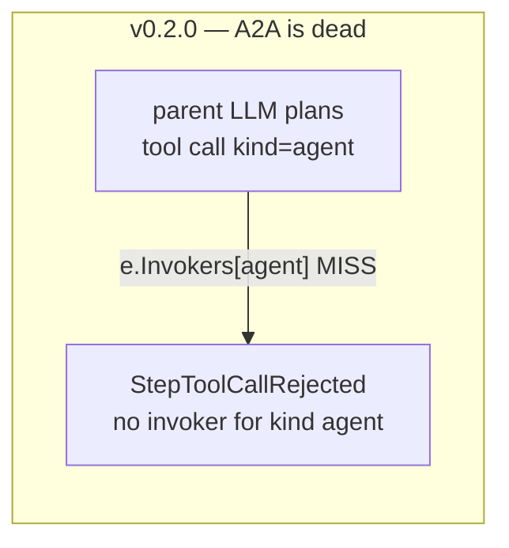
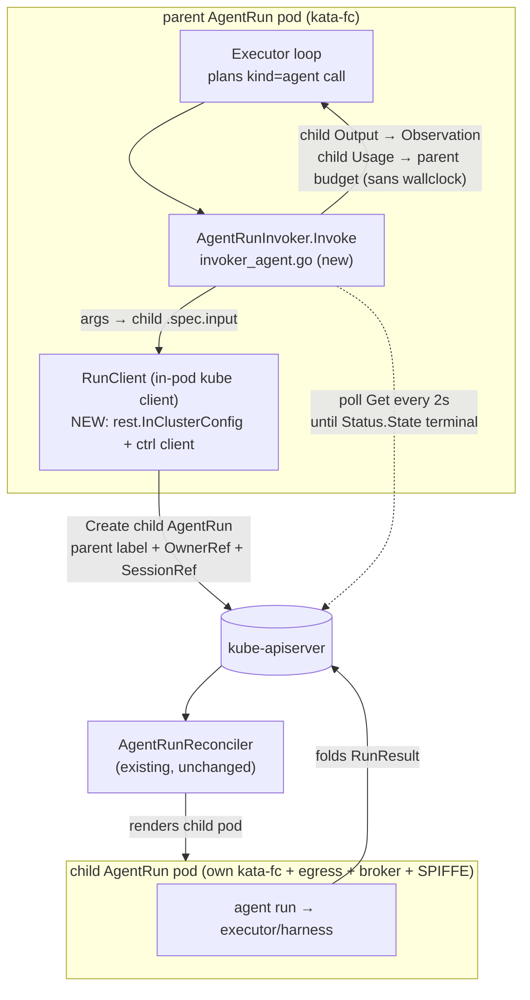

# Spec — Agent-to-Agent (`ToolKind=agent`) Child-Run Invoker

> **✅ Decisions resolved 2026-06-03 — see [decisions.md](../design/decisions.md).** Validated live (cftest + AWS-kata probes): A2A child-run creation works under runc AND a real kata microVM, and the run egress cage needs the explicit kubernetes-endpoint allow. D1: namespaced RBAC scoping is load-bearing for multi-tenant. Where this doc still says OPEN/PROPOSED and conflicts, the decision log wins.

> **Status: PROPOSAL / NOT BUILT (v0.2.0).** Implementation-grade spec, code-checked 2026-06-02.
> **Category:** stub→impl. **Effort: XL.** **Depends-on:** [loop-mode-tools-and-invokers](loop-mode-tools-and-invokers.md) (hard prerequisite — the empty-`Invokers` seam must be closed first).
>
> `ToolKind=agent` + `AgentTargetSpec` are defined, validated, and deep-copied —
> and acted on by **nothing**. There is no invoker; the executor rejects an
> agent-kind call like any other unwired kind. This spec turns the dead type into
> a working **synchronous child-`AgentRun` invoker**: a loop-mode parent agent
> calls another Agent as a tool, the call creates a child `AgentRun`, blocks until
> it reaches a terminal phase, and folds the child's `Output` + token/tool usage
> back as the tool observation. It also specifies the four net-new prerequisites
> that make this XL rather than L — an **in-pod kube client**, **downward-API
> self-identity**, a **new ServiceAccount Role/RoleBinding builder**, and the
> **egress allow-listing of the apiserver/kube-dns** (the last ties into
> [agentnetwork-datapath-enforcement](agentnetwork-datapath-enforcement.md)).
>
> This deepens **[framework-enhancements.md item A1](../design/framework-enhancements.md)**
> and the A2A subsection of **[tool-kinds-roadmap.md](../design/tool-kinds-roadmap.md)**;
> it does not duplicate them — A1 owns the headline design, this spec is the
> implementable plan.

---

## 1. Summary

A loop-mode `Agent` can already declare a `Tool` of `kind: agent` whose
`spec.agent.ref` points at another Agent ([`AgentTargetSpec`](../../pkg/agentmodel/v1/types.go), `types.go:145-148`).
**Full support** means: when the parent's LLM plans a call to that tool, the
in-pod runtime invokes an **`AgentRunInvoker`** that (1) translates the tool
`arguments` into a child `AgentRun.spec.input`, (2) creates the child `AgentRun`
in the **same namespace** with a parent label, an `OwnerReference` to the parent
run, and the inherited `SessionRef`, (3) **polls** the child to a terminal phase,
and (4) returns the child's `Status.Output` as the tool `Observation`, folding
the child's `Usage.Tokens`/`ToolCalls` (but **not** wall-clock — see §6.4) into
the parent's budget. The child is a fully first-class `AgentRun`: it gets its own
kata-fc sandbox, its own egress cage, its own broker config, and its own SPIFFE
identity — A2A composes the existing run datapath, it does not bypass it.

The outcome is a **synchronous, blocking, depth-and-budget-bounded delegation
tree**, observable end-to-end (each child run is a real CR; the parent's
`Status.Steps` records the tool call; an [`AgentSession`](agentsession-scaling-impl.md) (future) aggregating
`SessionRef` shows the whole tree). It deliberately does **not** build the
controller-orchestrated async fan-out (`Phase=RequiresAction`) — that is A4-Part-B,
a separate architecture inversion, explicitly out of scope (§10).

---

## 2. Current state

### 2.1 What exists (the seam is real, the type is inert)

| Piece | Status | Evidence |
|---|---|---|
| `ToolKind=agent` enum + `Valid()` | exists, RESERVED | `pkg/agentmodel/v1/types.go:118`, `:123-129` (comment: "no production invoker") |
| `AgentTargetSpec{ Ref ToolRef }` | exists | `pkg/agentmodel/v1/types.go:145-148` |
| `ToolSpec.Agent *AgentTargetSpec` | exists (discriminated union) | `pkg/agentmodel/v1/types.go:176` |
| Validation: `spec.agent.ref.name` required | exists | `pkg/agentmodel/v1/validation.go:97-100` |
| Executor dispatch-by-kind seam | exists, **tested** | `pkg/agentruntime/executor.go:257` (`e.Invokers[tool.Spec.Kind]`); `ToolInvoker` iface at `iface.go:31-35` |
| `RunRef{Namespace,Name,UID}` | exists, **unused in prod** | `pkg/agentmodel/runtime/contract.go:13-18` |
| Child-run lifecycle / broker / SPIFFE / fold | exists (reused wholesale) | `agentrun_controller.go`, `run_sandbox.go`, `secret_broker.go`, `spiffeid.go` |
| `AgentRunSpec.SessionRef` | exists, threaded into spec | `pkg/agentmodel/v1/types.go:222-223` |
| `AgentRunSpec.BudgetOverride` | exists | `pkg/agentmodel/v1/types.go:234-235` |

### 2.2 What is missing / stubbed (the implementable gap)

1. **No invoker.** There is exactly one `ToolInvoker` in the tree —
   `InProcessInvoker` (`pkg/agentruntime/fake.go:46-61`), **test-only**, wired
   only for `ToolFunction` in `*_test.go`. No `AgentRunInvoker` exists. An
   agent-kind call reaches `executor.go:257`, misses the empty `Invokers` map,
   and is recorded as a `StepToolCallRejected` with `no invoker for kind "agent"`
   (`executor.go:258-267`). (Even earlier, `e.Tools[tc.Tool]` at `:222` is empty
   — see prerequisite.)

2. **Loop-mode tools are unwired for ALL kinds (root cause).** `RunTurn` builds
   the executor with empty `Tools` and unset `Invokers`
   (`pkg/agentruntime/runonce.go:65-69`, `executor.go:54-60`); the operator never
   ships tool specs into the pod (`BuildRunSpecConfigMap` writes only
   `agent.json`/`run.json`/`provider.json`, `runspec.go:58-68`); the entrypoint
   never reads a `tools.json` (`cmd/agent/run.go:53`). **A2A cannot work until
   this is fixed** → [loop-mode-tools-and-invokers](loop-mode-tools-and-invokers.md)
   is a hard dependency, not a nice-to-have.

3. **The run pod has ZERO apiserver connectivity.** `cmd/agent/run.go` imports
   `pkg/secrets` and `pkg/agentruntime/openaillm` only — **no kube client, no
   in-cluster rest config** (`grep` for `client.New`/`InClusterConfig` in
   `cmd/agent/run.go` → nothing). Creating a child `AgentRun` requires a brand-new
   in-pod controller-runtime client threaded through `RunOnce`/`RunTurn`.

4. **The run pod does NOT know its own identity.** `BuildAgentRunPod`
   (`operator/internal/builders/agentrun.go:20-82`) injects **no** downward-API
   env. There is no `POD_NAMESPACE`/`POD_NAME`, and no way to learn the parent
   `AgentRun` UID for the child's `OwnerReference`.

5. **No RBAC builder exists.** `operator/internal/builders/agent_serviceaccount.go`
   renders only a bare `ServiceAccount` (`:26-39`) — **no `Role`, no
   `RoleBinding`**. The run SA today can do nothing against the apiserver. RBAC
   is hand-maintained in `operator/config/rbac/role.yaml` (no `kubebuilder:rbac`
   markers in `operator/internal/controllers/agentmodel/`), consistent with the
   known CRD/RBAC generation drift.

6. **Egress: nuance.** The **static** default-deny NetworkPolicy
   (`run_sandbox.go:60-123`) **already allows** in-cluster RFC1918 on any port
   (`:108-109` → `clusterInternalCIDRs = 10/8, 172.16/12, 192.168/16`) **and**
   DNS (`:104-107`). kube-dns and pod-backed
   services (in-cluster RFC1918) are reachable — **but a 2026-06-03 cftest probe
   proved the apiserver is NOT** (corrects this item's original assumption): the
   `kubernetes` Service DNATs to the node **host IP `:6443`** (host-network
   apiserver), the egress policy is evaluated **post-DNAT**, and that host-IP:6443
   falls outside both the RFC1918 allow and the public-`{80,443}` allow → dropped.
   The fix is an explicit apiserver-endpoint allow (see the **Live probe finding**
   at the end of this doc). The further gap is the **eBPF `AgentNetwork`
   allow-list** path (`pkg/agentnet/cgroup/maps.go`), which is an *explicit
   allow-list* — under an `AgentNetwork` the apiserver/kube-dns IPs are **not**
   implicitly allowed and A2A spawns would be dropped. That path is **itself
   unimplemented on the run datapath** (per
   [agentnetwork-datapath-enforcement](agentnetwork-datapath-enforcement.md));
   this spec adds the requirement that, when that enforcement lands, A2A-capable
   agents must have apiserver+kube-dns auto-allow-listed.



---

## 3. External interface research

**Not applicable** — A2A is an internal child-`AgentRun` mechanism. No external
tool/API. (Section retained for template parity; intentionally empty.)

---

## 4. Design

### 4.1 Shape: synchronous blocking child run, polled to terminal

The invoker runs **inside the parent's run pod**, on the parent's executor
goroutine, during the parent loop's tool-call step. It is **synchronous**: the
parent's executor blocks in `ToolInvoker.Invoke` while the child run executes,
exactly like an HTTP invoker blocking on a request. We **poll** the child CR
(not Watch) — it matches the AgentRun controller's existing 5s requeue style,
keeps the in-pod client minimal (a `Get` loop, no informer cache), and a Watch
buys nothing for a single object the caller is already blocked on.



### 4.2 Why the child is first-class (security composition)

The invoker creates a plain `AgentRun` CR and lets the **existing**
`AgentRunReconciler` render its pod. That means the child automatically inherits:

- its target Agent's **sandbox** (`resolveSandbox`, `sandbox.go:21-43`, fail-closed
  kata-fc),
- its **own egress NetworkPolicy** (`BuildAgentRunEgressPolicy`, `run_sandbox.go:60-63`),
- its **own broker config** + **own SPIFFE id** (per-run, `secret_broker.go`,
  `spiffeid.go`),
- the standard **fold path** (`foldRunResult`, `agentrun_controller.go:398-415`).

No A2A-specific isolation code is needed. The parent's tool `arguments` become
the child's `input`; **arguments carry no secrets** (the parent has none to pass
— secrets are broker-leased per-run), so the secretless invariant holds (§7).

### 4.3 Depth & cycle bounding

A2A is a tree of blocking runs; an unbounded or cyclic graph is a fork-bomb.
Three bounds:

1. **Per-call budget** — child `BudgetOverride = min(parent-remaining, tool cap)`
   (§6.4) caps tokens/steps/tool-calls of the subtree rooted at each child.
2. **Depth limit** — a `SMOL_AGENTS_A2A_MAX_DEPTH` env (default `4`) injected via
   downward-API chaining (§5.4): the invoker reads its own depth, refuses to
   spawn at the limit (returns an error observation, not a panic), and stamps
   `depth+1` onto the child via a label `agents.smol-agents.ai/a2a-depth`.
3. **Wall-clock** — the parent's `maxWallClockSeconds` already bounds total tree
   time because every level blocks; the invoker also enforces a per-call
   `Invoke` timeout derived from parent-remaining wall-clock.

> Cycle detection (A→B→A) is **NOT** attempted in v1 — depth limit + budget make
> a cycle terminate, just inefficiently. A real ancestry check is an open
> decision (§10).

---

## 5. Concrete changes

### 5.1 `pkg/agentruntime/invoker_agent.go` (NEW)

The invoker. Satisfies `ToolInvoker` (`iface.go:31-35`).

```go
package agentruntime

// RunClient is the minimal apiserver seam the AgentRunInvoker needs. Backed in
// production by an in-pod controller-runtime client (cmd/agent); a fake in tests.
type RunClient interface {
    CreateRun(ctx context.Context, child ChildRunRequest) (createdName string, err error)
    GetRun(ctx context.Context, name string) (RunSnapshot, error)
}

// ChildRunRequest is the operator-free description of a child AgentRun to create.
type ChildRunRequest struct {
    AgentRef       string            // == AgentTargetSpec.Ref.Name
    Input          json.RawMessage   // tool args → child input
    SessionRef     string            // inherited from parent
    BudgetOverride *v1.Budget        // min(parent-remaining, tool cap)
    Labels         map[string]string // parent run, a2a-depth
    OwnerUID       string            // parent run UID → OwnerReference
    OwnerName      string
}

// RunSnapshot is the slice of child RunStatus the poller reads.
type RunSnapshot struct {
    State  v1.Phase
    Output json.RawMessage
    Usage  v1.Usage
    TerminationReason string
}

type AgentRunInvoker struct {
    Client      RunClient
    Self        RunIdentity   // namespace/name/uid + depth (from downward API)
    Budget      v1.Budget     // parent budget (for min() cap)
    UsedSoFar   func() v1.Usage // parent usage at call time (closure over executor)
    PollEvery   time.Duration // default 2s
    MaxDepth    int           // default 4
    Clock       Clock
}

func (i *AgentRunInvoker) Invoke(ctx context.Context, tool v1.Tool, args json.RawMessage) (rt.Observation, error)
```

`Invoke` algorithm:

1. Guard: `tool.Spec.Agent == nil` → error (defensive; validation already
   enforces).
2. Depth guard: `i.Self.Depth >= i.MaxDepth` → return error observation
   `a2a: max delegation depth N reached`.
3. Compute child budget: `childBudget = minBudget(i.Budget.remaining(i.UsedSoFar()), toolCap)`
   where `toolCap` is an optional per-tool cap (§5.2 CRD field) — if unset, just
   parent-remaining.
4. `CreateRun` with `Input=args`, `SessionRef=i.Self.SessionRef`,
   `Labels={parent, depth+1}`, `OwnerUID/Name=i.Self.*`.
5. **Poll** `GetRun` every `PollEvery` until `State` is terminal
   (`Completed|Failed|Expired|Cancelled` — reuse `v1.Phase.Terminal()` if it
   exists, else a local set) or `ctx` is done.
6. On `ctx.Done()`: best-effort delete child (cancel), return
   `ctx.Err()` (executor classifies as cancellation).
7. On terminal: build `rt.Observation{Output: snap.Output}`; attach
   `snap.Usage` for the executor to roll up (see §5.3 — the `Observation` type
   must grow a `Usage` field, or the invoker returns it out-of-band).

**Determinism note:** the child receives the parent's `Seed`? **No** — each child
run gets `Seed=0` unless we thread it. Decision deferred to
[determinism-and-replay](determinism-and-replay.md); v1 leaves child `Seed`
unset (the parent's determinism already covers *which* call is made, not the
child's internal RNG).

### 5.2 CRD additions — `AgentTargetSpec` (`pkg/agentmodel/v1/types.go:145-148`)

```go
// AgentTargetSpec lets one Agent invoke another synchronously as a tool.
type AgentTargetSpec struct {
    Ref ToolRef `json:"ref"`

    // MaxTokens optionally caps the child run's token budget. The effective
    // child budget is min(parent-remaining, this). 0 = parent-remaining only.
    // +optional
    MaxTokens int64 `json:"maxTokens,omitempty"`   // NEW

    // TimeoutSeconds bounds the blocking Invoke. 0 = inherit parent-remaining
    // wall-clock. Defense against a child that never terminates.
    // +optional
    TimeoutSeconds int32 `json:"timeoutSeconds,omitempty"` // NEW
}
```

| Field | Type | Default | Validation |
|---|---|---|---|
| `ref` | `ToolRef` | — | `ref.name` required (exists, `validation.go:98-99`) |
| `maxTokens` | `int64` | `0` (= parent-remaining) | `>= 0` |
| `timeoutSeconds` | `int32` | `0` (= parent wall-clock) | `>= 0` |

> CRD regen is hand-edited (drift); the schema for
> `runtime.agents.smol-agents.ai_tools.yaml` (the `Tool` CRD carrying `ToolSpec`)
> must add `spec.agent.maxTokens`/`spec.agent.timeoutSeconds` manually.

### 5.3 `pkg/agentmodel/runtime/contract.go` — `Observation` carries usage

`Observation` (`contract.go:39-43`) today is `{Output, DurationMs}`. The executor
needs the child's token/tool usage to roll up. Add:

```go
type Observation struct {
    Output     json.RawMessage `json:"output"`
    DurationMs int64           `json:"durationMs"`
    // Usage is the sub-run resource cost, set ONLY by the AgentRunInvoker so the
    // executor can roll the child's tokens/tool-calls into the parent budget.
    // Nil/zero for all other invokers (http/mcp do not consume the parent budget
    // this way). WallClock is deliberately ignored on roll-up (see §6.4).
    // +optional
    Usage *v1.Usage `json:"usage,omitempty"`   // NEW
}
```

### 5.4 `pkg/agentruntime/executor.go` — roll up child usage

At the observation-accepted path (`executor.go:301-308`), after a successful
agent-kind invoke, fold the child usage **excluding wall-clock**:

```go
// existing: usage.ToolCalls++ ; usage.WallClockUsed = e.Clock.Since(startedAt)
if obs.Usage != nil {
    // Roll up child tokens + tool-calls; DO NOT add child WallClock — the parent
    // already accrued wall time blocking in Invoke (double-count otherwise).
    usage = usage.Add(obs.Usage.Tokens, obs.Usage.ToolCalls, 0)
    // NOTE: usage.Add increments Steps by 1 each call; for a roll-up we want the
    // token/tool deltas WITHOUT a phantom extra Step → add a usage.AddTokensTools
    // helper, or inline the field math here. (usage.Add semantics: budget.go:84-90.)
}
```

> **Correction to A1's sketch:** `Usage.Add` (`budget.go:84-90`) increments
> `Steps` by 1 on every call — using it naively for a roll-up inflates the
> parent step count. The implementation must do **field-wise** addition of
> `Tokens`/`ToolCalls` only (the tool call itself already counts as one
> `usage.ToolCalls++` at `executor.go:307`). This is a real footgun; add a
> dedicated `Usage.AddTokensTools(t int64, tc int32) Usage` helper.

### 5.5 `pkg/agentruntime/runonce.go` — populate the invoker (the seam)

This is where [loop-mode-tools-and-invokers](loop-mode-tools-and-invokers.md)
and this spec meet. `RunTurn` (`runonce.go:61-84`) currently sets only
`Harness/Secrets/LLM` and leaves `Tools`/`Invokers` empty. The combined wiring:

```go
func RunTurn(ctx, agent, run, leaser, llm, tools []v1.Tool, rc RunClient, self RunIdentity) (Result, error) {
    ...
    exec := New()
    exec.Harness = NewRegistryRunner(harness.Default())
    exec.Secrets = leaser
    exec.LLM = llm
    for _, t := range tools {                 // from tools.json (loop-mode-tools dep)
        exec.Tools[t.Name] = t
    }
    if rc != nil {                            // A2A only when a kube client is wired
        exec.Invokers[v1.ToolAgent] = &AgentRunInvoker{
            Client: rc, Self: self, Budget: agent.Spec.Budget,
            UsedSoFar: nil /* see below */, PollEvery: 2*time.Second, MaxDepth: self.MaxDepth, Clock: exec.Clock,
        }
    }
    // (http/mcp invokers also registered here — loop-mode-tools spec)
    ...
}
```

> `UsedSoFar` needs the executor's *live* `usage`, which `RunTurn` doesn't hold
> a reference to. Cleanest fix: the executor passes a usage-accessor into invoker
> construction at dispatch time, OR the invoker computes parent-remaining lazily
> via a callback the executor sets. Implementation detail flagged as a small
> refactor (§8 Phase 2).

### 5.6 `cmd/agent/run.go` — in-pod kube client + identity (NEW plumbing)

The entrypoint (`run.go:33-72`) gains:

```go
// NEW imports: ctrl-runtime client + rest in-cluster config + scheme.
self := agentruntime.RunIdentity{
    Namespace:  os.Getenv("POD_NAMESPACE"),
    Name:       os.Getenv("POD_NAME"),
    RunName:    os.Getenv("AGENT_RUN_NAME"),   // parent AgentRun name
    RunUID:     os.Getenv("AGENT_RUN_UID"),    // parent AgentRun UID → OwnerRef
    SessionRef: os.Getenv("AGENT_SESSION_REF"),
    Depth:      atoiDefault(os.Getenv("AGENT_A2A_DEPTH"), 0),
    MaxDepth:   atoiDefault(os.Getenv("AGENT_A2A_MAX_DEPTH"), 4),
}
var rc agentruntime.RunClient
if cfg, err := rest.InClusterConfig(); err == nil && self.Namespace != "" {
    if cl, err := client.New(cfg, client.Options{Scheme: amScheme}); err == nil {
        rc = newK8sRunClient(cl, self.Namespace)   // amv1.AgentRun CRUD, own ns
    }
}
// tools.json read here (loop-mode-tools dep) → []v1.Tool
res, runErr := agentruntime.RunOnceWithClient(ctx, *dir, leaser, llm, tools, rc, self)
```

A new `k8sRunClient` (in `cmd/agent`, not the pure pkg) implements `RunClient`
against `amv1.AgentRun`, hard-scoped to `self.Namespace` (it never accepts a
namespace argument — own-namespace only, defense in depth alongside RBAC).

### 5.7 `operator/internal/builders/agentrun.go` — downward API + identity env

`BuildAgentRunPod` (`agentrun.go:20-82`) injects downward-API env on the
execution container (both `loopContainer` and `harnessContainer`, though A2A is
loop-only — harnesses don't use the executor's invokers, `tool-kinds-roadmap.md`
§"Relationship to harness-mode tools"):

```go
env = append(env,
    corev1.EnvVar{Name: "POD_NAMESPACE", ValueFrom: &corev1.EnvVarSource{
        FieldRef: &corev1.ObjectFieldSelector{FieldPath: "metadata.namespace"}}},
    corev1.EnvVar{Name: "POD_NAME", ValueFrom: &corev1.EnvVarSource{
        FieldRef: &corev1.ObjectFieldSelector{FieldPath: "metadata.name"}}},
    // Parent AgentRun identity (NOT available via downward API — the pod's owner
    // is the AgentRun, but fieldRef can't read ownerReferences[].uid). The
    // controller stamps these as literal env from run.Name / run.UID.
    corev1.EnvVar{Name: "AGENT_RUN_NAME", Value: run.Name},
    corev1.EnvVar{Name: "AGENT_RUN_UID",  Value: string(run.UID)},
    corev1.EnvVar{Name: "AGENT_SESSION_REF", Value: run.Spec.SessionRef},
    corev1.EnvVar{Name: "AGENT_A2A_DEPTH", Value: a2aDepthFromLabel(run)},      // "0" if absent
    corev1.EnvVar{Name: "AGENT_A2A_MAX_DEPTH", Value: strconv.Itoa(maxDepth)},  // operator flag
)
```

> **Subtlety:** `run.UID` is set by the apiserver on the AgentRun *before* the
> controller builds the pod (the reconciler `Get`s a persisted object), so
> `run.UID` is populated — confirm in the reconciler that pod-build happens
> post-persist (it does: pod creation is a later reconcile step). The child's
> `OwnerReference` points at the **parent AgentRun** (UID from env), so deleting
> the parent run garbage-collects the whole subtree.

### 5.8 `operator/internal/builders/agent_serviceaccount.go` — Role + RoleBinding (NEW)

Today this file is SA-only (`:26-39`). Add a Role granting **create/get/watch/list/delete**
on `agentruns` in the **agent's own namespace**, and a RoleBinding to the agent
SA. Gate behind "does this Agent declare any `kind: agent` tool?" so non-A2A
agents keep zero apiserver authority.

```go
func AgentA2ARole(agent *amv1.Agent) *rbacv1.Role {
    return &rbacv1.Role{
        ObjectMeta: metav1.ObjectMeta{Name: AgentSAName(agent.Name) + "-a2a", Namespace: agent.Namespace, Labels: ...},
        Rules: []rbacv1.PolicyRule{{
            APIGroups: []string{"runtime.agents.smol-agents.ai"},
            Resources: []string{"agentruns"},
            Verbs:     []string{"create", "get", "list", "watch", "delete"},
        }, {
            APIGroups: []string{"runtime.agents.smol-agents.ai"},
            Resources: []string{"agentruns/status"},
            Verbs:     []string{"get"},   // poll reads status subresource
        }},
    }
}
func AgentA2ARoleBinding(agent *amv1.Agent) *rbacv1.RoleBinding { /* binds Role → AgentSAName */ }
```

> **Authority widening — scope tightly.** This is the first time a run pod can
> write to the apiserver. The Role is **namespaced** (not Cluster), limited to
> `agentruns` (+ status get), and only created for Agents that actually declare
> an `agent`-kind tool. `delete` is included for the cancel path (§5.1 step 6);
> if that's deemed too broad, drop it and rely on `OwnerReference` GC + the
> child's own wall-clock budget instead (open decision §10).

### 5.9 Agent controller — ensure Role/RoleBinding + resolve tool specs

`operator/internal/controllers/agentmodel/agent_controller.go` (the resolve loop
at `:90-108`) gains: (a) keep each fetched `Tool.Spec` (for `tools.json` — the
loop-mode-tools dep), and (b) if any resolved tool is `kind: agent`, ensure the
A2A `Role`+`RoleBinding` exist (mirroring the existing `ensureServiceAccount`
pattern). A controller-ref to the Agent so they GC with it.

### 5.10 Operator RBAC (`operator/config/rbac/role.yaml`) — hand-edit

The **operator's own** ServiceAccount must gain `create` on `roles`/`rolebindings`
(rbac.authorization.k8s.io) to mint the per-Agent A2A Role — and it must already
have it via `escalate`/`bind` guards (Kubernetes requires the granter to hold the
permissions it grants). Add the rules manually (RBAC is not codegen'd here).

### 5.11 File-target summary

| File | Change | New? |
|---|---|---|
| `pkg/agentruntime/invoker_agent.go` | `AgentRunInvoker`, `RunClient`, `RunIdentity`, `ChildRunRequest`, `RunSnapshot` | **NEW** |
| `pkg/agentruntime/iface.go` | (maybe) `RunClient` interface lives here for symmetry with `ToolInvoker` | edit |
| `pkg/agentruntime/runonce.go` | `RunOnceWithClient`/`RunTurn` signature gains `tools`, `rc`, `self`; register `Invokers[ToolAgent]` | edit (`:61-84`) |
| `pkg/agentruntime/executor.go` | roll up `obs.Usage` tokens/tool-calls (field-wise, not `Usage.Add`) at `:301-308` | edit |
| `pkg/agentmodel/v1/types.go` | `AgentTargetSpec.MaxTokens`/`TimeoutSeconds` | edit (`:145-148`) |
| `pkg/agentmodel/v1/budget.go` | `Usage.AddTokensTools` helper | edit |
| `pkg/agentmodel/v1/validation.go` | validate new `AgentTargetSpec` fields `>= 0` | edit (`:97-100`) |
| `pkg/agentmodel/runtime/contract.go` | `Observation.Usage *v1.Usage` | edit (`:39-43`) |
| `cmd/agent/run.go` | in-pod kube client, `RunIdentity` from env, `k8sRunClient` | edit (`:33-72`) |
| `operator/internal/builders/agentrun.go` | downward-API + parent-identity env | edit (`:84-146`) |
| `operator/internal/builders/agent_serviceaccount.go` | `AgentA2ARole`/`AgentA2ARoleBinding` | edit |
| `operator/internal/controllers/agentmodel/agent_controller.go` | ensure A2A Role/RB when agent-kind tools present | edit (`:90-108`) |
| `operator/cmd/manager/main.go` | `--a2a-max-depth` flag (default 4) | edit |
| `operator/config/rbac/role.yaml` | operator can create roles/rolebindings (hand-edit) | edit |
| CRD `..._tools.yaml` | `spec.agent.maxTokens`/`timeoutSeconds` (hand-edit) | edit |

---

## 6. Data / control flow

### 6.1 End-to-end (happy path)

1. Parent `AgentRun` pod starts; `cmd/agent/run.go` builds `RunIdentity` from
   downward-API + literal env, builds an in-pod `k8sRunClient`, reads `tools.json`,
   constructs the executor with `Invokers[ToolAgent]=AgentRunInvoker`.
2. Parent LLM plans a `ToolCall{Tool:"reviewer", Arguments:{...}}` where
   `reviewer` is a `kind: agent` tool → `AgentTargetSpec.Ref.Name = "code-reviewer-agent"`.
3. Executor validates args vs `InputSchema` (`executor.go:234`), pre-checks budget
   for one tool call (`:246`), dispatches to `AgentRunInvoker.Invoke`.
4. Invoker computes `childBudget = min(parent-remaining, tool.MaxTokens)`,
   `CreateRun{AgentRef:"code-reviewer-agent", Input:args, SessionRef:parent.SessionRef,
   OwnerUID:parent.UID, Labels:{parent, depth+1}, BudgetOverride:childBudget}`.
5. `AgentRunReconciler` (unchanged) renders the child pod: own kata-fc sandbox,
   own egress policy, own broker, own SPIFFE id; child `agent run` executes.
6. Invoker polls `GetRun("child-xyz")` every 2s; child folds its `RunResult`
   (`foldRunResult`, `:398-415`) → `Status.State=Completed`, `Status.Output=...`,
   `Status.Usage=...`.
7. Invoker returns `Observation{Output: child.Output, Usage: &child.Usage}`.
8. Executor validates `Output` vs the tool's `OutputSchema` (`:287`), records a
   `StepObservation` with the child output as `ToolCallRecord.Result` (`:301-306`),
   rolls up child `Tokens`/`ToolCalls` (sans wall-clock, §6.4).
9. Parent loop continues; eventually emits its `FinalAnswer`; parent `RunResult`
   folds normally.

### 6.2 Cancellation

`ctx` cancel in the parent (pod SIGTERM, or parent budget expiry) propagates
into `Invoke`; the invoker best-effort `delete`s the child `AgentRun` (which GC's
the child pod) and returns `ctx.Err()`. The executor classifies the parent as
`Cancelled` (`executor.go:104-107`/`145-151`). **The child's own deletion is also
covered by the `OwnerReference`** — if the parent run is deleted outright, GC
cascades to the child even without the explicit delete.

### 6.3 Child failure / expiry

If the child reaches `Failed` or `Expired`, the invoker returns an **error**
(not a panic): `obs, err := ...` with `err = fmt.Errorf("a2a child %s: %s", name, snap.TerminationReason)`.
The executor records a `StepToolCall` with the error (`:273-284`), increments
`ToolCalls`, and **continues the loop** — the parent LLM sees a failed tool and
can recover. (A2A failure is a tool failure, not a parent failure, matching the
existing invoke-error semantics.)

### 6.4 Budget roll-up rule (the load-bearing detail)

```
parent.Usage.Tokens     += child.Usage.Tokens
parent.Usage.ToolCalls  += child.Usage.ToolCalls
parent.Usage.WallClock  += 0          // ← child wall-clock EXCLUDED
parent.Usage.Steps      += 0          // ← the +1 already happened at executor.go:307 (this IS the step)
```

**Why exclude wall-clock:** the parent's `WallClockUsed` is recomputed from its
own `startedAt` on every step (`executor.go:111,133,308`); since the parent
*blocks* in `Invoke` for the child's entire duration, that wall time is **already
counted** in the parent. Adding `child.Usage.WallClockUsed` double-counts.
(This is A1's "exclude WallClock" point, verified against `executor.go`.)

---

## 7. Security model

### 7.1 Composition with existing controls

| Control | A2A child inherits it? | How |
|---|---|---|
| **kata-fc microVM** | ✅ yes | child pod resolved via `resolveSandbox` (`sandbox.go:21-43`), fail-closed |
| **Static egress cage** | ✅ yes | `BuildAgentRunEgressPolicy` per child (`run_sandbox.go:60-63`) |
| **Broker secrets (no inline)** | ✅ yes; args carry no secrets | child gets its own broker config; parent args are LLM-authored JSON, not credentials |
| **Per-run SPIFFE id** | ✅ yes | child run gets its own id (`spiffeid.go`) — *not* the parent's |
| **AgentNetwork eBPF allow-list** | ⚠️ NEW REQUIREMENT | apiserver+kube-dns must be auto-allow-listed for A2A agents (see below) |

### 7.2 New attack surface + mitigations

| Surface | Risk | Mitigation |
|---|---|---|
| **Run pod can write apiserver** | a compromised harness/LLM creates arbitrary `AgentRun`s (resource exhaustion, lateral spawning) | Namespaced Role, `agentruns`-only, **own-namespace `k8sRunClient`** (no ns arg), Role created **only** for agent-kind-tool Agents (§5.8); depth limit + per-call budget cap the blast radius |
| **Fork-bomb via deep/cyclic delegation** | A→B→A→… or fan-out explosion exhausts cluster | `MaxDepth=4`; child `BudgetOverride=min(parent-remaining,cap)` strictly shrinks each level; parent wall-clock bounds total tree time |
| **Input smuggling** | parent LLM crafts child `input` to escalate the child | child is governed by **its own** Agent's instructions/budget/tools/policy — it cannot exceed its own Agent's grants regardless of input; same as any external run trigger |
| **OwnerReference confusion** | child outlives/orphans | `OwnerReference`→parent run ensures GC; explicit cancel-delete on `ctx.Done()` |
| **Secret exfil via args/output** | parent passes a leased secret into a child arg, or child returns one | parent has **no** secrets to pass (broker-leased, never materialized into the executor's arg space); `RedactionPolicy` is a stub applied nowhere (`types.go:368-370`) — folding child output is no worse than today's unredacted output; redaction tracked separately |

### 7.3 AgentNetwork interaction (the cross-spec invariant)

`AgentNetwork`/eBPF enforcement is an **explicit allow-list**
(`pkg/agentnet/cgroup/maps.go`) and is **not wired on the run datapath today**
(see [agentnetwork-datapath-enforcement](agentnetwork-datapath-enforcement.md)
and [agentpolicy-enforcement](agentpolicy-enforcement.md)). The static
NetworkPolicy already permits in-cluster RFC1918 + DNS (§2.2.6), so **A2A works
under the static policy as-is**. The hard requirement this spec adds: **when
eBPF AgentNetwork enforcement lands, an Agent that declares any `kind: agent`
tool MUST have the apiserver `Service` ClusterIP and kube-dns auto-added to its
egress allow-list** — otherwise child-spawn `Create`/`Get` calls are silently
dropped. The cleanest implementation: the AgentNetwork datapath builder
special-cases A2A-capable agents (detectable from `Agent.Status.ResolvedTools`
kinds) and injects the two destinations. This MUST be called out in that spec's
acceptance criteria.

---

## 8. Phasing & effort

A2A is **XL** end-to-end. Ship the prerequisites first (they're independently
valuable), then the invoker.

| Phase | Scope | Effort | Depends on |
|---|---|---|---|
| **P0 (prereq)** | Loop-mode tool wiring: `tools.json`, `RunOnce` reads it, executor `Tools` populated, http/mcp invokers | **L** | [loop-mode-tools-and-invokers](loop-mode-tools-and-invokers.md) — **separate spec, must land first** |
| **P1** | In-pod kube client + downward-API identity: `cmd/agent/run.go` rest config + `k8sRunClient`, `BuildAgentRunPod` env, `RunIdentity` threading. *No invoker yet* — just proves a run pod can read its own namespace/name and reach the apiserver. | **L** | P0 (signature change is shared) |
| **P2** | `AgentRunInvoker` + `Observation.Usage` + executor field-wise roll-up + `Usage.AddTokensTools` + register `Invokers[ToolAgent]`. Unit-testable with a fake `RunClient`. | **M** | P1 |
| **P3** | RBAC builder (`AgentA2ARole`/`RoleBinding`) + Agent-controller `ensureA2ARole` + operator RBAC hand-edit. | **M** | P2 |
| **P4** | Depth/cycle bounding (`MaxDepth`, depth label/env chain, per-call timeout) + CRD `AgentTargetSpec` fields + validation. | **S** | P2 |
| **P5** | AgentNetwork auto-allow-list of apiserver/kube-dns for A2A agents. | **M** | [agentnetwork-datapath-enforcement](agentnetwork-datapath-enforcement.md) landing first; **deferred** until that exists |

**Critical path:** P0 → P1 → P2 → (P3, P4). P5 is gated on a different spec and
can lag (A2A works under the static policy meanwhile). MVP = P0→P4.

**Cross-spec dependencies:**
- **Hard:** [loop-mode-tools-and-invokers](loop-mode-tools-and-invokers.md) (P0).
- **Observability:** child runs surface in `Status.Steps`/`Status.Output` for
  free (the fold path is wired, `agentrun_controller.go:398-415`); a
  delegation-tree view wants [agentsession-scaling-impl](agentsession-scaling-impl.md)
  (`SessionRef` aggregation) — the child already inherits `SessionRef`.
- **Egress invariant:** [agentnetwork-datapath-enforcement](agentnetwork-datapath-enforcement.md) (P5).
- **Output richness:** [response-richness](response-richness.md) — A2A makes
  child sub-traces interesting; the 4 KiB termination-message cap truncates large
  child outputs the parent embeds.

---

## 9. Test plan

### 9.1 Unit (no cluster)

- `invoker_agent_test.go`: fake `RunClient` returning a scripted sequence of
  `RunSnapshot`s (Pending→Running→Completed). Assert: child created with correct
  `Input==args`, `SessionRef` inherited, `OwnerUID/Name` set, `BudgetOverride`
  == `min(parent-remaining, cap)`; poll loop terminates on `Completed`; returns
  `Observation{Output, Usage}`.
- Depth guard: `Self.Depth >= MaxDepth` → error observation, **no** `CreateRun`.
- Cancellation: `ctx` cancelled mid-poll → child `delete` called, returns
  `ctx.Err()`.
- Child failure: snapshot `Failed`/`Expired` → `Invoke` returns error; assert
  executor records `StepToolCall` with error and continues (extend
  `executor_test.go`).
- **Budget roll-up:** assert parent `Usage.Tokens`/`ToolCalls` grow by the child
  amounts and `WallClockUsed`/`Steps` do **not** double-count (the regression the
  whole §6.4 exists to prevent).
- `budget.go`: `Usage.AddTokensTools` field-wise correctness.
- Validation: `AgentTargetSpec.MaxTokens/TimeoutSeconds < 0` rejected.

### 9.2 Operator unit (envtest)

- `agent_serviceaccount_test.go`: extend — `AgentA2ARole`/`RoleBinding` shape,
  namespaced, `agentruns`+`agentruns/status` verbs only.
- `agentrun_test.go`/`agentrun.go` builder: downward-API env present on the
  exec container; `AGENT_RUN_UID==run.UID`, `AGENT_SESSION_REF==spec.SessionRef`.
- Agent controller: an Agent with a `kind: agent` tool gets the Role/RB created
  and controller-ref'd; an Agent without one does **not** (zero-authority
  default preserved).

### 9.3 E2E (cftest single-node k0s box)

The live single-node k0s box (per project memory, `~/.ssh/agent_claude_workspace`)
is the verification target:

1. Deploy two Agents: `parent` (mode=loop, OpenAI-compatible provider via z.ai)
   declaring a `kind: agent` tool → `child`; `child` (mode=harness or loop) that
   returns a deterministic transform of its input.
2. Create a parent `AgentRun`; assert a **child `AgentRun` appears** with the
   parent label + `OwnerReference`, runs in **its own kata-fc pod**, and reaches
   `Completed`.
3. Assert parent `Status.Output` embeds the child's result, parent `Status.Usage.Tokens`
   includes the child's tokens, and parent `Status.Steps` shows the agent-kind
   `ToolCall`/`Observation`.
4. **GC test:** delete the parent `AgentRun` → child is garbage-collected via
   `OwnerReference`.
5. **Egress sanity:** confirm the child-spawn `Create`/`Get` succeed under the
   static NetworkPolicy (no AgentNetwork). (P5 adds the eBPF-allow-list case when
   that lands.)
6. **kata→apiserver reachability** (the A1 unknown): verify a kata-fc microVM
   pod can dial the in-cluster apiserver Service — this is the single highest-
   risk assumption (§10).

---

## 10. Risks & open decisions

| # | Item | Recommendation / status |
|---|---|---|
| 1 | **kata-fc → in-cluster apiserver reachability** is **unverified**. A2A is dead in the water if a Firecracker microVM can't reach the apiserver `Service` ClusterIP through the CNI. | **Validate on cftest before committing P1** (test 9.3.6). If it fails, A2A needs either a host-network broker-proxy hop or a different transport — a major redesign. **Highest risk.** |
| 2 | **Authority widening.** Run pods gain apiserver write (`create agentruns`). | Mitigated by namespaced Role + own-ns client + opt-in (only agent-kind-tool agents). **Maintainer must accept** that A2A agents are no longer zero-apiserver-authority. |
| 3 | **Synchronous-blocking model** holds a parent pod (and its kata microVM + budget) open for the child's entire duration; a deep tree pins N microVMs simultaneously. | Acceptable for v1 (depth ≤4, budget-bounded). The async/controller-orchestrated alternative is **A4-Part-B**, explicitly deferred (architecture inversion, needs durable per-run history the 4 KiB cap can't provide). |
| 4 | **Cycle detection.** v1 relies on depth+budget, not ancestry. A→B→A burns budget inefficiently before terminating. | **Decision:** ship depth-only for v1; add an ancestry label chain (`a2a-ancestors`) only if cycles prove a real problem. |
| 5 | **`delete` verb in the A2A Role** (for cancel) widens authority. | **Decision needed:** keep `delete` (clean cancel) vs. drop it and rely on `OwnerReference` GC + child wall-clock budget for cancel. Leaning drop-it (smaller grant; cancel via owner-GC on parent deletion is sufficient for the common case). |
| 6 | **`UsedSoFar` plumbing.** The invoker needs the executor's live usage for `min()`; `RunTurn` doesn't hold that reference. | Small refactor: executor sets a usage-accessor callback on its invokers at dispatch, or computes the child cap inside the executor and passes it into `Invoke` via the tool spec. Flagged in §5.5. |
| 7 | **Child `Seed`.** Threaded or not? | v1: child `Seed=0` (unset). Determinism of *which* call is made is the parent's; child-internal determinism deferred to [determinism-and-replay](determinism-and-replay.md). |
| 8 | **`AgentSession` aggregation of a delegation tree** sharing one `SessionRef` collides with the ephemeral-session guard (the unbounded-conversation bug, per framework-enhancements A3). | Out of scope here; A2A only **inherits** `SessionRef`. The aggregator ([agentsession-scaling-impl](agentsession-scaling-impl.md)) must decide whether children share or fork the session. |
| 9 | **Poll vs Watch.** Poll (2s) chosen for client minimalism. | Accept; revisit only if latency on deep trees hurts. A Watch needs an informer/cache in-pod — disproportionate. |

---

## See also

- [Framework Enhancements — item A1](../design/framework-enhancements.md) — the headline A2A design this spec implements.
- [Tool Kinds Roadmap](../design/tool-kinds-roadmap.md) — the four-kind invoker landscape; A2A subsection.
- [Loop-mode tools & invokers](loop-mode-tools-and-invokers.md) — **hard prerequisite** (the empty-`Invokers` seam).
- [AgentNetwork datapath enforcement](agentnetwork-datapath-enforcement.md) — the apiserver/kube-dns allow-list invariant (P5).
- [AgentPolicy enforcement](agentpolicy-enforcement.md) — governance that should constrain which agents may delegate.
- [Response richness](response-richness.md) — surfacing child sub-traces; the 4 KiB cap.
- [AgentSession scaling (impl)](agentsession-scaling-impl.md) — aggregating a delegation tree under one `SessionRef`.
- [Determinism & replay](determinism-and-replay.md) — child `Seed` threading.
- [Agent Runtime Fit Analysis (v0.2.0)](../research/agent-runtime-fit-analysis-v0.2.0.md) — runtime capability baseline.

---

## Live probe finding — 2026-06-03 (cftest)

**Validated live on cftest** (isolated `p0probe` namespace, torn down after): a run pod with a namespaced `ServiceAccount` + `Role` (`agentruns`: create/get/list/watch) **creates a child AgentRun** (`201` own-namespace; `403` cross-namespace — authority is correctly scoped), and reaches the apiserver ClusterIP `10.96.0.1:443` on kube-router. So the A2A authority model and CNI path both work under `runc`.

**Critical caveat — the default-deny run egress cage BLOCKS the apiserver** unless explicitly allowed. On k0s the `kubernetes` Service backs to the node **host IP on `:6443`** (host-network apiserver), which is neither in the RFC1918 in-cluster allow (`10/8,172.16/12,192.168/16`) nor in the public `{80,443}` allow — so an A2A pod under the cage gets `000` (blocked) to the apiserver. **Required change:** when A2A is enabled, [agentnetwork-datapath-enforcement](agentnetwork-datapath-enforcement.md) must add an egress rule allowing the `kubernetes` EndpointSlice address(es) on the apiserver port (resolve at reconcile time; single-node k0s = `<node-ip>/32:6443`). Validated: adding `159.69.185.87/32:6443` returned the apiserver to `401` (reached).

**Still UNVERIFIED:** the kata-fc microVM → apiserver networking facet — no kata RuntimeClass on cftest (needs kata-deploy + a block-device snapshotter). See [README §8 Probe results](README.md).

**Update — kata microVM VERIFIED (AWS Graviton `c7g.metal`, real KVM, 2026-06-03):** the probe was repeated from inside a real kata-qemu microVM (guest kernel `6.18.28` vs host `6.17.0-1017-aws`, isolated 1 vCPU / 2 GB). Results were **identical to runc**: apiserver + kube-dns reachable, authenticated list `200`, **child AgentRun create `201`** (including *through* the egress cage), cross-namespace `403`, AWS IMDS + non-`{80,443}` blocked. **The microVM tap/CNI path does not break apiserver reachability or A2A.** This closes the last open P0 unknown for this spec — the design is validated under both runc and a hardware-isolated microVM.
