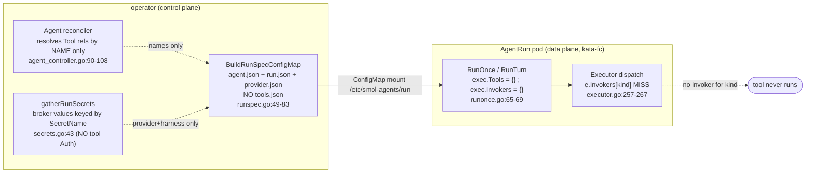
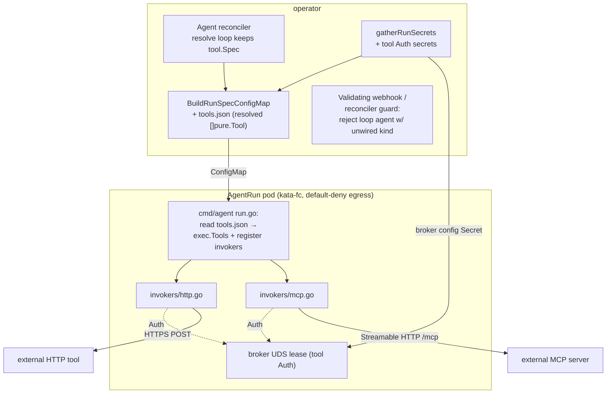

# Spec — Loop-Mode Tools & Invokers (HTTP + MCP)

> **✅ Decisions resolved 2026-06-03 — see [decisions.md](../design/decisions.md).** D7/D11: MCP = Streamable-HTTP per-agent **plus stdio only from an operator cluster allow-list** of approved images; hand-rolled client. Mandatory for multi-tenant tool use. Where this doc still says OPEN/PROPOSED and conflicts, the decision log wins.

> **STATUS: DESIGN / PROPOSAL — not implemented as of v0.2.0 (2026-06-03).**
> This spec turns the gap described in
> [tool-kinds-roadmap.md](../design/tool-kinds-roadmap.md) into an
> implementation plan. Everything below marked **(proposed)** does not exist in
> the tree yet; everything marked **(today)** is code-verified against v0.2.0.
>
> **Scope:** make a `mode: loop` Agent's referenced `Tool` CRs actually
> *execute* — for the `http` and `mcp` kinds. The four wiring breaks are:
> (1) tool specs are never shipped into the run pod; (2) the runtime builds the
> executor with empty `Tools`/`Invokers`; (3) no production `ToolInvoker`
> exists; (4) the MCP transport/credential story is unspecified. We close 1–3
> for `http` + `mcp`, define the MCP transport, and add an interim admission
> guard. **Out of scope:** the `agent` (A2A) kind — owned by
> [agent-to-agent-invoker](agent-to-agent-invoker.md) (future) — and the
> `function` kind, which is test-only by design.

---

## 1. Summary

"Full loop-mode tool support" means: a tenant declares `Tool` CRs (`kind: http`
or `kind: mcp`), references them from an `Agent` with `mode: loop`, and the
deterministic executor's plan-act-observe loop can *call* them — args validated
against the tool's `inputSchema`, the call dispatched over the right transport
with brokered credentials, the result validated against `outputSchema`, and the
whole exchange recorded as `Step`s folded into `AgentRun.status.steps`. Today
none of that runs: the operator resolves tool refs by **name only**, never ships
the specs, and the executor's `Invokers` map is empty, so the LLM's first tool
call is rejected mid-run with `no invoker for kind "…"`
([executor.go:257-267](../../pkg/agentruntime/executor.go)). The outcome of this
spec is two production invokers (`pkg/agentruntime/invokers/{http,mcp}.go`, both
**proposed**) behind the existing `ToolInvoker` seam
([iface.go:31-35](../../pkg/agentruntime/iface.go)), a `tools.json` payload added
to the per-run ConfigMap, the run entrypoint wiring that populates the executor,
tool-`Auth`→broker credential leasing reusing the existing secret-broker path,
and an apply-time guard so an agent referencing an unwired kind fails loud.

This spec **extends** [tool-kinds-roadmap.md](../design/tool-kinds-roadmap.md)
(which establishes *that* the gap exists and the dependency order); it does not
restate the gap analysis — it specifies the code.

---

## 2. Current state

### 2.1 The dispatch seam already works (this is wiring, not redesign)

The executor's tool path is complete and tested end-to-end against the
test-only `InProcessInvoker`:

| Stage | Code (today) | Status |
|---|---|---|
| Allow-list check | [executor.go:211-220](../../pkg/agentruntime/executor.go) (`allowed[tc.Tool]`) | works |
| Catalog lookup | [executor.go:222-231](../../pkg/agentruntime/executor.go) (`e.Tools[tc.Tool]`) | works, but `e.Tools` is **empty** in prod |
| Input-schema validation | [executor.go:234](../../pkg/agentruntime/executor.go) (`MatchesSchema(InputSchema, args)`) | works (shape-check only — see §2.4) |
| Budget pre-check | [executor.go:246](../../pkg/agentruntime/executor.go) (`AllowsStep(usage,0,1)`) | works |
| **Dispatch** | [executor.go:257](../../pkg/agentruntime/executor.go) (`e.Invokers[tool.Spec.Kind]`) | **map is empty** in prod → reject |
| Output-schema validation | [executor.go:287](../../pkg/agentruntime/executor.go) | works |
| Per-step accounting → `Step`/`ToolCallRecord` | [executor.go:301-308](../../pkg/agentruntime/executor.go) | works; folds to `Status.Steps` |

`ToolInvoker` is the per-kind transport abstraction
([iface.go:31-35](../../pkg/agentruntime/iface.go)): one method,
`Invoke(ctx, tool v1.Tool, args json.RawMessage) (rt.Observation, error)`. The
executor already wraps timing, schema checks and budget around it. **A new
invoker slots in with zero executor changes.**

The only implementation in the tree is `InProcessInvoker`
([fake.go:46-67](../../pkg/agentruntime/fake.go)) — a map-of-Go-handlers fake
registered **only in tests**, **only** for `v1.ToolFunction`.

### 2.2 The four breaks (verified against v0.2.0)



1. **Operator resolves by name only.** The Agent reconciler `r.Get`s each
   `Tool` CR purely to confirm existence and records `tool.Name` in
   `Status.ResolvedTools`
   ([agent_controller.go:90-108](../../operator/internal/controllers/agentmodel/agent_controller.go));
   it never reads `tool.Spec`. (Confirmed in the read of the resolve loop —
   `resolved = append(resolved, tool.Name)`.)
2. **No `tools.json`.** `BuildRunSpecConfigMap` marshals only `agent.json`,
   `run.json`, and (loop mode) `provider.json`
   ([runspec.go:49-83](../../operator/internal/builders/runspec.go)). The
   mounted spec dir `/etc/smol-agents/run` ([runspec.go:23](../../operator/internal/builders/runspec.go))
   has nothing to load tool defs from.
3. **Empty executor wiring.** `RunTurn` sets only `Harness`, `Secrets`, `LLM`
   ([runonce.go:65-69](../../pkg/agentruntime/runonce.go)); `New()` initialises
   `Tools`/`Invokers` to empty maps
   ([executor.go:54-60](../../pkg/agentruntime/executor.go)) and nothing
   populates them. `cmd/agent/run.go` calls `RunOnce`
   ([run.go:53](../../cmd/agent/run.go)) and never reads a `tools.json` or
   assigns `exec.Invokers`. There is an explicit `NOTE:` comment documenting
   this at [runonce.go:71-76](../../pkg/agentruntime/runonce.go).
4. **No production invoker.** Per §2.1, only the test fake exists.

### 2.3 What *does* exist that we can lean on

- **The OpenAI-compatible LLM client already advertises tools and parses tool
  calls.** `buildTools` maps each `v1.Tool` to an OpenAI function tool
  (name/description/`InputSchema` → `parameters`)
  ([openaillm/client.go:196-207](../../pkg/agentruntime/openaillm/client.go)),
  and the response parser reads `tool_calls[0]` back into `rt.ToolCall`
  ([client.go:122-127](../../pkg/agentruntime/openaillm/client.go)). So once
  `exec.Tools` is populated, the model *sees* the tools and *emits* calls with
  no LLM-client change. (This is the only loop-mode LLM client —
  `pkg/agentruntime/openaillm`, OpenAI-compatible only.)
- **The secret broker already serves run-pod credentials keyed by name.**
  `gatherRunSecrets` collects values keyed by `SecretRef.SecretName` (run-input
  secretRefs, harness env secretRefs, the provider key) into a `map[string][]byte`
  ([secrets.go:43-90](../../operator/internal/controllers/agentmodel/secrets.go)),
  `AttachSecretBroker` injects the native sidecar and mounts the UDS into the
  execution container only
  ([secret_broker.go:52-92](../../operator/internal/builders/secret_broker.go)),
  and `BuildBrokerConfigSecret` renders a static backend + a lease policy keyed
  to the run pod's local SPIFFE identity
  ([secret_broker.go:112+](../../operator/internal/builders/secret_broker.go)).
  In-pod, `cmd/agent` leases by name via `secrets.NewClient(socket)`
  ([run.go:48-51, 186-189](../../cmd/agent/run.go)). **Tool `Auth` plugs into
  this exact path** — one more contributor to `gatherRunSecrets`, one more
  leaser call in the invoker.
- **Steps fold to the cluster.** `Result.Steps` → `RunResult.Steps`
  ([runonce.go:34, 92-94](../../pkg/agentruntime/runonce.go)) →
  `run.Status.Steps` (`foldRunResult`,
  [agentrun_controller.go:404](../../operator/internal/controllers/agentmodel/agentrun_controller.go)).
  `clampForTerminationMessage` already elides tool-call arg/result payloads
  under the ~4 KiB cap ([run.go:102-143](../../cmd/agent/run.go)). So once tools
  run, their calls are observable with no extra work.

### 2.4 Schema validation is a shape-check today (load-bearing caveat)

`v1.MatchesSchema` is **not** a JSON Schema validator. It only confirms the
schema *looks* like a schema and the value is valid JSON
([schema.go:45-53](../../pkg/agentmodel/v1/schema.go)):

```go
func MatchesSchema(schema, value json.RawMessage) error {
	if err := ValidateJSONSchemaShape(schema); err != nil { return err }
	if !json.Valid(value) { return errors.New("agentmodel: value is not valid JSON") }
	return nil
}
```

The doc comment claims "full JSON Schema validation lives in
pkg/agentruntime/schema.go" — **that file does not exist** (verified:
`ls pkg/agentruntime/schema.go` → not found). So today a tool with
`inputSchema: {"type":"object","required":["q"]}` will accept `{}` — the
`required` constraint is **not enforced**. This is fine when no tool runs;
it becomes a correctness/safety gap the moment invokers ship (a malformed
arg set reaching an external endpoint). This spec therefore includes a real
validator as a sub-increment (§8, T2).

---

## 3. External interface research — MCP transports (current, 2025-11-25)

Confirmed against the **latest** MCP spec (protocol version `2025-11-25`),
which is authoritative as of this writing.

**MCP defines exactly two standard transports**
([spec/2025-11-25/basic/transports](https://modelcontextprotocol.io/specification/2025-11-25/basic/transports)):

1. **stdio** — the client launches the MCP server as a **subprocess** and
   exchanges newline-delimited JSON-RPC over the child's stdin/stdout (stderr =
   logs). "Clients SHOULD support stdio whenever possible."
2. **Streamable HTTP** — a single HTTP endpoint (e.g. `https://example.com/mcp`)
   supporting **POST** and **GET**; the server MAY use SSE to stream multiple
   messages. **This replaces the HTTP+SSE transport from `2024-11-05`, which is
   now explicitly deprecated** ("This replaces the HTTP+SSE transport from
   protocol version 2024-11-05").

Streamable HTTP request mechanics (what the invoker must implement):

| Concern | Requirement (spec) |
|---|---|
| Method | `POST` for every client→server JSON-RPC message; `GET` only to open a server-push SSE stream |
| `Accept` header | MUST list **both** `application/json` and `text/event-stream` |
| Response | For a JSON-RPC *request*, server returns **either** `Content-Type: application/json` (one JSON object) **or** `text/event-stream` (SSE stream whose terminal event carries the JSON-RPC response). Client MUST support both. |
| `MCP-Protocol-Version` header | MUST be sent on all post-init HTTP requests (e.g. `MCP-Protocol-Version: 2025-11-25`); negotiated at init |
| `MCP-Session-Id` header | If the server returns it on the `InitializeResult`, the client MUST echo it on all subsequent requests; HTTP 404 ⇒ session expired, re-initialize |
| Lifecycle | `initialize` request → `initialized` notification → operational; tools via `tools/list` then `tools/call` (JSON-RPC `params.name` + `params.arguments`) |
| Auth | `Authorization: Bearer <access-token>` (OAuth 2.1); the spec leaves token acquisition to the host |
| DNS-rebinding | servers MUST validate `Origin`; clients are unaffected |

**Transport decision for the `mcp` invoker (proposed): Streamable HTTP only.**

Rationale, given our security model (§7):

- **stdio is incompatible with the sandbox + egress posture.** stdio means
  *fork a subprocess inside the kata-fc microVM*. That subprocess would need the
  MCP-server binary baked into the run image (we ship per-kind harness bundles,
  not per-tenant tool binaries — [custom-agent-images](../design/custom-agent-images.md)),
  would run *inside* the agent's blast radius with the agent's network identity,
  and would bypass the egress NetworkPolicy entirely (it's in-pod). It also
  can't carry a brokered credential cleanly. We **reject stdio** for v1.
- **Streamable HTTP composes with everything we already have.** It's an
  outbound HTTPS call to `MCPSpec.URL` — the same egress surface the `http`
  invoker uses, governed by the run's NetworkPolicy
  ([agentnetwork-datapath-enforcement](agentnetwork-datapath-enforcement.md),
  future), and the bearer token is a broker lease (§5.4).
- **We do not need server-push.** A single bounded `tools/call` per loop
  iteration is request/response. The invoker therefore sends `Accept:
  application/json, text/event-stream` (as the spec requires) but, for v1, only
  needs to handle the **`application/json` single-object** response and the
  **terminal SSE event** of a stream; it does **not** implement resumability,
  `Last-Event-ID` replay, or the GET server-push stream. Long-poll / streaming
  tools are a future extension.
- **Backwards compat (old HTTP+SSE servers) is out of scope for v1.** The spec's
  fallback (POST `initialize`; on 4xx, GET for an `endpoint` event) is a
  documented future addition; v1 targets `2025-11-25` Streamable HTTP servers.

The `mcp` invoker is therefore a thin JSON-RPC-over-HTTPS client:
`initialize` → `notifications/initialized` → `tools/call`, carrying
`MCP-Protocol-Version`, echoing `MCP-Session-Id`, and adding `Authorization:
Bearer` from the broker lease when `MCPSpec.Auth` is set. Because each loop
iteration is one bounded call and the executor is stateless across pods, v1 does
**not** persist the MCP session across iterations — it re-initializes per
`Invoke` (correctness over efficiency; an init+call round-trip per tool call).
Caching the session within a single run pod's executor lifetime is a noted
optimization (§10).

> **Go SDK note:** an official Go MCP SDK exists
> (`github.com/modelcontextprotocol/go-sdk`). Whether to vendor it vs. hand-roll
> the ~150-line JSON-RPC client is an **open decision** (§10, D3). The hand-rolled
> path keeps the dependency surface and supply-chain review small (our
> [global rule: justify new tools]); the SDK gets lifecycle/version-negotiation
> correctness for free. The interface seam (`ToolInvoker`) makes this swappable
> later either way.

Sources:
[MCP transports (2025-11-25)](https://modelcontextprotocol.io/specification/2025-11-25/basic/transports);
[MCP authorization (2025-11-25)](https://modelcontextprotocol.io/specification/2025-11-25/basic/authorization);
[MCP spec index (2025-11-25)](https://modelcontextprotocol.io/specification/2025-11-25);
[deprecated HTTP+SSE transport (2024-11-05)](https://modelcontextprotocol.io/specification/2024-11-05/basic/transports).

---

## 4. Design

### 4.1 End-to-end shape (proposed)



Three layers, each a small, independently-shippable change:

1. **Control plane — ship the specs + tool creds.** Keep `tool.Spec` in the
   resolve loop; marshal resolved tools into `tools.json`; extend
   `gatherRunSecrets` to lease tool `Auth` secrets through the existing broker.
2. **Data plane — populate the executor.** Read `tools.json`, build the catalog,
   register `http`/`mcp` invokers wired to the broker leaser.
3. **Invokers — the two transports** behind the unchanged `ToolInvoker` seam.

Plus a **guard** so the still-unwired kinds (`agent`, `function`) fail at apply.

### 4.2 The `ToolInvoker` contract (unchanged) and what each invoker returns

```go
// pkg/agentruntime/iface.go:31-35 (TODAY — unchanged)
type ToolInvoker interface {
	Invoke(ctx context.Context, tool v1.Tool, args json.RawMessage) (rt.Observation, error)
}
```

`rt.Observation{ Output json.RawMessage, DurationMs int64 }`
([contract.go:39-43](../../pkg/agentmodel/runtime/contract.go)). The executor
validates `Output` against `tool.Spec.OutputSchema` after the call
([executor.go:287](../../pkg/agentruntime/executor.go)), so an invoker returns
the raw decoded result and lets the executor reject schema-mismatched results —
**the invoker must not pre-validate** (avoid double validation / divergent
errors). An invoker returns a non-nil `error` for transport/protocol failures
(connection, non-2xx, JSON-RPC error object, timeout); the executor records
those as a `StepToolCall` with the error and continues the loop
([executor.go:273-284](../../pkg/agentruntime/executor.go)).

### 4.3 Where credentials come from

The invoker needs the agent-side broker leaser. We pass it in at construction
(the same `agentruntime.SecretLeaser` `cmd/agent` already builds,
[run.go:19-28](../../cmd/agent/run.go)). The invoker resolves `Auth.SecretName`
→ value via `LeaseSecret` and injects it as a header (`Authorization: Bearer …`
for MCP; configurable for HTTP). **No secret is ever in the `Tool` spec or the
ConfigMap** — `AuthRef` is a *name*, leased at call time, consistent with how
harness env / provider keys work today.

---

## 5. Concrete changes

> File:line targets are against v0.2.0. New files marked **(new)**.

### 5.1 Operator — keep `tool.Spec` and ship `tools.json`

**`operator/internal/controllers/agentmodel/agent_controller.go`** — in the
resolve loop ([agent_controller.go:90-108](../../operator/internal/controllers/agentmodel/agent_controller.go)),
the controller already `r.Get`s each `Tool`. No change is needed to *status*
(`ResolvedTools` stays name-only), but the **AgentRun** reconciler must re-fetch
the specs at run-render time (the Agent reconciler and the AgentRun reconciler
run independently; carrying specs through `AgentStatus` would bloat status and
risk staleness). So the resolution of *specs* belongs in the run path, not the
agent path:

**`operator/internal/controllers/agentmodel/agentrun_controller.go`** — add a
helper `resolveAgentTools(ctx, agent) ([]pure.Tool, error)` that, for each
`agent.Spec.Tools` ref, `r.Get`s the `Tool` CR (honouring `ref.Namespace`,
defaulting to the agent's namespace) and returns the pure `[]pure.Tool`. Call it
in `Reconcile` right after `prepareRun`
([agentrun_controller.go:166](../../operator/internal/controllers/agentmodel/agentrun_controller.go))
and thread the result into `ensureRunSpec`. A missing `Tool` keeps the run
`Pending` with reason `ToolMissing` (mirror the existing `RunPrepPending`
pattern at [agentrun_controller.go:167-170](../../operator/internal/controllers/agentmodel/agentrun_controller.go)).

**`operator/internal/builders/runspec.go`** — add the filename constant and
marshal the tools:

```go
// runspec.go — alongside runSpecAgentFile etc. (line ~29)
const runSpecToolsFile = "tools.json"

// BuildRunSpecConfigMap signature gains `tools []pure.Tool` (proposed):
func BuildRunSpecConfigMap(run *amv1.AgentRun, agent *amv1.Agent,
	provider *RunProvider, tools []pure.Tool) (*corev1.ConfigMap, error) {
	// …existing agent.json / run.json / provider.json…
	if len(tools) > 0 {
		tj, err := json.Marshal(tools)
		if err != nil { return nil, fmt.Errorf("marshal tools: %w", err) }
		data[runSpecToolsFile] = string(tj)
	}
	// …
}
```

Mind the **~1 MiB ConfigMap ceiling** (same constraint that bounds
`AgentRunSpec.Inputs`, [types.go:225-228](../../pkg/agentmodel/v1/types.go)).
Tool specs are small (a URL + two JSON schemas); a guard rejecting an
oversized aggregate `tools.json` is cheap insurance (return an error that holds
the run `Failed` with `ToolSpecTooLarge`).

Update the one caller `ensureRunSpec`
([agentrun_controller.go:377](../../operator/internal/controllers/agentmodel/agentrun_controller.go))
to pass the resolved tools.

### 5.2 Operator — lease tool `Auth` through the broker

**`operator/internal/controllers/agentmodel/secrets.go`** — in
`gatherRunSecrets` ([secrets.go:43-90](../../operator/internal/controllers/agentmodel/secrets.go)),
after the harness-env loop, add a tools loop. The tools are already being
resolved in the run path (§5.1), so pass them in (or resolve once and share):

```go
// secrets.go gatherRunSecrets — add `tools []pure.Tool` param (proposed)
for _, t := range tools {
	var auth *pure.AuthRef
	switch t.Spec.Kind {
	case pure.ToolHTTP:
		if t.Spec.HTTP != nil { auth = t.Spec.HTTP.Auth }
	case pure.ToolMCP:
		if t.Spec.MCP != nil { auth = t.Spec.MCP.Auth }
	}
	if auth == nil || auth.SecretName == "" { continue }
	val, err := readSecretKey(ctx, c, namespace, auth.SecretName, auth.Key)
	if err != nil { return nil, nil, err }
	values[auth.SecretName] = val // keyed by lease name, served by the broker
}
```

This automatically (a) puts the credential into the run-owned broker config
Secret ([secret_broker.go:112+](../../operator/internal/builders/secret_broker.go)),
(b) adds the lease name to the run pod's allow policy, and (c) — because
`brokerValues` becomes non-empty — triggers `AttachSecretBroker`
([agentrun_controller.go:206-209](../../operator/internal/controllers/agentmodel/agentrun_controller.go))
so the UDS is mounted even for a loop agent with no harness/provider secret.
**No new broker plumbing.**

### 5.3 Data plane — populate the executor

**`pkg/agentruntime/runonce.go`** — add the filename constant next to
`AgentSpecFile`/`RunSpecFile` ([runonce.go:19-22](../../pkg/agentruntime/runonce.go)):

```go
const ToolsSpecFile = "tools.json" // MUST match builders.runSpecToolsFile
```

`RunOnce` reads it (optional — absent ⇒ no tools) and passes `[]v1.Tool` into
`RunTurn`. `RunTurn` ([runonce.go:61-84](../../pkg/agentruntime/runonce.go))
gains a `tools []v1.Tool` parameter and an `invokers map[v1.ToolKind]ToolInvoker`
(or builds them from `leaser`), then:

```go
// runonce.go RunTurn (proposed) — replace the NOTE block at :71-76
exec.Tools = make(map[string]v1.Tool, len(tools))
for _, t := range tools { exec.Tools[t.Name] = t }
exec.Invokers = invokers // e.g. {ToolHTTP: httpInvoker, ToolMCP: mcpInvoker}
```

To keep `RunTurn`'s signature stable for the session worker
([durable-session-architecture](../design/durable-session-architecture.md)),
prefer an options struct or a small `RunConfig{ Tools, Invokers }` over adding
positional params. **Decision D2 (§10).**

**`cmd/agent/run.go`** — `runAgentRun` ([run.go:34-71](../../cmd/agent/run.go))
builds the invoker registry from the broker leaser and reads `tools.json`:

```go
// run.go (proposed), after leaser is wired (:48-51)
tools, _ := agentruntime.LoadTools(*dir) // reads tools.json; nil if absent
invokers := invokers.Default(leaser, httpClient) // {http, mcp}
res, runErr := agentruntime.RunOnceWithTools(ctx, *dir, leaser,
	buildLoopLLM(ctx, *dir, leaser), tools, invokers)
```

(`RunOnce` keeps its current signature for callers that don't pass tools, or we
fold tools/invokers behind the `RunConfig` per D2.)

### 5.4 New package — `pkg/agentruntime/invokers/` **(new)**

```
pkg/agentruntime/invokers/
  iface.go        // small shared helpers; re-export nothing (ToolInvoker stays in agentruntime)
  http.go         // HTTPInvoker  (new)
  mcp.go          // MCPInvoker   (new)
  registry.go     // Default(leaser, httpClient) map[v1.ToolKind]ToolInvoker (new)
  http_test.go    // (new)
  mcp_test.go     // (new)
```

> **Import-cycle note:** `ToolInvoker`/`rt.Observation` live in
> `pkg/agentruntime` and `pkg/agentmodel/runtime`; the new package imports
> *those*, and `cmd/agent` imports the new package — `pkg/agentruntime` must
> **not** import `invokers` (the executor depends only on the interface). Wiring
> happens in `cmd/agent` (and the session worker), keeping the runtime core
> transport-free.

#### `HTTPInvoker` (`http.go`, new)

```go
type HTTPInvoker struct {
	Client *http.Client      // injected; bounded timeout
	Leaser agentruntime.SecretLeaser
}

func (h *HTTPInvoker) Invoke(ctx context.Context, tool v1.Tool, args json.RawMessage) (rt.Observation, error) {
	spec := tool.Spec.HTTP // guaranteed non-nil for kind=http (admission)
	method := spec.Method; if method == "" { method = http.MethodPost }
	req, _ := http.NewRequestWithContext(ctx, method, spec.URL, bytes.NewReader(args))
	req.Header.Set("Content-Type", "application/json")
	for k, v := range spec.Headers { req.Header.Set(k, v) }
	if err := applyAuth(ctx, h.Leaser, spec.Auth, req); err != nil { return rt.Observation{}, err }
	start := time.Now()
	resp, err := h.Client.Do(req)
	if err != nil { return rt.Observation{}, fmt.Errorf("http tool %q: %w", tool.Name, err) }
	defer resp.Body.Close()
	body, _ := io.ReadAll(io.LimitReader(resp.Body, maxToolResponseBytes))
	if resp.StatusCode/100 != 2 {
		return rt.Observation{}, fmt.Errorf("http tool %q: status %d: %s", tool.Name, resp.StatusCode, truncate(body))
	}
	if !json.Valid(body) { return rt.Observation{}, fmt.Errorf("http tool %q: non-JSON response", tool.Name) }
	return rt.Observation{Output: body, DurationMs: time.Since(start).Milliseconds()}, nil
}
```

- `applyAuth` (shared): leases `Auth.SecretName` and sets `Authorization: Bearer
  <leased>` **unless** the tenant already supplied an `Authorization` in
  `Headers` (let explicit win, but log). Default Bearer is the safe common case;
  a future `Auth.Scheme` field can generalise (basic, header-name) — noted as a
  follow-up, not v1.
- `maxToolResponseBytes` caps the body (e.g. 256 KiB) so a runaway endpoint
  can't OOM the run pod or blow the step trace. Schema validation of the body is
  the executor's job (§4.2).

#### `MCPInvoker` (`mcp.go`, new) — Streamable HTTP only (§3)

```go
type MCPInvoker struct {
	Client *http.Client
	Leaser agentruntime.SecretLeaser
}

func (m *MCPInvoker) Invoke(ctx context.Context, tool v1.Tool, args json.RawMessage) (rt.Observation, error) {
	spec := tool.Spec.MCP // non-nil for kind=mcp
	// v1: require an http(s) Streamable-HTTP endpoint; reject mcp:// (stdio) loudly.
	if !strings.HasPrefix(spec.URL, "http://") && !strings.HasPrefix(spec.URL, "https://") {
		return rt.Observation{}, fmt.Errorf("mcp tool %q: only http(s) Streamable-HTTP endpoints are supported (got %q)", tool.Name, spec.URL)
	}
	sess, err := m.initialize(ctx, spec) // POST initialize → MCP-Session-Id; then notifications/initialized
	if err != nil { return rt.Observation{}, err }
	start := time.Now()
	result, err := sess.callTool(ctx, tool.Name, args) // JSON-RPC tools/call {name, arguments}
	if err != nil { return rt.Observation{}, err }
	return rt.Observation{Output: result, DurationMs: time.Since(start).Milliseconds()}, nil
}
```

The unexported `mcpSession` carries the HTTP client, base URL, the leased bearer
token, and the `MCP-Session-Id`. It sets on every request: `Content-Type:
application/json`, `Accept: application/json, text/event-stream`,
`MCP-Protocol-Version: 2025-11-25`, `MCP-Session-Id` (after init),
`Authorization: Bearer <lease>` (if `Auth`). `callTool` sends
`{"jsonrpc":"2.0","id":N,"method":"tools/call","params":{"name":…,"arguments":…}}`
and decodes the response from **either** the `application/json` body **or** the
terminal SSE `data:` event (parse `text/event-stream`, take the last `data:`
line that is a JSON-RPC response with the matching `id`). A JSON-RPC `error`
object becomes a Go error. MCP tool results are `content[]` blocks; v1 extracts
the `structuredContent` field when present (the JSON-Schema-typed result), else
concatenates `text` content into a JSON string — **mapping `CallToolResult` →
`Observation.Output` is decision D4 (§10)**.

> **Tool-name mapping caveat:** our `Tool.Name` is the *CR name* (the LLM-facing
> allow-list key). The MCP server exposes its own tool names via `tools/list`.
> v1 assumes `Tool.Name` == the MCP server's tool name. If they differ we need
> an explicit `MCPSpec.RemoteName` field (proposed follow-up); for v1, document
> that the CR name must match the server's tool name, and optionally call
> `tools/list` once to verify and fail loud on mismatch.

#### `registry.go` (new)

```go
func Default(leaser agentruntime.SecretLeaser, httpClient *http.Client) map[v1.ToolKind]ToolInvoker {
	return map[v1.ToolKind]ToolInvoker{
		v1.ToolHTTP: &HTTPInvoker{Client: httpClient, Leaser: leaser},
		v1.ToolMCP:  &MCPInvoker{Client: httpClient, Leaser: leaser},
	}
}
```

`v1.ToolAgent` and `v1.ToolFunction` are **deliberately absent** — a call to
either still hits the executor's `no invoker for kind` reject
([executor.go:257-267](../../pkg/agentruntime/executor.go)), which the admission
guard (§5.6) prevents from ever being declared.

### 5.5 Real JSON Schema validation (sub-increment)

Replace the shape-check `MatchesSchema` ([schema.go:45-53](../../pkg/agentmodel/v1/schema.go))
with a real validator. The comment already names the intended dependency
(`santhosh-tekuri/jsonschema`). Create **`pkg/agentruntime/schema.go` (new)**
implementing `func ValidateAgainstSchema(schema, value json.RawMessage) error`
using compiled JSON Schema, and have the executor call *that* instead of
`v1.MatchesSchema` at [executor.go:234](../../pkg/agentruntime/executor.go) and
[:287](../../pkg/agentruntime/executor.go). Keep `v1.MatchesSchema` as the
admission-time shape-check (no heavy dep in `pkg/agentmodel/v1`). This is a
**dependency** of safe tool execution (a tool with required args must reject
calls missing them) but can ship as its own PR.

### 5.6 Interim admission guard — reject unwired kinds

Per [tool-kinds-roadmap.md §Interim guardrail](../design/tool-kinds-roadmap.md),
keep a **single source of truth** for "supported loop-mode kinds":

```go
// pkg/agentmodel/v1/validation.go (proposed) — exported so webhook + controller share it
func SupportedLoopToolKinds() map[ToolKind]bool {
	return map[ToolKind]bool{ToolHTTP: true, ToolMCP: true} // grows as invokers ship
}
```

Two enforcement points (defence in depth):

1. **Validating webhook** (preferred, fail-at-apply): in the Agent webhook, if
   `mode: loop` and any referenced `Tool`'s kind ∉ `SupportedLoopToolKinds()`,
   reject with a clear message. (Webhook needs the `Tool` lookup — it already
   has a client for cross-CR checks, or reject on kind alone if specs aren't
   loaded.)
2. **Agent reconciler** (belt-and-braces, post-resolve loop at
   [agent_controller.go:108](../../operator/internal/controllers/agentmodel/agent_controller.go)):
   after fetching each `Tool`, if `mode: loop` and the kind is unsupported, set
   `Status.Phase = "Failed"`, `Reason = "ToolKindUnsupported"`, message naming
   the tool + kind + this doc, and `return` without marking `Ready`.

This converts today's silent mid-run rejection into an immediate, legible
failure for `agent`/`function`, and (once HTTP+MCP ship) shrinks to rejecting
only `agent`/`function`. **It must scope to `mode: loop`** so harness agents
(whose tool refs are inert, [tool-kinds-roadmap.md §Harness](../design/tool-kinds-roadmap.md))
are not false-positived.

### 5.7 CRD field additions

**None required for v1.** `MCPSpec`/`HTTPSpec`/`AuthRef` already carry
everything ([types.go:131-166](../../pkg/agentmodel/v1/types.go)). Proposed
**optional, additive** fields (mark all `// +optional`, default-safe) as
follow-ups, *not* v1:

| Field | Type | Default | Why |
|---|---|---|---|
| `MCPSpec.RemoteName` | `string` | `Tool.Name` | when the MCP server's tool name ≠ the CR name |
| `HTTPSpec.AuthScheme` | `string` (`bearer`\|`basic`\|`header`) | `bearer` | generalise non-Bearer HTTP auth |
| `ToolSpec.TimeoutSeconds` | `*int32` | invoker default (e.g. 30) | per-tool call timeout, bounded by budget wallclock |

No CRD regen is needed for v1 since no API types change. (If the follow-up
fields land, regen is required — heed [crd_generation_drift](../../README.md)
caveats: do **not** blindly `make manifests`.)

---

## 6. Data / control flow (end-to-end, proposed)

```
apply Agent(mode=loop, tools=[search]) + Tool(search, kind=mcp, auth=secretRef:mcp-token)
  │
  ├─ webhook/reconciler guard: kind=mcp ∈ supported? yes → admit
  │
create AgentRun(agentRef=…)
  │  AgentRun reconcile:
  │   1. resolveRunSandbox → kata-fc (fail-closed)            [unchanged]
  │   2. prepareRun → provider + brokerValues                 [unchanged]
  │   3. resolveAgentTools → []pure.Tool{search}              [NEW §5.1]
  │   4. gatherRunSecrets += tool Auth "mcp-token"            [NEW §5.2]
  │   5. ensureRunSpec → ConfigMap{agent.json, run.json, tools.json}  [NEW §5.1]
  │   6. ensureBrokerConfig → static{mcp-token}, policy{run-uid → lease mcp-token}  [auto, brokerValues non-empty]
  │   7. AttachSecretBroker (UDS mounted into exec container) [auto]
  │   8. ensureRunEgressPolicy (default-deny + 80/443)        [unchanged]
  │   9. create pod (RuntimeClassName=kata-fc)                [unchanged]
  │
pod: cmd/agent run --dir=/etc/smol-agents/run
  │   a. wait broker socket → leaser                          [unchanged]
  │   b. LoadTools(tools.json) → []v1.Tool                    [NEW §5.3]
  │   c. invokers.Default(leaser, httpClient)                 [NEW §5.4]
  │   d. RunOnceWithTools → RunTurn: exec.Tools/Invokers set  [NEW §5.3]
  │
executor loop (per iteration):
  │   Plan → LLM.Chat(tools=exec.Tools) → ToolCall{search, {"q":"…"}}
  │   allow-list ok → catalog lookup ok → ValidateAgainstSchema(inputSchema)  [NEW §5.5]
  │   budget pre-check ok
  │   e.Invokers[mcp].Invoke(ctx, tool, args):
  │       lease "mcp-token" via UDS → Bearer
  │       POST <url> initialize (Accept: json+sse, MCP-Protocol-Version) → MCP-Session-Id
  │       POST notifications/initialized
  │       POST tools/call {name:search, arguments:{q:…}} → result (json or terminal SSE)
  │   ValidateAgainstSchema(outputSchema) → Observation step recorded
  │   …loop until Final or budget…
  │
RunResult{steps:[Plan, Observation, …, Final]} → termination message (clamped) + stdout
  │
foldRunResult → AgentRun.status.steps  [unchanged, executor.go/runonce.go/agentrun_controller.go:404]
```

---

## 7. Security model

How loop-mode tool calls compose with the existing posture (verified v0.2.0):

- **Sandbox.** The call originates inside the kata-fc microVM (default
  `--default-run-runtime-class=kata-fc`, fail-closed
  [sandbox.go:21-43](../../operator/internal/builders/sandbox.go), per
  [agent-runtime-fit-analysis-v0.2.0](../research/agent-runtime-fit-analysis-v0.2.0.md)).
  An invoker is just outbound HTTPS from that microVM — no new privilege, no host
  surface. **This is exactly why we reject MCP stdio** (§3): a subprocess would
  break the "outbound HTTPS only, no in-pod tool binaries" property.
- **Egress.** Tool traffic exits through the run's static default-deny
  NetworkPolicy ([run_sandbox.go](../../operator/internal/builders/run_sandbox.go):
  DNS + in-cluster RFC1918 + public 80/443; metadata 169.254/16 **blocked**).
  ⚠️ **Honest gap:** this static policy **ignores `AgentNetwork` allow-lists** —
  it does not pin the tool's egress to *just* the tool's host. So a loop agent
  with an `http`/`mcp` tool can reach *any* public 443 endpoint, not only the
  tool URL. Tightening egress to the declared tool hosts is owned by
  [agentnetwork-datapath-enforcement](agentnetwork-datapath-enforcement.md)
  (future) — this spec **depends on** it for least-privilege egress but does not
  implement it. v1 ships with the broad default-deny; the data-exfil surface
  (an LLM-chosen URL is *not* possible — the URL is fixed in the `Tool` CR, only
  the *args* are LLM-chosen) is bounded by the schema-validated args and the
  fixed endpoint.
- **Credentials (broker / secretless).** Tool `Auth` is a *name*; the value is
  leased at call time over the run's UDS from a static backend keyed to the run
  pod's local SPIFFE identity ([secret_broker.go](../../operator/internal/builders/secret_broker.go)).
  The credential is never in the `Tool` spec, the ConfigMap, or the pod env —
  consistent with [egress-credentials](../features/egress-credentials.md) and
  [secrets-broker-credential-backends](../design/secrets-broker-credential-backends.md).
  The broker policy only authorises the run pod to lease *its* declared names.
- **SPIFFE.** The run pod's identity gates the broker lease today via
  `LocalPeerAttestor` (SO_PEERCRED) or SPIRE. The MCP `Authorization: Bearer`
  token is a *brokered secret*, **not** the pod's SPIFFE identity — an MCP server
  that wants SPIFFE-based auth would need mTLS, which is a future transport
  extension (not v1).

**New attack surface + mitigations:**

| Surface | Risk | Mitigation (v1) |
|---|---|---|
| Args reach an external endpoint | Injection / oversized payload to the tool | Schema-validate args (§5.5); ConfigMap-sized; endpoint is **fixed in the CR**, not LLM-chosen |
| Untrusted tool *response* | Malformed/huge body OOM/trace-bloat; tool-result prompt injection back into the loop | `maxToolResponseBytes` cap; output-schema validation ([executor.go:287](../../pkg/agentruntime/executor.go)); response is data the LLM consumes — same trust boundary as any tool result (document for tenants) |
| Credential leak | Tool token logged into steps | `applyAuth` sets headers, never bodies; `ToolCallRecord` stores args/result, **not** request headers; `clampForTerminationMessage` elides payloads ([run.go:125-143](../../cmd/agent/run.go)) |
| MCP `Origin`/DNS-rebinding | server-side concern | N/A to client; we always use the fixed `MCPSpec.URL` |
| Broad egress (above) | tool token usable against any 443 host the agent reaches | accept for v1; tighten via [agentnetwork-datapath-enforcement](agentnetwork-datapath-enforcement.md) (future) |
| SSRF via tool URL | n/a — URL is operator-resolved from the CR, not user-supplied per run | metadata IP already blocked by the egress policy |

---

## 8. Phasing & effort

Shippable increments. Each is independently testable; T1→T3 deliver working
HTTP tools, T4 adds MCP.

| # | Increment | Size | Depends on |
|---|---|---|---|
| **T1** | Ship `tools.json`: keep `tool.Spec` (run path), `runSpecToolsFile`, `BuildRunSpecConfigMap` + caller, `resolveAgentTools` in AgentRun reconcile | **S** | — |
| **T2** | Real JSON Schema validation (`pkg/agentruntime/schema.go`, swap executor calls); keep `v1.MatchesSchema` as admission shape-check | **S** | — (but precondition for safe T3) |
| **T3** | `invokers/` package + `HTTPInvoker` + `registry.go`; populate `exec.Tools`/`Invokers` in `RunTurn`/`cmd/agent`; tool-`Auth`→broker in `gatherRunSecrets` | **M** | T1, T2 |
| **T4** | `MCPInvoker` (Streamable HTTP): initialize/initialized/tools/call, session header, Bearer auth, SSE-terminal-event parse, result→Observation mapping | **L** | T3 |
| **T5** | Interim admission guard (`SupportedLoopToolKinds`, webhook + reconciler), scoped to `mode: loop` | **S** | — (ship **first**, independent) |
| **T6** | E2E on cftest k0s: loop agent + fake HTTP tool, then fake MCP server | **M** | T3 (HTTP), T4 (MCP) |

**Recommended order:** T5 (loud failure now) → T1 → T2 → T3 (HTTP shipped) →
T4 (MCP shipped) → T6.

**Cross-spec dependencies:**

- [agentnetwork-datapath-enforcement](agentnetwork-datapath-enforcement.md)
  (future) — for least-privilege egress pinned to the tool host. This spec works
  without it (broad default-deny) but is not least-privilege until it lands.
- [secrets-broker-credential-backends](../design/secrets-broker-credential-backends.md)
  / [dynamic-credential-backends](dynamic-credential-backends.md) — static
  backend suffices for v1; dynamic mint (e.g. OAuth-per-call) is a later tool-auth
  mode.
- [response-richness](response-richness.md) — the ~4 KiB termination cap that
  bounds how much of a large tool trace survives to `Status.Steps` (already
  clamped; size-budget work lives there, not here).
- [agent-to-agent-invoker](agent-to-agent-invoker.md) (future) — owns
  `ToolKind=agent`; **depends on** T1–T3 (the generic wiring) before its
  A2A-specific work.

---

## 9. Test plan

### Unit

- **`runspec_test.go`** — `BuildRunSpecConfigMap` emits `tools.json` with the
  resolved `[]pure.Tool`; absent when no tools; oversized aggregate → error.
- **`secrets_test.go`** — `gatherRunSecrets` collects `HTTP.Auth`/`MCP.Auth`
  secrets into `values` keyed by `SecretName`; nil `Auth` skipped; missing
  Secret → error (run stays Pending).
- **`agentrun_controller_test.go`** (envtest) — a loop AgentRun with an `http`
  tool renders a ConfigMap with `tools.json` **and** attaches the broker even
  with no harness/provider secret (because tool Auth made `brokerValues`
  non-empty).
- **`invokers/http_test.go`** — `httptest.Server`: POST body == args; `Headers`
  applied; `Auth` → `Authorization: Bearer` from a fake leaser; non-2xx → error;
  non-JSON body → error; body > cap truncated/errored. Assert the invoker does
  **not** validate against `outputSchema` (executor's job).
- **`invokers/mcp_test.go`** — `httptest.Server` speaking Streamable HTTP:
  asserts `Accept: application/json, text/event-stream`,
  `MCP-Protocol-Version: 2025-11-25`, `MCP-Session-Id` echoed after init,
  `Authorization: Bearer` present; `tools/call` params `{name,arguments}`
  correct; decodes **both** an `application/json` response **and** an
  SSE-terminal-event response; a JSON-RPC `error` → Go error; `mcp://` URL
  rejected loudly.
- **`schema_test.go`** (T2) — a tool `inputSchema` with `required:["q"]`
  **rejects** `{}` and accepts `{"q":"x"}`; executor records
  `StepToolCallRejected` on the former.
- **`executor_test.go`** (extend) — register a real-ish invoker (via the seam)
  and assert the full plan→toolcall→observation→final trace, budget
  `ToolCalls++` accounting, and `StepToolCallRejected` on `no invoker for kind`
  for an unregistered kind (regression that the seam still rejects cleanly).
- **`validation_test.go`** (T5) — `SupportedLoopToolKinds`; a `mode: loop` agent
  with a `kind: agent` tool is rejected; the **same** agent in `mode: harness` is
  **admitted** (inert refs).

### E2E (cftest single-node k0s — [cf_tunnel_deploy / hermes_zai_e2e_proven](../../README.md))

- **HTTP tool, real microVM.** Deploy a loop Agent (z.ai/glm-4.6 provider, the
  proven e2e model) + a `Tool(kind=http)` pointing at an in-cluster echo
  Service (extend `cmd/fake-gateway` or add a tiny echo). Drive an AgentRun whose
  input nudges a tool call; assert `AgentRun.status.steps` contains an
  `Observation` with the echoed result and `usage.toolCalls >= 1`, all under
  kata-fc + default-deny egress (proves the call exits the microVM through the
  NetworkPolicy and the broker leased the tool token).
- **MCP tool.** Add a minimal Streamable-HTTP MCP server (a new
  `cmd/fake-mcp`, mirroring the existing fakes — `cmd/fake-gateway`,
  `cmd/fake-github` already exist) exposing one schema'd tool; same assertions.
- **Guard.** `kubectl apply` a `mode: loop` Agent referencing a `kind: agent`
  tool → expect webhook rejection (or `Status.Phase=Failed`,
  `Reason=ToolKindUnsupported`).
- **Negative — credential isolation.** Confirm the tool token never appears in
  `AgentRun.status` or pod env (grep the rendered ConfigMap + pod spec).

---

## 10. Risks & open decisions

**Risks**

- **Egress is not least-privilege (§7).** v1 ships broad default-deny; a tool
  token is usable against any 443 host the agent can reach. Mitigated only when
  [agentnetwork-datapath-enforcement](agentnetwork-datapath-enforcement.md)
  lands. Honest: this is a *known* reduction vs. the ideal "pin egress to the
  tool host."
- **Schema validation is a shape-check until T2 (§2.4).** Shipping T3 (HTTP)
  *before* T2 means malformed args can reach an external endpoint. **Mitigation:
  sequence T2 before T3** (reflected in §8).
- **MCP result→Observation mapping is lossy.** `CallToolResult.content[]` is
  richer than a single JSON value (text + structured + resources). The
  output-schema check assumes a JSON value. v1 prefers `structuredContent`; the
  mapping is a real fidelity decision (D4).
- **Per-call MCP re-initialize is chatty.** One `initialize` round-trip per tool
  call (the executor is stateless across pods, but *within* one run pod the
  session could be cached). Acceptable for v1; optimisation noted.
- **`pi` is a false friend** ([agentmodel_hardening_phases / harness notes](../../README.md)):
  unrelated to tool invokers, but worth noting that "MCP-ish" naming elsewhere
  in the tree (HarnessKind `pi`) is Inflection's Pi, not an MCP transport.

**Open decisions (maintainer must choose)**

- **D1 — Webhook vs. reconciler-only guard.** A validating webhook fails at
  apply (best UX) but adds webhook surface/cert wiring; reconciler-only is
  simpler but the failure shows up in `Status` post-apply. Recommend: webhook if
  one already exists for Agent admission; else reconciler-only for v1, webhook
  later. (§5.6 wires both behind one source of truth regardless.)
- **D2 — `RunTurn` signature.** Add `tools`/`invokers` as positional params vs. a
  `RunConfig` struct. The session worker
  ([durable-session-architecture](../design/durable-session-architecture.md))
  also calls `RunTurn`, so a struct avoids churn. **Recommend `RunConfig`.**
- **D3 — Hand-roll MCP client vs. vendor `github.com/modelcontextprotocol/go-sdk`.**
  Hand-roll keeps the dependency/supply-chain surface minimal (per the global
  "justify new tools" rule) for our narrow one-call use; the SDK gets
  lifecycle/version-negotiation correctness for free. Recommend hand-roll for
  v1 (the seam makes it swappable), revisit if we need resources/prompts/sampling.
- **D4 — MCP `CallToolResult` → `Observation.Output`.** Prefer
  `structuredContent` (typed) and fall back to joining `text` blocks as a JSON
  string? Or require tools to return `structuredContent` and fail otherwise?
  Recommend: prefer structured, fall back to text-as-JSON-string, document that
  `outputSchema` should match whichever the server emits.
- **D5 — Tool-name vs. MCP remote-name.** v1 requires `Tool.Name` == the MCP
  server's tool name (with an optional `tools/list` verify). Add `MCPSpec.RemoteName`
  now or as a follow-up? Recommend follow-up (additive, no v1 blocker).
- **D6 — HTTP non-Bearer auth.** v1 = Bearer (or tenant-supplied `Headers`).
  Add `HTTPSpec.AuthScheme` now or later? Recommend later (additive).

## See also

- [tool-kinds-roadmap.md](../design/tool-kinds-roadmap.md) — the gap analysis
  this spec implements (do not duplicate; this is the *how*).
- [agent-to-agent-invoker](agent-to-agent-invoker.md) (future) — `ToolKind=agent`;
  depends on the generic wiring (T1–T3) here.
- [agentnetwork-datapath-enforcement](agentnetwork-datapath-enforcement.md) /
  [agentpolicy-enforcement](agentpolicy-enforcement.md) (future) — egress
  least-privilege + policy this composes with.
- [secrets-broker-credential-backends](../design/secrets-broker-credential-backends.md)
  / [dynamic-credential-backends](dynamic-credential-backends.md) /
  [egress-credentials](../features/egress-credentials.md) — how tool `Auth`
  becomes a brokered, secretless credential.
- [response-richness](response-richness.md) — the termination-message size
  budget that bounds large tool traces.
- [agent-runtime-fit-analysis-v0.2.0](../research/agent-runtime-fit-analysis-v0.2.0.md)
  — runtime capability assessment, including the loop-tool gap.
- [agent-model](../features/agent-model.md) — `Tool`/`Agent` model; the `Tool`
  CRD as a JSON-Schema'd MCP-typed capability.
