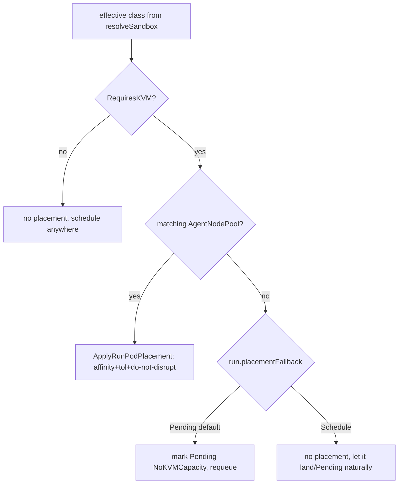

# Spec — Run-Path Governance (placement, deadlines, concurrency, session resources)

> Status: **DESIGN / NOT BUILT (2026-06-03).** This is an implementation-grade
> proposal. Nothing in §5 (Concrete changes) exists yet unless explicitly
> labelled "EXISTS". It deepens the P1 backlog item **P1-4** ("no per-tenant
> concurrency/quota or `activeDeadlineSeconds`") and **P1-2** ("AgentRun/
> AgentSession pods get no node placement") in
> [`docs/research/agent-runtime-fit-analysis-v0.2.0.md`](../research/agent-runtime-fit-analysis-v0.2.0.md).
>
> **Scope.** Governance of the *run/session datapath* — the short-lived
> `AgentRun` pod and the long-lived `AgentSession` worker Deployment. Four
> independent-but-related controls: (a) **node placement** (bind kata runs to a
> kata-capable `AgentNodePool`); (b) **`activeDeadlineSeconds`** (a hard pod-level
> kill switch sized from the budget); (c) **per-Agent / per-namespace run
> concurrency caps** with an optional admission queue; (d) **first-class
> resource requests/limits on the session worker**. It does **not** cover egress
> allow-listing (see [`agentnetwork-datapath-enforcement.md`](./agentnetwork-datapath-enforcement.md)),
> provider/tool/budget admission (see [`agentpolicy-enforcement.md`](./agentpolicy-enforcement.md)),
> or the session *scaling* knobs (turn batching, autoscaling — see
> [`agentsession-scaling-impl.md`](./agentsession-scaling-impl.md) and
> [`docs/design/agent-session-scaling.md`](../design/agent-session-scaling.md)).
> Those are siblings; this spec is the resource/scheduling/admission floor they
> build on.

---

## 1. Summary

The smol-agents *containment* substrate is real (kata-fc microVM + default-deny
egress, both fail-closed — [`run_sandbox.go`](../../operator/internal/builders/run_sandbox.go),
[`sandbox.go:21`](../../operator/internal/controllers/agentmodel/sandbox.go)), but
the *governance* around it is absent on the run path. Three concrete, verified
defects today:

1. A run pod resolves a `kata-fc` RuntimeClass but is given **no node placement**
   — no `nodeAffinity`, no toleration, no `karpenter.sh/do-not-disrupt`. The
   operator has a complete `AgentNodePool` → placement system used by
   `SmolAgent` serving workloads, but the run/session reconcilers never call it.
   A kata run can therefore land on a non-KVM node and sit `Pending` forever (the
   isolation taint also keeps it off dedicated nodes it *could* use), and a live
   Firecracker microVM can be consolidated out from under work.
2. Run and session pods carry **no `activeDeadlineSeconds`**. `Budget.MaxWallClockSeconds`
   is enforced *in-process* by the runtime ([`budget.go:74`](../../pkg/agentmodel/v1/budget.go)),
   but if the agent process hangs, deadlocks, or ignores its context, nothing at
   the Kubernetes layer reaps the pod — a hung kata microVM holds a metal node
   indefinitely.
3. There is **no per-tenant concurrency or quota** on runs. `MaxConcurrentReconciles`
   bounds reconcile parallelism, not the number of *live run pods* a namespace or
   Agent can spawn. A loop that creates AgentRuns can exhaust a (scarce, expensive)
   metal node pool with no backpressure. This is the single remaining `Scale=2`
   score in the fit analysis (§2).

**Outcome of this spec:** a kata run reliably schedules on a kata node, is hard-
killed if it overruns ~1.5× its wall-clock budget, and is admitted only within
per-Agent and per-namespace concurrency caps (excess runs queue fairly by
priority rather than thundering-herd the cluster); session workers request the
resources they actually need. All four controls reuse existing builders and
fail open/closed in the conservative direction.

---

## 2. Current state

### 2.1 What EXISTS and we reuse

| Capability | Where | Status |
|---|---|---|
| `NodePlacement{PoolName, Isolation}` + `ApplyPodTemplatePlacement(*PodTemplateSpec, NodePlacement)` (sets `nodeAffinity` on `PoolLabelKey`, toleration on `IsolationTaintKey`, and the `do-not-disrupt` annotation) | [`workload.go:357-409`](../../operator/internal/builders/workload.go) | **EXISTS, used by SmolAgent only** |
| `ApplyKnativePlacement` (unstructured equivalent) | [`workload.go:411-462`](../../operator/internal/builders/workload.go) | EXISTS |
| `RequiresKVM(isolation)` (`strings.HasPrefix(iso,"kata")`) | [`karpenter.go:62-66`](../../operator/internal/builders/karpenter.go) | EXISTS |
| `PoolLabelKey`/`IsolationTaintKey`/`DoNotDisruptAnnotation` constants | [`karpenter.go:21-24`](../../operator/internal/builders/karpenter.go), [`workload.go:369`](../../operator/internal/builders/workload.go) | EXISTS |
| `ResolvePlacement(ctx, features.Env) (*NodePlacement, bool, error)` — auto-matches a pool by isolation, lowest-name-wins, returns `(nil,false)` for gvisor/runc/no-pool | [`features/placement.go:27-51`](../../operator/internal/controllers/features/placement.go) | **EXISTS, but bound to `features.Env{CR: *v1.SmolAgent}`** — not reusable as-is from the agentmodel reconcilers |
| `resolveSandbox(ctx, reader, requested, default, allowHost) (class, pending, failed)` — fail-closed RuntimeClass resolution, shared by both run + session reconcilers | [`sandbox.go:21-43`](../../operator/internal/controllers/agentmodel/sandbox.go) | EXISTS |
| `Budget.MaxWallClockSeconds` (+ in-process enforcement) | [`budget.go:25-27,74`](../../pkg/agentmodel/v1/budget.go) | EXISTS |
| `AgentRunSpec.BudgetOverride` (per-run escalation; runtime applies it at [`runonce.go:62`](../../pkg/agentruntime/runonce.go)) | [`types.go:235`](../../pkg/agentmodel/v1/types.go) | EXISTS |
| `MaxConcurrentReconciles` on both reconcilers (default 4 via `--max-concurrent-reconciles`) | [`agentrun_controller.go:97`](../../operator/internal/controllers/agentmodel/agentrun_controller.go), [`main.go:51`](../../operator/cmd/manager/main.go) | EXISTS (reconcile-parallelism only) |
| `AgentNodePool` CRD + reconciler (Karpenter NodePool/EC2NodeClass, kata metal requirement, isolation taint) | [`agentnodepool_types.go`](../../operator/api/v1/agentnodepool_types.go), [`agentnodepool_controller.go`](../../operator/internal/controllers/agentnodepool_controller.go) | EXISTS |

### 2.2 What is MISSING (the gap this spec closes)

| Defect | Evidence (zero refs found) |
|---|---|
| **No placement on run pods** | `BuildAgentRunPod` sets `RestartPolicy`, `SecurityContext`, containers, volumes — **no `Affinity`, `Tolerations`, or `do-not-disrupt`** ([`agentrun.go:56-71`](../../operator/internal/builders/agentrun.go)). The run reconciler calls `ApplyRunSandbox` but never `ApplyPodTemplatePlacement`/`ResolvePlacement` ([`agentrun_controller.go:186-189`](../../operator/internal/controllers/agentmodel/agentrun_controller.go)). |
| **No placement on session pods** | The session reconciler builds the pod, applies sandbox + broker + NATS env, wraps it in a Deployment — **no placement** ([`agentsession_controller.go:132-152`](../../operator/internal/controllers/agentmodel/agentsession_controller.go)). The synthetic-`AgentRun` carrier has no isolation knob beyond the agent's. |
| **No `activeDeadlineSeconds`** | `corev1.PodSpec.ActiveDeadlineSeconds` is set nowhere in the builders (verified by grep across `operator/internal`, `pkg`). The only wall-clock bound is in-process ([`budget.go:74`](../../pkg/agentmodel/v1/budget.go)). |
| **No run-concurrency cap** | The run reconciler creates a pod whenever one is absent ([`agentrun_controller.go:148-226`](../../operator/internal/controllers/agentmodel/agentrun_controller.go)) with no count gate. No `ResourceQuota`, `PriorityClass`, or admission queue exists on the run path. |
| **Session worker has no resources** | `sessionDeployment` copies `pod.Spec` verbatim ([`agentsession_controller.go:224-238`](../../operator/internal/controllers/agentmodel/agentsession_controller.go)); the run-pod containers carry hardcoded requests/limits ([`agentrun.go:102-111,128-137`](../../operator/internal/builders/agentrun.go)) tuned for a one-shot, not a long-lived resident worker, and the spec exposes no override. |

> **Note — this corrects a stale belief.** The fit analysis §1/§4 already retired
> the "runs are runc" claim; runs *are* kata-fc by default. The gap here is
> strictly the *scheduling/governance* layer on top of that correct isolation
> default. Do not re-litigate the RuntimeClass default in this spec.

---

## 3. External interface research

**N/A — internal only.** All four controls compose existing Kubernetes
primitives (`PodSpec.ActiveDeadlineSeconds`, `nodeAffinity`/`tolerations`,
`PriorityClass`, optional `ResourceQuota`) and existing in-repo builders. No
external-tool interface needs confirmation.

---

## 4. Design

### 4.1 Component map

```
                         AgentRun reconcile (pod-absent branch)
                                      │
   ┌──────────────────────────────────┼─────────────────────────────────────┐
   │ 1. admit?  ── (c) concurrency gate: count live run pods for Agent + ns   │
   │                 over caps → requeue (or enqueue in fairness queue)       │
   ├──────────────────────────────────┼─────────────────────────────────────┤
   │ 2. resolveRunSandbox  (EXISTS, fail-closed) → class                      │
   ├──────────────────────────────────┼─────────────────────────────────────┤
   │ 3. (a) ResolveRunPlacement(class) → *NodePlacement  (NEW resolver,       │
   │        reuses ResolvePlacement logic; gvisor/runc ⇒ nil)                 │
   ├──────────────────────────────────┼─────────────────────────────────────┤
   │ 4. BuildAgentRunPod → ApplyRunSandbox (EXISTS)                           │
   │        → ApplyRunPodPlacement(pod, placement)   (NEW, (a))               │
   │        → ApplyRunDeadline(pod, effectiveBudget)  (NEW, (b))              │
   └──────────────────────────────────┴─────────────────────────────────────┘
                                      │
                              create pod (caged)
```

The same `ApplyRunPodPlacement` + `ApplyRunDeadline` are applied to the
**session worker pod template** before it is wrapped in a Deployment;
`ApplyRunDeadline` is **skipped** for sessions (a resident worker has no
single-shot wall-clock — its bound is `IdleTimeoutSeconds`, already wired).
Concurrency-gate (c) is run-only.

### 4.2 (a) Placement — resolve Agent sandbox → AgentNodePool, stamp the pod

The existing `ResolvePlacement` takes a `features.Env` carrying a `*v1.SmolAgent`
and reads `env.CR.Spec.Features.Sandbox.RuntimeClass`. The run/session path has
*already resolved* the class string (via `resolveSandbox`) and has no `SmolAgent`.
Rather than fake a `features.Env`, extract a **class-string resolver** that both
call sites share:

```go
// features/placement.go  (refactor: add a class-based core)
func ResolvePlacementForClass(ctx context.Context, r client.Reader, runtimeClass string) (*builders.NodePlacement, bool, error)
// ResolvePlacement(ctx, env) becomes a thin wrapper: ResolvePlacementForClass(ctx, env.Reader, env.CR.Spec.Features.Sandbox.RuntimeClass)
```

Resolution rules (unchanged from the SmolAgent path — same `RequiresKVM` gate,
same lowest-name-wins determinism, same `(nil,false)` for no-pool):

| Effective class | `RequiresKVM` | Result | Pod gets |
|---|---|---|---|
| `kata-fc` / `kata-clh` | yes | match pool by `Spec.Isolation == class`, lowest name | nodeAffinity + toleration + do-not-disrupt |
| `kata-*` but **no matching pool** | yes | `(nil,false)` | **see fail-closed decision below** |
| `gvisor` / `runc` | no | `(nil,false)` | nothing (scheduler default) |



**Fail-closed decision (D-1, see §10).** The SmolAgent serving path falls back to
gVisor when no kata pool exists *and the platform allows it* ([`features/sandbox.go:50-67`](../../operator/internal/controllers/features/sandbox.go)).
A run pod has **no gVisor fallback** — it has already committed to `kata-fc` via
`resolveSandbox` (and an AgentRun has no per-run sandbox override —
[`types.go:43-48`](../../pkg/agentmodel/v1/types.go)). The conservative behaviour
is therefore: **a kata class with no matching pool holds the run `Pending`**
(reason `NoKVMCapacity`, requeue 30s) rather than scheduling it untainted onto a
random node where the kata RuntimeClass handler will fail it anyway. This makes
the failure legible (`kubectl describe agentrun` shows *why* it isn't running)
and matches the existing `SandboxNotReady` Pending pattern at
[`agentrun_controller.go:158-161`](../../operator/internal/controllers/agentmodel/agentrun_controller.go).

> **Why not put placement in the builder unconditionally?** Because placement
> requires a `client.Reader` (it lists `AgentNodePool`s), and `BuildAgentRunPod`
> is a *pure* builder with no client. We keep that purity: the controller
> resolves placement, then calls a pure `ApplyRunPodPlacement(pod, *NodePlacement)`.

### 4.3 (b) `activeDeadlineSeconds` — a hard pod-level kill switch

`activeDeadlineSeconds` is a *backstop*, not the primary control — the in-process
budget enforcement at [`budget.go:74`](../../pkg/agentmodel/v1/budget.go) and the
harness `context.WithTimeout` at [`harness/iface.go:130`](../../pkg/agentruntime/harness/iface.go)
remain the first line. The deadline catches the cases those miss: a wedged
process, a kernel hang inside the microVM, a harness that swallows its context, or
a `MaxWallClockSeconds` that the harness simply doesn't honour (most CLI harnesses
report `tokens=0` and only Hermes parses usage — the runtime can't always trust
the inner loop to self-terminate).

**Sizing:** `activeDeadlineSeconds = ceil(effectiveBudget.MaxWallClockSeconds × runDeadlineMultiplier)` with `runDeadlineMultiplier = 1.5` (default, operator flag).
The 1.5× headroom covers image pull, kata microVM cold-start (heavy — Scale=2 in
the fit analysis), AgentFS restore init-container, and broker handshake, none of
which count against the in-process wall-clock (which starts at run *execution*,
not pod *creation*). When the pod blows the deadline, Kubernetes sets
`pod.Status.Phase=Failed` with reason `DeadlineExceeded`; the existing
`terminationReason(pod)` already surfaces that ([`agentrun_controller.go:307-314`](../../operator/internal/controllers/agentmodel/agentrun_controller.go)).

**Effective budget** = `run.Spec.BudgetOverride` if set, else `agent.Spec.Budget`
(mirrors [`runonce.go:62-63`](../../pkg/agentruntime/runonce.go)). The deadline must
be computed from the *override* so an escalated run isn't killed early.

```
effWall := agent.Spec.Budget.MaxWallClockSeconds
if run.Spec.BudgetOverride != nil { effWall = run.Spec.BudgetOverride.MaxWallClockSeconds }
deadline := int64(math.Ceil(float64(effWall) * multiplier))   // multiplier default 1.5, min result 1
```

Sessions: **no `activeDeadlineSeconds`** (a resident worker is not a single-shot;
`activeDeadlineSeconds` on a `RestartPolicy=Always` Deployment pod would kill the
worker on a fixed timer, defeating durability). The session's time bound is
`IdleTimeoutSeconds` ([`agentsession_controller.go:138-140`](../../operator/internal/controllers/agentmodel/agentsession_controller.go)).

### 4.4 (c) Run concurrency cap + optional admission queue

Two layers, smallest-blast-radius first:

**Layer 1 — reconciler gate (always on, simple).** In the *pod-absent* branch,
before preparing the run, the reconciler counts **live** run pods (label
`agents.smol-agents.ai/run` exists; pod not terminal) for (i) the Agent and (ii)
the namespace, and compares against the caps. If either is exceeded, the run is
held `Pending` (reason `ConcurrencyLimited`) and requeued with backoff. This is a
soft, eventually-consistent cap — adequate for protecting a scarce node pool, and
it composes with the placement Pending state.

Caps resolve, most-specific-wins:

```
perAgentCap   = Agent.spec.maxConcurrentRuns          (0/unset ⇒ no Agent cap)
perNamespace  = AgentRunQuota(ns).spec.maxConcurrentRuns   (NEW CRD, optional;
                 else operator flag --default-namespace-run-concurrency, 0 ⇒ unlimited)
```

**Layer 2 — fairness/priority admission queue (optional, behind a flag).** Layer 1
is FIFO-by-requeue and can starve or thundering-herd under load. Layer 2 adds an
in-memory **per-namespace priority queue** in the reconciler: when a run can't be
admitted it's enqueued keyed by `(priority desc, creationTimestamp asc)`; on each
reconcile tick the controller admits the head item(s) up to the free capacity.
`priority` comes from `AgentRun.spec.priority` (int32, default 0) bounded by an
`AgentRunQuota`-level max. This is *not* a Kubernetes scheduler plugin — it's
admission ordering for **pod creation**, layered above the existing 5s requeue
loop. It is deliberately optional because it adds reconciler state (a queue that
must be rebuilt on leader failover by listing Pending runs — acceptable since the
queue is advisory and self-heals).

> The two layers share the same *count* function and the same `Pending` plumbing;
> Layer 2 only changes *which* Pending run is admitted next. Ship Layer 1 first.

### 4.5 (d) Session-worker resources

`AgentSession.spec.resources` (`corev1.ResourceRequirements`, optional) overrides
the run-pod container defaults on the worker container before it's wrapped in the
Deployment. A resident session worker has a different resource profile than a
one-shot run (it holds a model context / tmux / file watchers across many turns).
When unset, fall back to the existing loop/harness container defaults
([`agentrun.go:102,128`](../../operator/internal/builders/agentrun.go)) so behaviour
is unchanged for callers who don't set it.

---

## 5. Concrete changes

> Everything below is **NEW / proposed** unless tagged EXISTS.

### 5.1 CRD field additions

**`AgentSpec`** ([`pkg/agentmodel/v1/types.go`](../../pkg/agentmodel/v1/types.go), wrapper [`operator/api/agentmodel/v1/types.go`](../../operator/api/agentmodel/v1/types.go)):

```go
// MaxConcurrentRuns caps the number of simultaneously-live AgentRuns for THIS
// Agent. Excess runs are held Pending (reason "ConcurrencyLimited") and admitted
// as earlier runs finish. 0 (default) means no per-Agent cap (the namespace cap,
// if any, still applies). Run-path governance only; see docs/specs/run-governance.md.
// +kubebuilder:validation:Minimum=0
// +optional
MaxConcurrentRuns int32 `json:"maxConcurrentRuns,omitempty"`
```

**`AgentRunSpec`** ([`pkg/agentmodel/v1/types.go:219`](../../pkg/agentmodel/v1/types.go)):

```go
// Priority orders this run in the per-namespace admission queue when runs are
// concurrency-limited (higher first; ties break by creationTimestamp). Bounded
// by the namespace AgentRunQuota's maxPriority. Default 0. Honoured only when the
// operator runs with the admission-queue enabled (--run-admission-queue).
// +optional
Priority int32 `json:"priority,omitempty"`
```

**`AgentRunSpec` — placement fallback (optional, defaults to fail-closed):**

```go
// PlacementFallback selects what happens when this run's sandbox needs a
// kata-capable AgentNodePool but none matches: "Pending" (default — hold the run
// Pending with reason NoKVMCapacity) or "Schedule" (create the pod without
// placement and let the scheduler/RuntimeClass decide; for clusters where kata
// nodes aren't labelled). See docs/specs/run-governance.md §4.2.
// +kubebuilder:validation:Enum=Pending;Schedule
// +kubebuilder:default:=Pending
// +optional
PlacementFallback string `json:"placementFallback,omitempty"`
```

**`AgentSessionSpec`** ([`pkg/agentmodel/v1/types.go:331`](../../pkg/agentmodel/v1/types.go)):

```go
// Resources overrides the session worker container's requests/limits. A resident
// session holds context across turns and typically needs more memory than a
// one-shot run. Unset inherits the run-pod defaults.
// +optional
Resources *corev1.ResourceRequirements `json:"resources,omitempty"`
```

> `corev1` import + a hand-written DeepCopy for the pointer are needed in the pure
> package; `ResourceRequirements` already deep-copies via apimachinery. Confirm the
> pure package may import `k8s.io/api/core/v1` (it already imports
> `k8s.io/apimachinery/.../meta/v1` — adding `core/v1` is consistent). If a hard
> rule forbids `core/v1` in the pure types, fall back to a minimal
> `{cpu,memory requests/limits string}` shape resolved in the builder. **(D-3)**

**NEW CRD `AgentRunQuota`** (namespaced, one-per-namespace by convention; new file
`pkg/agentmodel/v1/runquota.go` + wrapper in `operator/api/agentmodel/v1`):

```go
type AgentRunQuotaSpec struct {
    // MaxConcurrentRuns caps simultaneously-live AgentRuns across the namespace.
    // +kubebuilder:validation:Minimum=0
    MaxConcurrentRuns int32 `json:"maxConcurrentRuns"`
    // MaxPriority bounds AgentRun.spec.priority in this namespace (default 0 ⇒
    // priority ignored). Only meaningful with the admission queue enabled.
    // +kubebuilder:validation:Minimum=0
    // +optional
    MaxPriority int32 `json:"maxPriority,omitempty"`
}
type AgentRunQuotaStatus struct {
    // ActiveRuns is the observed count of live run pods in the namespace.
    ActiveRuns int32 `json:"activeRuns,omitempty"`
    // QueuedRuns is the observed count of Pending runs held by the concurrency gate.
    QueuedRuns int32 `json:"queuedRuns,omitempty"`
    ObservedGeneration int64 `json:"observedGeneration,omitempty"`
}
// +kubebuilder:resource:scope=Namespaced,shortName=arq
// +kubebuilder:printcolumn:name="Max",type=integer,JSONPath=`.spec.maxConcurrentRuns`
// +kubebuilder:printcolumn:name="Active",type=integer,JSONPath=`.status.activeRuns`
// +kubebuilder:printcolumn:name="Queued",type=integer,JSONPath=`.status.queuedRuns`
```

> **D-2 (see §10):** `AgentRunQuota` vs. reusing `AgentPolicy.spec.maxBudget`-style
> guardrails. `AgentPolicy` ([`types.go:361`](../../pkg/agentmodel/v1/types.go)) is the
> natural home for *namespace-scoped governance*, but it has **zero enforcement
> today** and its sibling spec ([`agentpolicy-enforcement.md`](./agentpolicy-enforcement.md))
> is building its controller. Two viable paths: (i) add `maxConcurrentRuns` to
> `AgentPolicySpec` and let the AgentPolicy controller own quota; or (ii) a
> standalone `AgentRunQuota` that ships independently of AgentPolicy. This spec
> proposes **(ii)** so run-governance can land without blocking on AgentPolicy,
> with a documented merge path (fold into AgentPolicy later). Maintainer decides.

### 5.2 New builder functions ([`operator/internal/builders/run_governance.go`](../../operator/internal/builders/run_sandbox.go) — new file)

```go
// ApplyRunPodPlacement binds a run/session pod to its kata AgentNodePool: sets
// nodeAffinity (PoolLabelKey In [pool]), the isolation toleration, and the
// karpenter do-not-disrupt annotation. No-op when placement is nil (gvisor/runc
// or no-pool-with-Schedule-fallback). Reuses the NodePlacement helpers.
func ApplyRunPodPlacement(pod *corev1.Pod, p *NodePlacement) {
    if p == nil || p.PoolName == "" { return }
    if pod.Spec.Affinity == nil { pod.Spec.Affinity = &corev1.Affinity{} }
    pod.Spec.Affinity.NodeAffinity = placementNodeAffinity(*p)        // EXISTS, workload.go:371
    pod.Spec.Tolerations = append(pod.Spec.Tolerations, placementToleration(*p)) // EXISTS, :385
    if pod.ObjectMeta.Annotations == nil { pod.ObjectMeta.Annotations = map[string]string{} }
    pod.ObjectMeta.Annotations[DoNotDisruptAnnotation] = "true"      // EXISTS, :369
}

// ApplyRunDeadline sets pod.Spec.ActiveDeadlineSeconds = ceil(maxWallClockSeconds
// * multiplier) as a hard backstop above the in-process budget. No-op when
// maxWallClockSeconds <= 0 (budget validation guarantees > 0, so this is defensive).
func ApplyRunDeadline(pod *corev1.Pod, maxWallClockSeconds int32, multiplier float64) {
    if maxWallClockSeconds <= 0 { return }
    if multiplier <= 0 { multiplier = 1.5 }
    d := int64(math.Ceil(float64(maxWallClockSeconds) * multiplier))
    if d < 1 { d = 1 }
    pod.Spec.ActiveDeadlineSeconds = &d
}
```

> `placementNodeAffinity`/`placementToleration` are currently **unexported** in
> [`workload.go:371,385`](../../operator/internal/builders/workload.go) but in the same
> `builders` package, so `run_governance.go` calls them directly — no export
> needed. (`ApplyPodTemplatePlacement` works on `*PodTemplateSpec`; the run pod is a
> `*corev1.Pod`, hence the new pod-shaped helper rather than reusing it directly.)

### 5.3 Placement resolver refactor ([`features/placement.go`](../../operator/internal/controllers/features/placement.go))

Extract the class-string core so the agentmodel reconcilers don't fake a
`features.Env`:

```go
func ResolvePlacementForClass(ctx context.Context, r client.Reader, rc string) (*builders.NodePlacement, bool, error) {
    if rc == "" { rc = "kata-fc" }
    if !builders.RequiresKVM(rc) || r == nil { return nil, false, nil }
    list := &v1.AgentNodePoolList{}
    if err := r.List(ctx, list); err != nil { return nil, false, err }
    matches := make([]string, 0, len(list.Items))
    for _, anp := range list.Items {
        if anp.Spec.Isolation == rc { matches = append(matches, anp.Name) }
    }
    if len(matches) == 0 { return nil, false, nil }
    sort.Strings(matches)
    return &builders.NodePlacement{PoolName: matches[0], Isolation: rc}, true, nil
}
// ResolvePlacement(ctx, env) → ResolvePlacementForClass(ctx, env.Reader, env.CR.Spec.Features.Sandbox.RuntimeClass)
```

All existing `placement_test.go` cases still pass (they exercise `ResolvePlacement`,
which is unchanged behaviourally). New table-tests target `ResolvePlacementForClass`
directly.

> The agentmodel package importing `operator/internal/controllers/features` is the
> only wrinkle — check for an import cycle (`features` imports `builders`, not
> `agentmodel`, so agentmodel→features is acyclic). If a future cycle appears, move
> `ResolvePlacementForClass` down into `builders` (it only needs `client.Reader` +
> `AgentNodePoolList`). **(D-4)**

### 5.4 AgentRun reconciler wiring ([`agentrun_controller.go`](../../operator/internal/controllers/agentmodel/agentrun_controller.go))

Add fields to `AgentRunReconciler` (struct at `:85`):

```go
RunDeadlineMultiplier float64 // from --run-deadline-multiplier (default 1.5)
DefaultNamespaceRunConcurrency int32 // from --default-namespace-run-concurrency (0 ⇒ unlimited)
EnableAdmissionQueue bool // from --run-admission-queue
// (Layer-2 only) per-namespace queues, guarded by a mutex; rebuilt on demand.
```

In the **pod-absent branch** (currently begins `if apierrors.IsNotFound(err)` at
[`:148`](../../operator/internal/controllers/agentmodel/agentrun_controller.go)), insert
*before* `resolveRunSandbox`:

```go
// (c) Concurrency gate — admit only within per-Agent + per-namespace caps.
if admit, reason := r.admitRun(ctx, run, agent); !admit {
    r.markPending(run, "ConcurrencyLimited", reason)
    return r.updateRunStatus(ctx, run, ctrl.Result{RequeueAfter: 10 * time.Second})
}
```

After `resolveRunSandbox` succeeds and before `BuildAgentRunPod`, add placement:

```go
// (a) Resolve kata node placement; fail-closed unless run opts into Schedule.
placement, _, perr := features.ResolvePlacementForClass(ctx, r.Client, sbClass)
if perr != nil { return ctrl.Result{}, fmt.Errorf("resolve placement: %w", perr) }
if placement == nil && builders.RequiresKVM(sbClass) && run.Spec.PlacementFallback != "Schedule" {
    r.markPending(run, "NoKVMCapacity",
        fmt.Sprintf("no AgentNodePool provides isolation %q", sbClass))
    return r.updateRunStatus(ctx, run, ctrl.Result{RequeueAfter: 30 * time.Second})
}
```

After `builders.ApplyRunSandbox(desired, sbClass)` ([`:189`](../../operator/internal/controllers/agentmodel/agentrun_controller.go)):

```go
builders.ApplyRunPodPlacement(desired, placement)
// (b) hard deadline from the effective (override-aware) wall-clock budget.
effWall := agent.Spec.Budget.MaxWallClockSeconds
if run.Spec.BudgetOverride != nil { effWall = run.Spec.BudgetOverride.MaxWallClockSeconds }
builders.ApplyRunDeadline(desired, effWall, r.RunDeadlineMultiplier)
```

`admitRun` helper (new, same file):

```go
func (r *AgentRunReconciler) admitRun(ctx context.Context, run *amv1.AgentRun, agent *amv1.Agent) (bool, string) {
    live, err := r.countLiveRuns(ctx, run.Namespace) // list pods w/ run label, drop terminal
    if err != nil { return true, "" } // fail-open on count error: don't wedge runs on a transient API blip
    nsCap := r.resolveNamespaceCap(ctx, run.Namespace) // AgentRunQuota or flag default
    if nsCap > 0 && live.total >= nsCap {
        if r.EnableAdmissionQueue && !r.isQueueHead(run, live) { return false, "namespace at capacity (queued)" }
        return false, fmt.Sprintf("namespace at %d/%d concurrent runs", live.total, nsCap)
    }
    if agent.Spec.MaxConcurrentRuns > 0 && live.byAgent[agent.Name] >= agent.Spec.MaxConcurrentRuns {
        return false, fmt.Sprintf("agent %q at %d/%d concurrent runs",
            agent.Name, live.byAgent[agent.Name], agent.Spec.MaxConcurrentRuns)
    }
    return true, ""
}
```

> **Race note.** Two reconciles racing the gate can both admit at the boundary
> (the count is read-then-create, not atomic). This is acceptable: the cap is a
> *soft* protection on a scarce pool, momentary overshoot by `MaxConcurrentReconciles`
> is bounded and self-corrects. A hard cap would need a validating admission
> webhook with a live count — out of scope (see §10 D-5).

### 5.5 AgentSession reconciler wiring ([`agentsession_controller.go`](../../operator/internal/controllers/agentmodel/agentsession_controller.go))

After `builders.ApplyRunSandbox(pod, sbClass)` ([`:133`](../../operator/internal/controllers/agentmodel/agentsession_controller.go)):

```go
placement, _, perr := features.ResolvePlacementForClass(ctx, r.Client, sbClass)
if perr != nil { return ctrl.Result{}, fmt.Errorf("resolve session placement: %w", perr) }
if placement == nil && builders.RequiresKVM(sbClass) {
    return r.writeStatus(ctx, session, pure.PhasePending, 30*time.Second) // NoKVMCapacity
}
builders.ApplyRunPodPlacement(pod, placement)
// (d) session-worker resources override.
if session.Spec.Resources != nil { pod.Spec.Containers[0].Resources = *session.Spec.Resources }
// NB: no ApplyRunDeadline for sessions — idle-timeout bounds the resident worker.
```

Add `RunDeadlineMultiplier`-equivalent is unnecessary for sessions; placement
reuses the same resolver. The Deployment wrapper (`sessionDeployment`,
[`:224`](../../operator/internal/controllers/agentmodel/agentsession_controller.go)) copies
`pod.Spec` verbatim, so placement + resources propagate to the template with no
change there.

### 5.6 Manager flags + wiring ([`main.go`](../../operator/cmd/manager/main.go))

```go
flag.Float64Var(&runDeadlineMultiplier, "run-deadline-multiplier", 1.5,
    "activeDeadlineSeconds = multiplier × Budget.MaxWallClockSeconds on run pods")
flag.Int64Var(&defaultNamespaceRunConcurrency, "default-namespace-run-concurrency", 0,
    "default max concurrent runs per namespace when no AgentRunQuota exists (0 = unlimited)")
flag.BoolVar(&enableRunAdmissionQueue, "run-admission-queue", false,
    "enable per-namespace fairness/priority admission queue (Layer 2)")
```

Thread into `AgentRunReconciler{...}` at [`:102-106`](../../operator/cmd/manager/main.go)
and the session reconciler at [`:111-116`](../../operator/cmd/manager/main.go). The
run reconciler must watch pods cluster-wide for counting — it already
`Owns(&corev1.Pod{})` ([`:111`](../../operator/internal/controllers/agentmodel/agentrun_controller.go));
add a label-restricted index or list with the `agents.smol-agents.ai/run` label
selector for `countLiveRuns` (cheap: the operator already caches pods it owns).

### 5.7 CRD YAML + RBAC

- Regenerate `agents.yaml` (Agent: `maxConcurrentRuns`), `agentruns.yaml` (`priority`,
  `placementFallback`), `agentsessions.yaml` (`resources`) and add the new
  `agentrunquotas.yaml`. Note the **CRD-generation drift** caveat
  (`operator/config/crd` is not cleanly reproducible from Go — hand-merge, do not
  blindly `make manifests`).
- RBAC: add `agentrunquotas` (get/list/watch + status) to the operator role; the
  run reconciler already has `pods` list/watch.

---

## 6. Data / control flow

**Run admission → placement → deadline → create (happy path):**

1. AgentRun created → reconcile, pod absent.
2. **(c)** `admitRun`: count live run pods (namespace + per-Agent). Within caps → continue; over → `Pending/ConcurrencyLimited`, requeue 10s.
3. `resolveRunSandbox` → `kata-fc` (EXISTS, fail-closed).
4. **(a)** `ResolvePlacementForClass(kata-fc)` → matching `AgentNodePool` → `NodePlacement`. No pool + `PlacementFallback=Pending` → `Pending/NoKVMCapacity`, requeue 30s.
5. `BuildAgentRunPod` → `ApplyRunSandbox` → `ApplyRunPodPlacement` → `ApplyRunDeadline(effWall, 1.5)`.
6. Attach memory/broker/egress (EXISTS) → `Create(pod)` → `Running`.
7. Pod runs on a kata node, do-not-disrupt set, hard deadline armed.
8. Completion: in-process budget caps it (Expired) **or** the pod deadline fires (`Failed/DeadlineExceeded`, surfaced via `terminationReason`) **or** normal exit. Status folds as today ([`foldRunResult`, :398](../../operator/internal/controllers/agentmodel/agentrun_controller.go)).
9. Pod terminal → freed concurrency slot → next queued/Pending run admitted on its next tick.

**Session worker:** steps 3–5 minus `ApplyRunDeadline`, plus `Resources` override, then wrapped in the 1-replica Deployment (EXISTS).

---

## 7. Security model

| Control | Composition with the substrate |
|---|---|
| **Placement** | *Strengthens* the kata guarantee: without it, a `kata-fc` pod can schedule on a non-KVM node and either fail (RuntimeClass handler rejects) or — worst case on a misconfigured cluster — silently fall through to a less-isolated runtime. Binding to the tainted `AgentNodePool` (`IsolationTaintKey`) ensures the microVM lands only where `/dev/kvm` exists, and `do-not-disrupt` stops Karpenter consolidating a live Firecracker VM out from under untrusted work (R-PROV-5). No new credential/secret surface. |
| **`activeDeadlineSeconds`** | A *containment backstop*: a compromised or wedged harness that ignores its context-deadline (or never reaches the budget pre-check) is still reaped by Kubernetes, bounding how long a hostile workload can hold a metal node or keep an egress channel open. Composes with — does not replace — the in-process budget and the egress cage. |
| **Concurrency cap** | A *DoS / resource-exhaustion* control: bounds how many run pods (hence how much kata metal capacity, egress capacity, and broker load) one Agent or namespace can consume. Without it a runaway loop creating AgentRuns is an availability attack on a shared, expensive pool. The cap is per-namespace, aligning with the existing tenant boundary. |
| **Session resources** | Prevents a single resident worker from being OOM-killed (under-request) or hogging a node (over-request); a `LimitRange`/`ResourceQuota` in the namespace still bounds it externally. |

**New attack surface + mitigations:**

- *Placement bypass via `PlacementFallback=Schedule`.* A tenant could set
  `Schedule` to dodge the kata-pool requirement and land a pod on a general node.
  **Mitigation:** `Schedule` does **not** weaken the RuntimeClass — `ApplyRunSandbox`
  still pins `kata-fc`, so a node without the kata handler simply fails to run it;
  `Schedule` only removes the affinity hint. If even that is too permissive for a
  multi-tenant cluster, gate `PlacementFallback` behind an AgentPolicy field (the
  AgentPolicy controller, once built, can forbid `Schedule`). Default is the safe
  `Pending`.
- *Concurrency-gate fail-open.* `admitRun` fails *open* on a pod-count API error
  (§5.4) to avoid wedging all runs on a transient blip. A tenant cannot *induce*
  that error to bypass the cap (it's the operator's own cached list). Worst case is
  brief overshoot, already bounded by `MaxConcurrentReconciles`.
- *Deadline as a side-channel for early kill.* `BudgetOverride` lets a run raise its
  own wall-clock and thus its deadline; this is *already* the documented escalation
  knob and is bounded by AgentPolicy `maxBudget` (sibling spec). No new escalation.
- *SPIFFE/broker:* unchanged — placement/deadline/concurrency touch scheduling and
  pod lifecycle only, not identity or secret brokering.

---

## 8. Phasing & effort

| Phase | Deliverable | Effort | Depends on |
|---|---|---|---|
| **G1 — Placement** | `ResolvePlacementForClass` refactor + `ApplyRunPodPlacement` + run & session reconciler wiring + `PlacementFallback` field + golden tests | **M** | none (all reused) |
| **G2 — Deadline** | `ApplyRunDeadline` + effective-budget computation + flag + golden test | **S** | none |
| **G3 — Concurrency (Layer 1)** | `AgentSpec.MaxConcurrentRuns` + `AgentRunQuota` CRD + `admitRun`/`countLiveRuns` + `Pending/ConcurrencyLimited` + flag + envtest | **M** | (soft) coordinate CRD with [`agentpolicy-enforcement.md`](./agentpolicy-enforcement.md) (D-2) |
| **G4 — Session resources** | `AgentSessionSpec.Resources` + wiring + golden test | **S** | resolve pure-package `core/v1` import (D-3) |
| **G5 — Admission queue (Layer 2, optional)** | per-namespace priority queue + `AgentRunSpec.Priority` + `AgentRunQuota.MaxPriority` + flag + tests + leader-failover rebuild | **L** | G3 |

**Suggested milestone:** Milestone B ("Governance & guardrails") in the fit-analysis
roadmap (§7), alongside [`agentpolicy-enforcement.md`](./agentpolicy-enforcement.md)
and the AgentSession scaling work. G1+G2 (placement+deadline) can land in Milestone
A ("Close the containment loop") since they directly harden the kata guarantee —
ship those first.

**Sibling dependencies (spec keys):** `agentpolicy-enforcement` (CRD-home decision
for namespace quota, D-2), `agentsession-scaling-impl` (turn/autoscaling knobs that
sit above session resources), `agentnetwork-datapath-enforcement` (the other half of
Milestone A; independent but co-deployed).

---

## 9. Test plan

**Unit / golden (builders):**
- `ApplyRunPodPlacement`: sets nodeAffinity (`PoolLabelKey In [pool]`), toleration (`IsolationTaintKey`), `do-not-disrupt`; **no-op when placement nil**; idempotent (mirrors [`placement_test.go`](../../operator/internal/builders/placement_test.go)).
- `ApplyRunDeadline`: `30s × 1.5 = 45`; ceil on fractional; no-op on `<=0`; min 1; multiplier `<=0` defaults to 1.5.
- `ResolvePlacementForClass`: match-by-isolation, lowest-name determinism, gvisor/runc ⇒ `(nil,false)`, nil reader ⇒ `(nil,false)`, no-pool ⇒ `(nil,false)` (reuse the `stubReader` from [`placement_test.go`](../../operator/internal/controllers/features/placement_test.go)).

**Unit (reconciler, fake client):**
- Run held `Pending/NoKVMCapacity` when `kata-fc` + no pool + default fallback; **created** when `PlacementFallback=Schedule` (no affinity, RuntimeClass still pinned).
- `activeDeadlineSeconds` computed from `BudgetOverride` when set, else Agent budget.
- `admitRun`: under cap → admit; at per-Agent cap → `ConcurrencyLimited`; at namespace cap → `ConcurrencyLimited`; count-error → fail-open admit.
- Pod with placement lands on the resolved pool; session worker gets `Resources` override and **no** `activeDeadlineSeconds`.

**Envtest:**
- Create `AgentNodePool(kata-fc)` + Agent + AgentRun → run pod has the affinity/toleration/annotation and a deadline (extend [`agentnodepool_envtest_test.go`](../../operator/internal/controllers/agentnodepool_envtest_test.go) / the agentmodel envtest suite).
- `AgentRunQuota(maxConcurrentRuns=2)` + 3 runs → 2 Running, 1 `Pending/ConcurrencyLimited`; complete one → third admits.

**E2E (cftest single-node k0s, amd64):**
- A `kata-fc` AgentRun schedules on the kata node and folds output (the existing Hermes z.ai green path, now asserting placement labels). *Caveat:* the single-node box has one pool; the meaningful assertions are (i) the pod carries the affinity/toleration/do-not-disrupt and (ii) `activeDeadlineSeconds` is set — a true multi-pool scheduling assertion needs the L2 AL2023 ring.
- Deadline backstop: an agent that `sleep`s past `1.5×budget` → pod `Failed/DeadlineExceeded`, run terminal with that reason.

---

## 10. Risks & open decisions

- **D-1 — Placement fallback for kata-no-pool.** Proposed: `Pending` (fail-closed)
  by default, with an opt-in `Schedule`. Alternative: mirror SmolAgent's
  gVisor-fallback. Rejected here because an AgentRun has no per-run sandbox override
  and gVisor for a run silently downgrades the advertised isolation. **Decision:
  confirm fail-closed default.**
- **D-2 — Quota CRD home.** Standalone `AgentRunQuota` (ships now) vs. fold into
  `AgentPolicySpec` (cleaner, but blocks on the unbuilt AgentPolicy controller).
  Proposed standalone with a documented merge path. **Maintainer decides ownership.**
- **D-3 — `core/v1` in the pure `pkg/agentmodel/v1` package.** `AgentSessionSpec.Resources`
  wants `corev1.ResourceRequirements`. The pure package currently imports only
  apimachinery `meta/v1`. If importing `k8s.io/api/core/v1` into the pure types is
  disallowed, use a minimal string-based shape resolved in the builder.
- **D-4 — Import direction agentmodel → features.** `ResolvePlacementForClass` lives
  in `features` today; agentmodel importing it is acyclic now but couples two
  controller packages. Alternative: push the resolver into `builders` (it only needs
  `client.Reader` + `AgentNodePoolList`). **Lean toward `builders`** for cleanliness.
- **D-5 — Soft vs. hard concurrency cap.** The reconciler gate is eventually-
  consistent and can overshoot by up to `MaxConcurrentReconciles` at the boundary. A
  hard cap requires a validating admission webhook doing a live count on every
  AgentRun CREATE — more moving parts, a new webhook surface. Proposed: soft cap is
  sufficient for protecting a scarce pool; revisit if strict quota becomes a
  requirement.
- **Cold-start vs. deadline multiplier.** 1.5× may be tight for very short budgets
  (e.g. `MaxWallClockSeconds=10` → 15s deadline, but kata cold-start + AgentFS
  restore can approach that). Consider an *additive floor* (`max(1.5×W, W+coldStartFloor)`)
  if short-budget runs trip the deadline during startup. Left as a tuning follow-up;
  flagged so it isn't a surprise.
- **AgentRunQuota.Status maintenance.** Writing `ActiveRuns`/`QueuedRuns` needs the
  run reconciler (or a small quota reconciler) to update the quota object — adds a
  cross-object write. Could be deferred (status is observability, not enforcement;
  the gate reads counts directly from pods, not from status).
